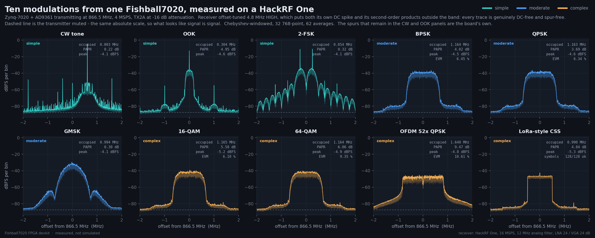
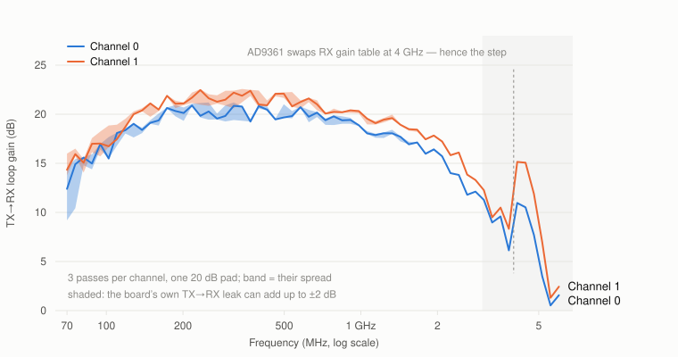

<p align="center">
  <picture>
    <source media="(prefers-color-scheme: dark)" srcset="docs/img/vmat-logo-dark.png">
    
  </picture>
</p>

# Fishball7020 FPGA Devkit

### Editable firmware for a two-channel SDR that ships without any.

The **"7020-SDR"** — a Zynq XC7Z020 + AD9361 radio, 70 MHz to 6 GHz, two
transmit and two receive channels, also sold as **PlutoSky** — arrives with no
published, buildable source. This reconstructs it: you open the real block
design, put your own HDL next to the AD9361 datapath, rebuild every layer
(bitstream → FSBL → U-Boot → kernel → rootfs) and flash it back over the
network without opening the case.

> **Not the official Analog Devices / OpenSourceSDRLab repository.** This is an
> independent, reverse-engineered reconstruction, verified as close to
> bit-perfect as public sources allow — [how this repo came to
> exist](docs/provenance.md).

<p align="center">
  <a href="https://matsvandamme.github.io/fishball7020-fpga-devkit/course/"></a>
  
  
  
  <a href="LICENSE"></a>
  <a href="../../actions/workflows/verify-patches.yml"></a>
</p>

<p align="center"></p>

New to any of this? **[How it works](docs/how-it-works.md)** starts from the
beginning and assumes nothing — or take
**[Fabric School](https://matsvandamme.github.io/fishball7020-fpga-devkit/course/)**,
the 53-lesson course written against this exact board.

---

## Is this your board?

This targets one board: the one sold as
[**"7020-SDR" (XC7Z020 + AD9361, dual TX/RX)**](https://nl.aliexpress.com/item/1005012055627197.html),
also listed as PlutoSky, PlutoSky R1, PlutoSky_7020_AD936X_SDR and Fish-Wan.
Listings drift; the board's own report does not:

```bash
# run on your HOST, from anywhere (needs libiio-utils)
iio_attr -S
#  1: 192.168.2.1 (FISH Ball PlutoSDR Rev.A (Z7020-AD9361)), serial=... [ip:fishball.local]
```

`FISH Ball PlutoSDR Rev.A (Z7020-AD9361)` fits. `Z7010`, `AD9363` or another
Rev does not — the original ADALM-PLUTO and other AD936x boards use different
pins and will not work with this firmware unchanged.

## What you get

- **Firmware that matches a factory unit**, rebuilt from source with one
  command — device tree byte-for-byte identical, rootfs and bootloader
  matching by content. ([How it was verified](docs/provenance.md))
- **ADI's real block design**, open in Vivado, so your HDL sits *in* the
  AD9361 datapath rather than beside it. ([IP by IP](docs/block-design.md))
- **A transmitter that is off unless you are transmitting** — and that mutes
  itself within 250 ms if the program feeding it dies, which stock firmware
  does not. ([Transmitter safety](docs/transmitter-safety.md))
- **A USER LED that means something**: lit whenever RF can leave either port.
  ([USER LED](docs/user-led.md))
- **Two receivers that both survive decimation.** Stock ADI wiring filters only
  channel 0, leaving channel 1 aliased by 70 dB; one optional patch fixes it
  for 22 DSP slices. ([Both channels](docs/both-receive-channels.md))
- **Four header pins that tick with the transmitted waveform**, carrying the
  bits the DAC throws away. ([Sample-locked GPIO](#sample-locked-gpio-outputs))
- **A self-test that answers "is this board damaged?"** with measurements, not
  with "it still enumerates". ([Is the board healthy?](#is-the-board-healthy))
- **You do not need Vivado** to change the kernel, a driver or the rootfs —
  build from a released hardware platform instead and skip the 50 GB install.
  ([Building without Vivado](docs/building-without-vivado.md))
- **An agent skill** in [`.claude/skills/`](.claude/skills/fishball7020-firmware/SKILL.md)
  carrying the rules that were expensive to work out. Ignore it if you do not
  use an agent.

> ### 📡 [What it puts on the air](docs/modulation-gallery.md) — measured, not simulated
>
> Ten modulations transmitted by one Fishball7020 and received on a **HackRF
> One**: CW, OOK, 2-FSK, BPSK, QPSK, GMSK, 16-QAM, 64-QAM, OFDM and a
> LoRa-style chirp. Spectra with ~85 dB of clean dynamic range, constellations
> recovered over the air, and a spur traced back to whichever radio made it.
>
> [](docs/modulation-gallery.md)
>
> The receiver is deliberately a *separate* radio: a board receiving its own
> transmission shares one clock with itself and hides every oscillator problem
> there is. All 128 chirp symbols decoded, the 64-QAM grid resolves fully, and
> the EVM floor turns out to belong to the link rather than the board.

## Quick start

### Just want a working board?

1. **Back up your card first.** Copy the five files off the board's microSD
   card. That is your way back.
2. Download the five SD-card files from the
   [latest release](../../releases/latest) and copy them onto the FAT32 card.
3. Check the **`BOOT`** DIP switch next to `RST` is in SD mode — both sliders
   pushed away from `ON` (`0 0`). Boards ship like that.
4. Insert and power on. After ~40 s the board appears over USB at
   `192.168.2.1`.

Nothing happening? [Boot modes](docs/flashing.md#boot-modes-boot-dip-switch) ·
[recovering the factory firmware](docs/flashing.md#if-things-go-wrong-recovering-the-factory-firmware).

### Want to change the firmware?

```bash
# run from: wherever you want the devkit to live (e.g. ~)
git clone https://github.com/matsvandamme/fishball7020-fpga-devkit.git
cd fishball7020-fpga-devkit

./devkit doctor          # can this machine build? finds out now, not at minute 40
./devkit setup           # clone upstream source + apply patches            (~5 min)
./devkit build           # everything                                    (45-90 min)
./devkit verify          # is the build sane?
./devkit flash --all     # onto the running board over the network, then reboot
./devkit verify --board  # is the board actually running it?
```

`./devkit --help` describes every subcommand and flag, grouped by what you are
trying to do, and it completes with tab:

```bash
# run from: the repo root
source <(./devkit completion)      # this shell
./devkit completion install        # every shell, from now on
```

**Three routes to a toolchain**, in the order most people should try them:

| | |
|---|---|
| **No Vivado at all** | `./devkit build --xsa FILE` uses a hardware platform from a [release](../../releases/latest) and skips the FPGA stage. You still need Vitis. ([how](docs/building-without-vivado.md)) |
| **A container** — recommended if you need Vivado | Vivado 2022.2 supports Ubuntu 18.04/20.04/22.04 and nothing newer. `./devkit container` sidesteps that, and installs Vivado for you. Verified byte-for-byte identical `BOOT.bin` to a host build. ([how](docs/building-in-a-container.md)) |
| **On the host** | Fine on Ubuntu 18.04/20.04/22.04. ([install](docs/building.md#install-vivadovitis-20222)) |

Anything that touches the radio — `flash`, `selftest`, `gpio-check`, `temps` —
always runs on the host, container or not.

> ### Before you ever transmit
>
> The receive port survives **+2.5 dBm** — the AD9361 data sheet's own
> absolute-maximum rating. This board is sold in a variant with a power
> amplifier that reaches about **+19 dBm**, some 16 dB more than its own
> receiver tolerates. So **never loop TX back to RX without at least 20 dB of
> attenuation**, and never transmit at power into an open port. Most of this
> board's range is licensed spectrum.
> More in [Transmitter safety](docs/transmitter-safety.md).

## Your first hour

**Connect.** Use the **USB 2.0** socket, not `DEBUG`. It appears as a network
interface:

```bash
# run on your HOST, from anywhere
ssh root@192.168.2.1        # password: analog
ssh root@fishball.local     # over Ethernet it answers to its name instead
```

`DEBUG` is the serial console and JTAG — only needed when the board will not
boot. ([which port is which](docs/flashing.md#verify-your-build-is-actually-running))

**Look at it.** None of these transmit, and nothing needs to be plugged into
the RF ports:

```bash
# run from: the repo root
./devkit status            # what is built, what the board is running
./devkit selftest --ssh    # is the radio damaged? answers with measurements
./devkit temps             # both die temperatures, against their ratings
./devkit net               # what address did it get, and how?
```

**You never type an address.** Every tool resolves `fishball.local` first and
falls back to the USB gadget at `192.168.2.1`; `tools/board_addr.py` is the one
place that order is decided, and `BOARD=` or `SDR_URI=` overrides it. To
software the board is a Pluto at `ip:fishball.local`, so libiio, pyadi-iio, GNU
Radio and SDRangel work with it as they would with a Pluto.

**On your network.** Ethernet takes a DHCP address and the board announces
itself as `fishball.local`. `./devkit net dhcp` and `./devkit net static <ip>`
switch modes permanently. This firmware also fixes two things stock gets wrong:
no hostname in the DHCP request, and a MAC regenerated at every boot — which
makes a DHCP reservation impossible.
([the four routes, and the SD-card file that looks like it works](docs/networking.md))

## Where to go next

| I want to… | Start here |
|---|---|
| learn this from nothing — SDR, Verilog and Vivado | **[Fabric School](https://matsvandamme.github.io/fishball7020-fpga-devkit/course/)** — 53 lessons written against this board ([179-page PDF](https://matsvandamme.github.io/fishball7020-fpga-devkit/course/Fabric-School.pdf)) |
| understand what the build produces and why | [How it works](docs/how-it-works.md) |
| install a toolchain, or avoid needing one | [Building](docs/building.md) · [in a container](docs/building-in-a-container.md) · [without Vivado](docs/building-without-vivado.md) |
| add my own HDL to the radio's datapath | [Add your own HDL](docs/building.md#add-your-own-hdl) · [the block design](docs/block-design.md) |
| see a complete worked example | [An FM channelizer in the FPGA](docs/wbfm-channelizer.md) |
| check my HDL in a second, before a 20-minute build | [Simulating your HDL first](docs/building.md#simulating-your-hdl-first) |
| use both receivers with the FPGA decimator on | [Two receivers that survive decimation](docs/both-receive-channels.md) |
| change a driver or the kernel | [Changing the kernel](docs/kernel.md) |
| get my build onto the board | [Flashing the board](docs/flashing.md) · [JTAG, the fastest HDL loop](docs/flashing.md#option-d--jtag-temporary-but-the-fastest-hdl-loop) |
| capture IQ that is still useful in a year | [Capturing IQ](docs/capturing-iq.md) — SigMF sidecars, and a dropped-sample check |
| see what this board actually transmits | **[The modulation gallery](docs/modulation-gallery.md)** — ten modulations on a HackRF One, with the code to repeat it |
| see which Wi-Fi channels are busy around me | [Scanning the Wi-Fi bands](tools/wifi-scan/README.md) — a GNU Radio sweep of 2.4 and 5 GHz |
| drive the GPIO pins, from host, board or fabric | [GPIO](docs/gpio.md) — three routes, and which pins are free |
| blink the USER LED | [Controlling the USER LED](docs/user-led.md) |
| put the board on my router, or fix its IP | `./devkit net dhcp` · [Changing the IP address](docs/networking.md) |
| drive the radio from an AI assistant | the sibling **[Fishball7020-mcp](https://github.com/matsvandamme/Fishball7020-mcp)** — 21 MCP tools |
| fix a build that fails | [Troubleshooting](docs/troubleshooting.md) |

## What is on the board


An **AD9361** transceiver (70 MHz – 6 GHz, two channels), a **Zynq XC7Z020**
(two ARM cores plus FPGA fabric), 1 GB of DDR3L, a power amplifier on each
transmit port, a balun per SMA port turning the chip's differential RF pins
into single-ended coax, gigabit Ethernet and USB. Every chip with its
datasheet, plus clocks, connectors and supply rails, read off the vendor
schematic: **[What is on the board](docs/hardware.md)**.

## Sample-locked GPIO outputs

The AD9361's DAC is 12 bits wide and discards the bottom four bits of every
16-bit sample. This firmware routes those four bits to pins 7, 9, 11 and 13 of
the `JP5` header instead, so **every pin edge belongs to one specific
transmitted sample**, at a fixed offset from its RF — usable as a clock, frame
marker or trigger for hardware that must stay in step with the transmitter.
It costs nothing: the DAC never sees those bits.

The idea of routing those least significant bits straight to the GPIO outputs
was suggested by **Akil0515** ([Telegram](https://t.me/Akil0515)) — see
[CONTRIBUTORS.md](CONTRIBUTORS.md).

<picture>
  <source media="(prefers-color-scheme: dark)" srcset="docs/img/saleae-timing-dark.svg">
  
</picture>

Off by default. To try it with the transmitter silent:

```bash
# run from: the repo root
python3 tools/sample_gpio_clock.py --help    # needs: pip install pyadi-iio numpy
./devkit gpio-check                          # check the pins work, no scope needed
```

**The full story** — how the nibble reaches the pin, the pinout, a complete
Python example, measured timing and limits:
**[docs/tx-gpio-bitmap.md](docs/tx-gpio-bitmap.md)**.

## Is the board healthy?

If you have overdriven an input, transmitted into an open port, or the board
has simply stopped behaving, the self-test answers with measurements. Most
checks need nothing plugged in:

```bash
# run from: the repo root
./devkit selftest --ssh                          # no cable, never transmits
./devkit selftest --ssh --loopback --pad 20      # + the RF tests
```

It cannot overdrive your receiver even if you forget the attenuator: it never
transmits with less than 35 dB of its own attenuation.
([what it checks](tools/selftest/README.md))

## Measured performance

One board, 28 runs. Gain settings do what they say to within 1.7%, harmonics
sit at least 63 dB below the carrier, the two transmitters match to 0.2 dB, and
the transmitter goes at least 75 dB quiet when it stops.

<picture>
  <source media="(prefers-color-scheme: dark)" srcset="docs/img/loop-gain-dark.svg">
  
</picture>

Two traps before measuring your own: a gain calibration made below 4 GHz is
wrong above it, because the AD9361 changes receive gain table there; and the
board leaks its own transmit signal into its receiver, which spoils loopback
measurements through large attenuators — use 20 dB.

Full tables and how the numbers were checked:
**[measured performance](docs/measured-performance.md)**. With real modulated
signals, and where the streaming ceiling comes from:
**[modulation and throughput](docs/modulation-and-throughput.md)**.

## How fast can you actually stream?

The board has **gigabit Ethernet** and a radio that runs at **61.44 MS/s**.
Both are true, and multiplying them together is the mistake everyone makes.

<picture>
  <source media="(prefers-color-scheme: dark)" srcset="docs/img/throughput-dark.svg">
  
</picture>

**What the board can do**, measured with the capture running on the board so
no network is involved:

| | 1 channel | 2 channels |
|---|---|---|
| Sustained capture | **49.8 MS/s** | **46.2 MS/s each** |

That is most of what the converter produces. **What you will actually get is
set by the link to your host**, not by the board — so a number measured on
somebody else's desk will not be yours.

**What each configuration demands** is the left panel above, and it is just
`4 × channels × sample rate` — one complex sample being 4 bytes:

| Active channels | At the full 61.44 MS/s | A gigabit link allows |
|---|---:|---:|
| 1 RX *or* 1 TX | 245.8 MB/s | 31.25 MS/s |
| 2 RX *or* 2 TX | 491.5 MB/s | 15.62 MS/s |
| 1 RX + 1 TX | 491.5 MB/s | 31.25 MS/s |
| 1 RX + 2 TX, or 2 RX + 1 TX | 737.3 MB/s | 15.62 MS/s |
| 2 RX + 2 TX | 983.0 MB/s | 15.62 MS/s |

Ethernet is full duplex, so transmit and receive each get their own 125 MB/s
and do not compete *on the wire* — which is why `1 RX + 1 TX` allows the same
rate as `1 RX` alone. They do compete for the board's CPU.
[The full table, and the chip's own interface limit](docs/modulation-and-throughput.md#theoretical-rates-every-rxtx-combination).

Three things are worth knowing whatever your setup:

- **Raise the libiio buffer.** It is free and it matters more than anything
  else: a small buffer costs roughly two thirds of the rate. Use `-b 1048576`
  or larger; past a few Msamples it stops helping.
- **Two channels give less each but more in total.** The per-buffer overhead
  amortises while the cost per byte does not.
- **The USB gadget is far slower than Ethernet** — around 1.7 MS/s.

```bash
# run on your HOST — the -b matters more than anything else here
iio_readdev -u ip:fishball.local -b 1048576 -s 33554432 cf-ad9361-lpc     voltage0 voltage1 > capture.iq
```

**To get the full 61.44 MS/s, take the host out of the loop entirely.** A
cyclic transmit hands the hardware one buffer and it repeats forever with no
host involvement — which is how QPSK measures 2.17% EVM at the top of the
range. Equally, filtering or decimating in the fabric means fewer bytes ever
need to cross.

The measurements, the buffer sweep and the conditions they were taken under:
**[modulation and throughput](docs/modulation-and-throughput.md)**.

## Repository layout

```
fishball7020-fpga-devkit/
├── devkit              ← the one entry point: doctor, setup, build, flash, ...
├── docs/               ← everything this page links to
├── firmware/
│   ├── patches/        what makes this board's firmware; applied by setup
│   ├── scripts/        the build
│   ├── sim/            one-second HDL simulation, no Vivado
│   ├── src/            upstream source, created by setup (not committed)
│   └── output/         the five SD-card files a build produces
└── tools/              flashing, the self-test, the GPIO and RF tools
```

File by file: [Building your own firmware](docs/building.md#repository-layout).

## Getting help

Build failed, or the board acting up? [Troubleshooting](docs/troubleshooting.md)
and the [self-test](#is-the-board-healthy). Still stuck?
[Open an issue](../../issues/new/choose) — the templates ask for the details
that speed things up. Contributions welcome: [CONTRIBUTING.md](CONTRIBUTING.md)
· [CONTRIBUTORS.md](CONTRIBUTORS.md).

## Vendor resources

- [**Hardware schematic**](docs/vendor/7020_936x_SDR-schematic.pdf), kept here
  because the vendor's own GitHub copy is a **different revision** that does
  not describe this board. [Which is which](docs/vendor/README.md).
- [PlutoSky R1 write-up](https://blog.opensourcesdrlab.com/archives/PlutoSky-R1) ·
  [vendor file archive](https://workupload.com/archive/kc2v7ryVZZ) ·
  [factory binaries](https://github.com/OpenSourceSDRLab/PlutoSky_7020_AD936X_SDR)

None of it includes editable HDL sources, which is the gap this repo fills.

## License

This repo's own scripts, patches and documentation are **GPL-2.0**. The
upstream source that `setup` downloads (Linux, U-Boot, Buildroot) stays GPL,
and Xilinx Vivado/Vitis and AMD IP are proprietary and licensed separately.
The breakdown is in [`LICENSE`](LICENSE).

One directory is not ours:
[`.claude/skills/goal-creator/`](.claude/skills/goal-creator/) is a third-party
agent skill vendored under **MIT**, with its own `LICENSE` and a
[`VENDORED.md`](.claude/skills/goal-creator/VENDORED.md) recording where it came
from and at which commit. Nothing in the firmware or the build depends on it.
