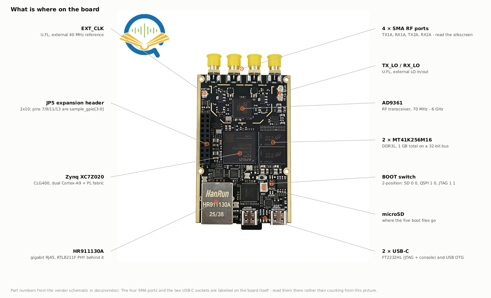

> **This is not the official Analog Devices / OpenSourceSDRLab repository.**
> The Fishball7020 is an ADALM-PLUTO-derivative board that ships with no
> published, editable firmware source. This is an independent,
> reverse-engineered reconstruction, verified as close to bit-perfect as public
> sources allow — see [how this repo came to exist](docs/provenance.md).

# Fishball7020 FPGA Devkit

<p align="center">
  
  
  
  <a href="LICENSE"></a>
  <a href="../../actions/workflows/verify-patches.yml"></a>
</p>

<p align="center"></p>

Build your own FPGA/HDL firmware for the **"7020-SDR"**, a Zynq XC7Z020-CLG400
+ AD9361 software-defined radio with two transmit and two receive channels,
also sold as **PlutoSky** by OpenSourceSDRLab. You open the real block design,
add your own HDL next to the AD9361 datapath, rebuild every layer (bitstream →
FSBL → U-Boot → kernel → rootfs), and flash it back over the network without
opening the case.

If bitstream, FSBL and block design are new terms, **[How it
works](docs/how-it-works.md)** starts from the beginning and assumes nothing.

## Is this your board?

This repo targets one exact board: the one sold as
[**"7020-SDR" (XC7Z020 + AD9361, dual TX/RX)**](https://nl.aliexpress.com/item/1005012055627197.html),
also listed as PlutoSky, PlutoSky R1, PlutoSky_7020_AD936X_SDR and Fish-Wan.
Listings drift, but the board's own report does not. With the board plugged
in over USB:

```bash
# run on your HOST, from anywhere (needs libiio-utils)
iio_attr -S
#  1: 192.168.2.1 (FISH Ball PlutoSDR Rev.A (Z7020-AD9361)), serial=... [ip:pluto.local]
```

`FISH Ball PlutoSDR Rev.A (Z7020-AD9361)` means it fits. `Z7010`, `AD9363` or
another Rev means it does not: the original ADALM-PLUTO and other AD936x boards
use different pins and will not work with this firmware unchanged.

## What you get

- **Firmware that matches a factory unit**, rebuilt from source with one
  command: the device tree is byte-for-byte identical, the rootfs and
  bootloader match by content. ([How it was verified](docs/provenance.md))
- **ADI's real block design**, open in Vivado, so your HDL sits in the AD9361
  datapath rather than beside it. ([The block design, IP by IP](docs/block-design.md))
- **A transmitter that is off unless you are transmitting.** Stock firmware
  leaves it energised from power-on. ([Transmitter safety](docs/transmitter-safety.md))
- **Four header pins that tick with the transmitted waveform**, carrying bits
  the DAC throws away. ([Sample-locked GPIO outputs](#sample-locked-gpio-outputs))
- **A self-test** that tells you whether the radio is damaged, with measurements.
  ([Is the board healthy?](#is-the-board-healthy))
- **An agent skill** in [`.claude/skills/`](.claude/skills/fishball7020-firmware/SKILL.md)
  that Claude Code loads on its own, carrying the rules that were expensive to
  work out. Ignore it if you do not use an agent.

## Quick start

### Just want a working board?

1. **Back up your card first.** Copy the five files on the board's microSD card
   somewhere safe. That is your way back if anything goes wrong.
2. Download the five SD-card files from the
   [latest release](../../releases/latest), and copy them onto the FAT32 card.
3. Check the **`BOOT`** DIP switch, next to `RST`, is in SD mode: both
   sliders pushed away from `ON` (`0 0`). Boards ship like that.
4. Insert the card and power on. After about 40 seconds the board appears over
   USB at `192.168.2.1`.

If nothing happens, see [boot modes](docs/flashing.md#boot-modes-boot-dip-switch)
and [recovering the factory firmware](docs/flashing.md#if-things-go-wrong-recovering-the-factory-firmware).

### Want to change the firmware?

You need **Ubuntu 22.04** and **Vivado/Vitis 2022.2**, which is free for this
chip but a large download. Installing it is by far the slowest step:
[install instructions](docs/building.md#install-vivadovitis-20222). Then:

```bash
# run from: wherever you want the devkit to live (e.g. ~)
git clone https://github.com/matsvandamme/fishball7020-fpga-devkit.git
cd fishball7020-fpga-devkit

./devkit doctor          # can this machine build? finds out now, not at minute 40
./devkit setup           # clone upstream source + apply patches            (~5 min)
./devkit build           # build everything                              (45-90 min)
./devkit verify          # is the build sane?
./devkit flash --all     # copy it onto the running board over the network, reboot
./devkit verify --board  # is the board actually running it?
```

`./devkit` runs from the repo root and wraps everything:
`doctor · setup · sim · build · verify · flash · selftest · gpio-check · status`.
Arguments pass straight through, so `./devkit build --hdl-only` works.

> ### Before you ever transmit
>
> The receive port survives **+2.5 dBm**. This board is sold in a variant with
> a power amplifier that puts out about **+19 dBm**, some 16 dB more than its
> own receiver tolerates. So **never loop TX back to RX without at least 20 dB
> of attenuation in between**, and never transmit at power into an open or
> unterminated port. Most of this board's range is licensed spectrum. More in
> [Transmitter safety](docs/transmitter-safety.md).

## Your first hour with the board

**Connect.** Plug a cable into the board's **USB 2.0** socket (not `DEBUG`).
It shows up as a network interface, and the board is at `192.168.2.1`:

```bash
# run on your HOST, from anywhere
ssh root@192.168.2.1        # password: analog
```

The `DEBUG` socket is the serial console and JTAG, which you only need when the
board will not boot. [Which USB port is which](docs/flashing.md#verify-your-build-is-actually-running).

**Check it is healthy.** Nothing needs to be plugged into the RF ports for
this, and it never transmits:

```bash
# run from: the repo root
./devkit selftest --ssh
```

**See where you are.** `./devkit status` shows whether the source is set up,
what you last built, and whether the board is reachable. Once you have built
something, `./devkit verify --board` checks the board is really running it.

**Talk to it.** To software it is a Pluto at `ip:192.168.2.1`, so libiio,
pyadi-iio, GNU Radio and SDRangel work with it as they would with a Pluto.

## Making changes

| I want to… | Start here |
|---|---|
| understand what the build produces and why | [How it works](docs/how-it-works.md) |
| install the tools and build | [Building your own firmware](docs/building.md) |
| add my own HDL to the radio's datapath | [Add your own HDL](docs/building.md#add-your-own-hdl) · [the block design](docs/block-design.md) |
| see a complete worked example | [An FM channelizer in the FPGA](docs/wbfm-channelizer.md) |
| check my HDL in a second, before a 20-minute build | [Simulating your HDL first](docs/building.md#simulating-your-hdl-first) |
| change a driver or the kernel | [Changing the kernel](docs/kernel.md) |
| get my build onto the board | [Flashing the board](docs/flashing.md) |
| iterate on the FPGA in seconds over JTAG | [Option D — JTAG](docs/flashing.md#option-d--jtag-temporary-but-the-fastest-hdl-loop) |
| blink the USER LED | [Controlling the USER LED](docs/user-led.md) |
| fix a build that fails | [Troubleshooting](docs/troubleshooting.md) |

## What is on the board



An **AD9361** transceiver (70 MHz – 6 GHz, two channels), a **Zynq
XC7Z020** (two ARM cores plus FPGA fabric), 1 GB of DDR3L, a power amplifier
on each transmit port, gigabit Ethernet and USB. Every chip, clock, connector
and supply rail, read off the vendor schematic: **[What is on the
board](docs/hardware.md)**.

## Sample-locked GPIO outputs

The AD9361's DAC is 12 bits wide and ignores the bottom four bits of every
16-bit sample you send it. This firmware routes those four bits to pins 7, 9,
11 and 13 of the `JP5` header instead. Every pin edge then belongs to one
specific transmitted sample, at a fixed offset from its RF. That makes the pins
usable as a clock, frame marker or trigger for external hardware that must
stay in step with the transmitter, such as radar or MIMO receivers. It costs
nothing: the DAC never sees those bits.

<picture>
  <source media="(prefers-color-scheme: dark)" srcset="docs/img/saleae-timing-dark.svg">
  
</picture>

It is off by default. To try it with the transmitter silent:

```bash
# run from: the repo root
python3 tools/sample_gpio_clock.py --help    # needs: pip install pyadi-iio numpy
./devkit gpio-check                          # check the pins work, no scope needed
```

**The full story** — how the nibble reaches the pin, the pinout, a complete
Python example, measured timing and limits:
**[docs/tx-gpio-bitmap.md](docs/tx-gpio-bitmap.md)**.

## Is the board healthy?

If you have overdriven an input, transmitted into an open port, or the board
has simply stopped behaving, the self-test answers with measurements. Most
checks need nothing plugged in. The RF checks need TX cabled to RX through a
**20 dB attenuator**:

```bash
# run from: the repo root
./devkit selftest --ssh                          # no cable, never transmits
./devkit selftest --ssh --loopback --pad 20      # + the RF tests
```

It cannot overdrive your receiver even if you forget the attenuator: it never
transmits with less than 35 dB of its own attenuation. What it checks and how
to read the result: [`tools/selftest/README.md`](tools/selftest/README.md).

## Measured performance

One board, 28 runs. Gain settings do what they say to within 1.7%, harmonics
sit at least 63 dB below the carrier, the two transmitters match to 0.2 dB, and
the transmitter goes at least 75 dB quiet when it stops.

<picture>
  <source media="(prefers-color-scheme: dark)" srcset="docs/img/loop-gain-dark.svg">
  
</picture>

Two things are worth knowing before you measure your own board. A gain
calibration made below 4 GHz is wrong above it, because the AD9361 changes
receive gain table there. And the board leaks some of its own transmit signal
into its receiver, which spoils loopback measurements through large
attenuators: use 20 dB. The full tables, the leak, and how the numbers were
checked: **[docs/measured-performance.md](docs/measured-performance.md)**.

## Repository layout

```
fishball7020-fpga-devkit/
├── devkit              ← the one entry point: ./devkit doctor, setup, build, flash, ...
├── docs/               ← everything this page links to
├── firmware/
│   ├── patches/        what makes this board's firmware; applied by setup
│   ├── scripts/        the build
│   ├── sim/            one-second HDL simulation, no Vivado
│   ├── src/            upstream source, created by setup (not committed)
│   └── output/         the five SD-card files a build produces
└── tools/              flashing, the self-test, the GPIO tools
```

The full tree, file by file, is in
[Building your own firmware](docs/building.md#repository-layout).

## Getting help

Build failed, or the board is acting up? Check
[Troubleshooting](docs/troubleshooting.md) and run the
[self-test](#is-the-board-healthy). Still stuck?
[Open an issue](../../issues/new/choose): the templates ask for the details
that speed things up. Contributions are welcome; see
[CONTRIBUTING.md](CONTRIBUTING.md).

## Vendor resources

- [**Hardware schematic**](docs/vendor/7020_936x_SDR-schematic.pdf), kept here
  because the vendor's own GitHub copy is a **different revision** that does
  not describe this board. [Which is which](docs/vendor/README.md).
- [PlutoSky R1 write-up](https://blog.opensourcesdrlab.com/archives/PlutoSky-R1) ·
  [vendor file archive](https://workupload.com/archive/kc2v7ryVZZ) ·
  [factory binaries](https://github.com/OpenSourceSDRLab/PlutoSky_7020_AD936X_SDR)

None of it includes editable HDL sources, which is the gap this repo fills.

## License

This repo's own scripts, patches and documentation are **GPL-2.0**. The
upstream source that `setup` downloads (Linux, U-Boot, Buildroot) stays GPL,
and Xilinx Vivado/Vitis and AMD IP are proprietary and licensed separately.
The breakdown is in [`LICENSE`](LICENSE).
