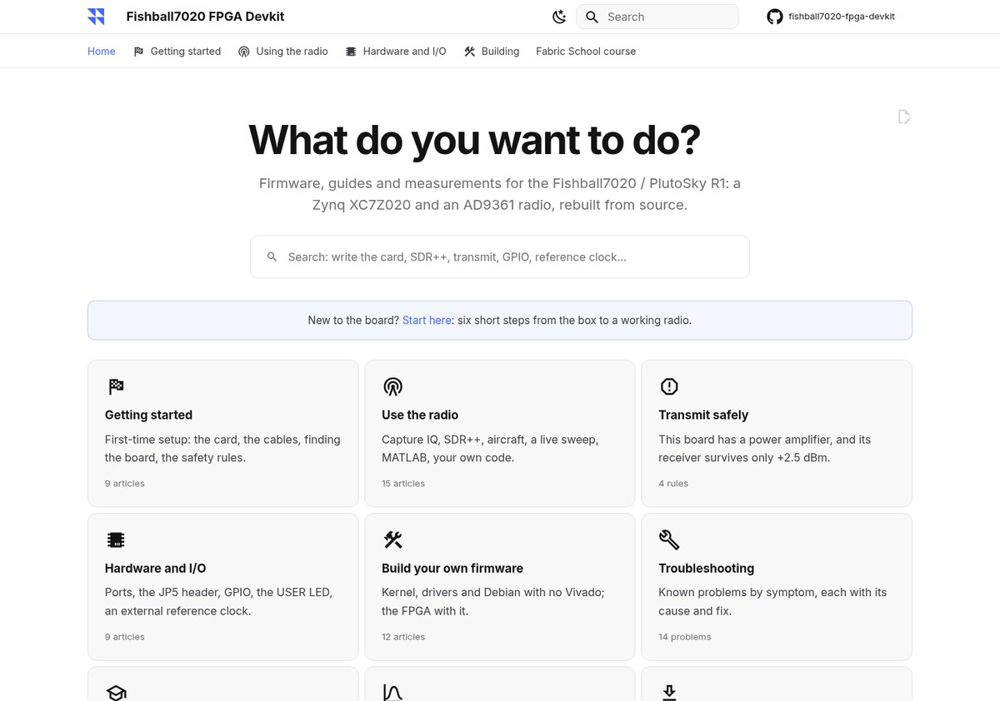
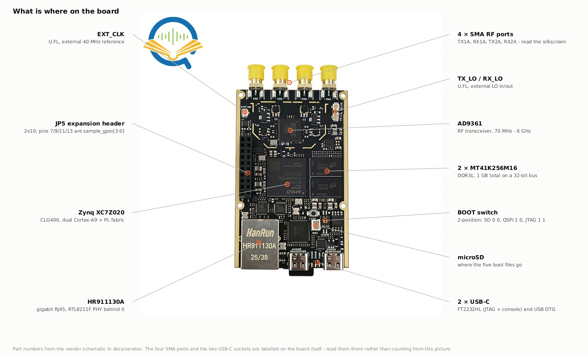

<p align="center">
  <picture>
    <source media="(prefers-color-scheme: dark)" srcset="docs/img/covers/devkit-stack-dark.png">
    
  </picture>
</p>

# Fishball7020 Devkit

**Editable, rebuildable firmware for a two-channel SDR that ships without any.**

<p align="center">
  <a href="https://matsvandamme.github.io/fishball7020-fpga-devkit/"></a>
  <a href="https://matsvandamme.github.io/fishball7020-fpga-devkit/course/"></a>
  
  <a href="LICENSE"></a>
  <a href="../../actions/workflows/verify-patches.yml"></a>
  <a href="../../actions/workflows/verify-modern.yml"></a>
</p>

<p align="center">
  
  
  
  <br><sub>The board bare, and boxed as the PlutoSky R1 (ports end, antenna end). Photos: OpenSourceSDRLab.</sub>
</p>

## 📚 Documentation

**Everything is on the documentation site: [matsvandamme.github.io/fishball7020-fpga-devkit](https://matsvandamme.github.io/fishball7020-fpga-devkit/).** Short task articles with diagrams, searchable, with the full reference one click deeper.

<p align="center">
  <a href="https://matsvandamme.github.io/fishball7020-fpga-devkit/"></a>
</p>

| I want to… | Start at |
|---|---|
| get a board running | **[Start here](https://matsvandamme.github.io/fishball7020-fpga-devkit/start/)**: six short steps from the box to a working radio |
| receive, transmit, use SDR++ or Python | **[Use the radio](https://matsvandamme.github.io/fishball7020-fpga-devkit/radio/)** |
| transmit without breaking anything | **[Before you transmit](https://matsvandamme.github.io/fishball7020-fpga-devkit/start/before-you-transmit/)**: four rules |
| find a port, a pin or a part | **[Hardware and I/O](https://matsvandamme.github.io/fishball7020-fpga-devkit/hw/)** |
| change the kernel, a driver or the FPGA | **[Build your own firmware](https://matsvandamme.github.io/fishball7020-fpga-devkit/build/)** |
| learn SDR and FPGA from zero | **[Fabric School](https://matsvandamme.github.io/fishball7020-fpga-devkit/course/)**: 54 lessons |
| fix a problem | **[Troubleshooting](https://matsvandamme.github.io/fishball7020-fpga-devkit/troubleshooting/)** |

## 🌟 Highlights

- **Every layer rebuilds from source** (bitstream, FSBL bootloader, U-Boot, kernel, root filesystem) with one command, and flashes back over the network without opening the case.
- **Matches a factory unit**: device tree byte-for-byte identical, root filesystem and bootloader matching by content ([how it was verified](docs/provenance.md)).
- **A current system**: Linux 6.12 LTS from Analog Devices and Debian 13, or the factory 5.15 kernel if you want it.
- **No Vivado needed** to change the kernel, a driver or the root filesystem ([how](docs/building-without-vivado.md)). Vivado is AMD's 50 GB FPGA tool.
- **A safer transmitter**: it boots muted and mutes itself when the program feeding it dies ([transmitter safety](docs/transmitter-safety.md)).
- **Both receivers survive FPGA decimation**, and four header pins tick with the transmitted samples ([both channels](docs/both-receive-channels.md) · [sample-locked GPIO](docs/tx-gpio-bitmap.md)).
- **A self-test that answers "is this board damaged?"** with measurements, and a [54-lesson course](https://matsvandamme.github.io/fishball7020-fpga-devkit/course/) that teaches SDR and FPGA from zero on this board.

## ℹ️ Overview

The board is sold as **PlutoSky R1**, **7020-SDR**, **Fishball7020** and **Fish-Wan**: a Zynq XC7Z020 (two ARM cores plus FPGA fabric) with an AD9361 radio chip, 70 MHz to 6 GHz, two transmit and two receive channels, a power amplifier on each transmit port. It arrives with no published, buildable source. This repository reconstructs it, so you can open the real FPGA design, put your own logic next to the radio's datapath and rebuild everything. To software the board looks like an ADALM-Pluto at `ip:fishball.local`, so libiio, pyadi-iio, GNU Radio, SDR++, SDRangel and MATLAB work with it.

> **Not the official Analog Devices / OpenSourceSDRLab repository.** This is an independent, reverse-engineered reconstruction.

**Is this your board?** Ask it (needs `libiio-utils`):
```bash
# run on your HOST, from anywhere
iio_attr -S
#  1: 192.168.2.1 (FISH Ball PlutoSDR Rev.A (Z7020-AD9361)), serial=... [ip:fishball.local]
```

`FISH Ball PlutoSDR Rev.A (Z7020-AD9361)` fits. A `Z7010`, an `AD9363` or another Rev does not work unchanged. Transmit power figures here assume the power amplifier is fitted ([variants](docs/hardware.md)).

**Two firmware targets.** `./devkit` drives both: modern by default, factory with `--target factory`.

| | [`firmware-modern/`](firmware-modern/README.md) (use this) | [`firmware/`](firmware/README.md) |
|---|---|---|
| kernel | 6.12 LTS, Analog Devices' tree | 5.15, the vendor's fork |
| userspace | Debian 13 armhf, on the SD card | Buildroot and busybox, in RAM |
| FPGA | taken from a built design (an `.xsa` file) | built with Vivado: the only bitstream source here |



## 🚀 Usage

Connect the **USB 2.0** socket (not `DEBUG`, which is the serial console). The board appears as a network interface after about 40 s:

```bash
# run from: the repo root
ssh root@192.168.2.1       # password: analog; over Ethernet use root@fishball.local
./devkit ssh-key           # never type the password again: then just `ssh fishball`
./devkit status            # what is built, what the board is running
./devkit selftest --ssh    # is the radio damaged? never transmits, nothing plugged in
./devkit temps             # both die temperatures, live
```

Then pick a starting point: receive with [SDR++](docs/sdrpp.md) or [other tools](docs/other-sdr-tools.md), stream IQ to a file with [capturing IQ](docs/capturing-iq.md), watch [aircraft overhead](docs/adsb.md) with `./devkit adsb`, watch a sweep go round your bench loop with [chirp-view](docs/chirp-view.md), run the [examples](examples/), use [MATLAB](docs/matlab.md), or put the board [on your network](docs/networking.md).

> [!CAUTION]
> ### Before you ever transmit
> The receive port survives **+2.5 dBm**. The transmitter reaches about **+19 dBm**, 16 dB more. So **never loop TX back to RX without at least 20 dB of attenuation**, and never transmit at power into an open port. The devkit's transmitting tools refuse to run until you record `./devkit tx-guard affirm`. Most of this board's range is licensed spectrum. Read [transmitter safety](docs/transmitter-safety.md) first.

## ⬇️ Installation

**Just want a working board?** Back up every file on the board's microSD card first; that is your way back. Then:

1. Download [the latest release](../../releases/latest) (modern firmware). It needs two partitions, so write it with a clone of this repository and a card reader: `sudo ./devkit write-card --from ~/Downloads /dev/sdX`. **On Windows**, double-click `write-card.cmd` from the same release instead: [writing the card on Windows](docs/windows-sd-card.md). For the factory firmware, copy the five files of [v1.7](../../releases/tag/v1.7) onto the FAT32 card instead.
2. Check the **`BOOT`** DIP switch next to `RST` is in SD mode: both sliders away from `ON`. Boards ship like that.
3. Insert the card and power on, from a mains USB charger: on a laptop's USB power the board can hang. Nothing happening? [Boot modes and recovery](docs/flashing.md).

**Want to change the firmware?** The kernel, drivers and Debian, with no Vivado:
```bash
# run from: wherever you want the devkit to live (e.g. ~)
git clone https://github.com/matsvandamme/fishball7020-fpga-devkit.git
cd fishball7020-fpga-devkit
./devkit doctor                                     # can this machine build?
./devkit setup                                      # fetch the sources, apply the patches (~0.6 GB)
XSA="$(./firmware-modern/fetch-pinned-xsa.sh)"      # the FPGA design of a factory release
./devkit build --all --xsa "$XSA"                   # boot files, kernel and Debian root
sudo ./devkit write-card /dev/sdX                   # the first time: a whole new card
```

After that, `./devkit flash --kernel-only` puts a changed kernel on the running board over the network. Never flash with DFU.

**Changing the FPGA** needs Vivado 2022.2, on Ubuntu 18.04 to 22.04 or in the container `./devkit container` builds for you:
```bash
# run from: the repo root
./devkit doctor --target factory          # finds missing tools now, not at minute 40
./devkit setup --target factory           # clone upstream source, apply patches  (~5 min)
./devkit build --target factory           # everything                           (45-90 min)
./devkit flash --target factory --all     # onto the running board, then reboot
./devkit verify --target factory --board  # is the board actually running it?
```

`./devkit help` lists every command and `./devkit help <command>` explains one; `./devkit completion install` adds tab completion. `DEVKIT_TARGET=factory` makes factory the default. Details: [building](docs/building.md) · [in a container](docs/building-in-a-container.md) · [flashing](docs/flashing.md).

## 💭 Feedback and contributing

Build failing or the board acting up? Try [troubleshooting](docs/troubleshooting.md) and `./devkit selftest --ssh`. Still stuck? [Open an issue](../../issues/new/choose); the templates ask for what speeds things up. Contributions are welcome: [CONTRIBUTING.md](CONTRIBUTING.md). People who shaped this firmware, including MrMati (the modern kernel) and Akil0515 (the sample-locked GPIO idea), are in [CONTRIBUTORS.md](CONTRIBUTORS.md).

The repository's own scripts, patches and documentation are GPL-2.0; downloaded upstream sources keep their licenses, and Vivado and AMD IP are proprietary ([LICENSE](LICENSE)). [`.claude/skills/goal-creator/`](.claude/skills/goal-creator/VENDORED.md) is a vendored third-party skill under MIT. [`.claude/skills/fishball7020-firmware/`](.claude/skills/fishball7020-firmware/SKILL.md) is an agent skill with this board's hard-won rules.

## 📖 Further reading

- **[The documentation site](https://matsvandamme.github.io/fishball7020-fpga-devkit/)** ([above](#-documentation)), or the [documentation map](docs/README.md): every page, by what you want to do.
- **[How it works](docs/how-it-works.md)**: what the build produces and why, assuming nothing.
- **[Fabric School](https://matsvandamme.github.io/fishball7020-fpga-devkit/course/)**: 54 lessons, from what a radio is to your own logic in the AD9361 datapath.
- **[Using this board in your own project](docs/your-own-project.md)**: where your code can live, and what each place costs.
- **[The modulation gallery](docs/modulation-gallery.md)** and **[measured performance](docs/measured-performance.md)**: what the board puts on the air, measured.
- **[What is on the board](docs/hardware.md)** and the [vendor schematic](docs/vendor/README.md).
- The sibling **[Fishball7020-mcp](https://github.com/matsvandamme/Fishball7020-mcp)** drives the radio from an AI assistant.
