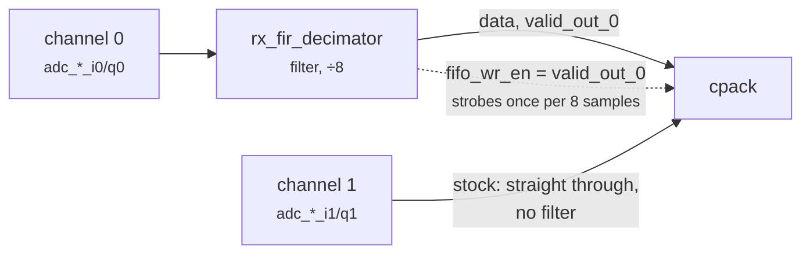

# Two receivers that both survive decimation

With the FPGA's ÷8 decimator engaged, upstream's block design filters only
channel 0, so channel 1 comes out aliased. Patch
`firmware/patches/0021-filter-both-receive-channels-by-default.patch` puts both
channels through the filter for about six lines of Tcl and 22 DSP slices; it is
**applied by every build**. Read this if you use both receivers at a decimated
rate, or build upstream's wiring.

!!! abstract "Key facts"
    | | |
    |---|---|
    | the defect (upstream) | with the ÷8 decimator engaged, channel 1 is sampled at one eighth rate **with no anti-alias filter**: a 10 MHz tone's alias lands at 2.32 MHz at full strength |
    | the fix | patch `0021`, applied by every build: both channels through the filter |
    | result | at least **69.7 dB** of alias suppression on channel 1 |
    | cost | 22 DSP slices (94 / 220 instead of 72 / 220); timing still met |
    | not fixed | the transmit interpolator: **do not engage it**, TX1 then emits nothing |

## Using it

Nothing to do: `./devkit setup --target factory` applies it with the rest of the patch series.
Engage the decimator and capture both channels:

```bash
# run from: your host
iio_attr -u ip:192.168.2.1 -i -c cf-ad9361-lpc voltage0 sampling_frequency_available
#   61440000 7680000        <- always {converter rate, converter rate / 8}

iio_attr -u ip:192.168.2.1 -i -c cf-ad9361-lpc voltage0 sampling_frequency 7680000

# channel 0 is voltage0/voltage1, channel 1 is voltage2/voltage3
iio_readdev -u ip:192.168.2.1 -b 131072 -s 262144 cf-ad9361-lpc \
  voltage0 voltage1 voltage2 voltage3 > both.bin
```

To build upstream's wiring instead (channel 0 filtered, channel 1 straight
through, 22 DSP slices back), delete the Vivado project (or the build reuses it)
and set `STOCK_RX_FILTER=1`. An empty `STOCK_RX_FILTER=` counts as unset.

```bash
# run from: the repo root
rm -rf firmware/src/hdl/projects/pluto/pluto.{xpr,cache,gen,hw,ip_user_files,runs,sim,srcs,sdk}
STOCK_RX_FILTER=1 ./devkit build --target factory --hdl-only && ./devkit verify --target factory \
  && ./devkit flash --target factory --boot-only
```

`system_bd.tcl` prints which wiring it chose, and `./devkit verify --target factory` reports
`-> decimator on RX channel 0 only (STOCK_RX_FILTER=1, upstream wiring)` or
`-> decimator on BOTH RX channels (default)`.

## The defect



Three facts in the stock block design combine badly:

1. **Only channel 0 is filtered.** Channel 1 goes straight to `cpack` inputs 2 and 3.
2. **`cpack` captures everything on channel 0's timing.** Its write strobe,
   `fifo_wr_en`, is `rx_fir_decimator/valid_out_0`; channel 1's `adc_valid_i1`
   is connected to nothing.
3. **The decimator drops the rate by 8**, so that strobe fires once per eight
   input samples.

So channel 1 is sampled at one eighth rate **with no anti-alias filter**:
everything outside ±Fs/16 folds onto it, offset from channel 0 by the filter's
group delay. Keeping one sample in eight folds eight slices of bandwidth (noise
included) on top of each other; the FIR empties the seven discarded slices first,
which is also where decimation's 10·log₁₀(D) dB of signal-to-noise gain comes
from. Upstream shares this design with many **1R1T** boards (one receiver, one
transmitter), where the asymmetry never shows.

## Before and after

`TX2A` → 20 dB attenuator → `RX2A`, 900 MHz, converter at 61.44 MSPS, decimator
engaged (7.68 MSPS, a **±3.84 MHz** window). A tone generated in the FPGA is swept
0.2–20 MHz and compared with the same tone with the decimator bypassed: the
difference is the channel's anti-alias response.

<picture>
  <source media="(prefers-color-scheme: dark)" srcset="img/channel1-alias-dark.svg">
  
</picture>

| Tone | Folds in at | Stock | With this patch |
|---|---|---|---|
| 1.00 MHz | 1.00 MHz, in band | +1.4 dB | −4.6 dB |
| 3.84 MHz | 3.84 MHz, the edge | +1.4 dB | −10.6 dB |
| 5.00 MHz | −2.68 MHz | +1.4 dB | **−69.6 dB** |
| 10.00 MHz | +2.32 MHz | +1.4 dB | **−70.4 dB** |
| 20.00 MHz | −3.04 MHz | +1.2 dB | **−66.0 dB** |

Stock, channel 1 attenuates nothing, so every tone above 3.84 MHz lands in the
window at full strength: the 10 MHz tone's alias at 2.32 MHz peaks at
**+18.75 dB**, indistinguishable from a real signal. Patched, the alias is
invisible (at least **69.7 dB** of suppression; average −70.1 dB past 5 MHz).
With the decimator bypassed the two builds agree within 0.05 dB.

## What the patch does

The Tcl helper (`projects/common/xilinx/adi_fir_filter_bd.tcl`) already loops
over its channel count, so the fix asks for four and wires the second pair:

```tcl
# excerpt: the patch's change to projects/pluto/system_bd.tcl
# ask for 4 (ch0 I/Q and ch1 I/Q) rather than 2
ad_add_decimation_filter "rx_fir_decimator" 8 4 1 {61.44} {61.44} <coe>

# feed channel 1 in
ad_connect axi_ad9361/adc_valid_i1  rx_fir_decimator/valid_in_2
ad_connect axi_ad9361/adc_enable_i1 rx_fir_decimator/enable_in_2
ad_connect axi_ad9361/adc_data_i1   rx_fir_decimator/data_in_2
ad_connect axi_ad9361/adc_valid_q1  rx_fir_decimator/valid_in_3
ad_connect axi_ad9361/adc_enable_q1 rx_fir_decimator/enable_in_3
ad_connect axi_ad9361/adc_data_q1   rx_fir_decimator/data_in_3

# and take cpack's inputs from the filter instead of from axi_ad9361
ad_connect cpack/enable_2        rx_fir_decimator/enable_out_2
ad_connect cpack/fifo_wr_data_2  rx_fir_decimator/data_out_2
ad_connect cpack/enable_3        rx_fir_decimator/enable_out_3
ad_connect cpack/fifo_wr_data_3  rx_fir_decimator/data_out_3
```

Both channels now share one `active` bit, one coefficient set and one group
delay, so they stay sample-aligned and `cpack/fifo_wr_en` on `valid_out_0` is
correct.

<p align="center"></p>

Four `fir_compiler`s and four bypass muxes instead of two, with one
`cdc_sync_active` driving every `select_path`, so both channels switch together.
The whole design is [`img/bd-top.svg`](img/bd-top.svg); both drawings come from
[`img/make_bd_layout.sh`](img/make_bd_layout.sh).

## What it costs

| | `STOCK_RX_FILTER=1` | **Default** |
|---|---|---|
| DSP48 slices | 72 / 220 | **94 / 220** |
| Slice LUTs | 11,896 / 53,200 | 12,521 / 53,200 |
| Worst negative slack | +0.205 ns | **+0.215 ns** |
| Timing endpoints | 48,263 | 54,211 |

Two extra `fir_compiler` instances, about 11 DSP slices each; timing is met with
slightly more margin than stock, and 126 DSP slices remain free.

## What this does not fix

!!! danger "The transmit interpolator: do not engage it"
    `tx_upack/fifo_rd_en` is the OR of the interpolator's valid and channel 1's DAC
    valid, so on a 2R2T board channel 1 drags the packer at full rate and TX1 emits
    nothing. See [block-design.md](block-design.md#the-transmit-path).

- **The shared coefficient file.** Receive and transmit both use
  `library/util_fir_int/coefile_int.coe`; editing it changes both.
- **The ÷8 factor.** The driver offers exactly `{1, 8}`; another rate would build
  and be unreachable.
