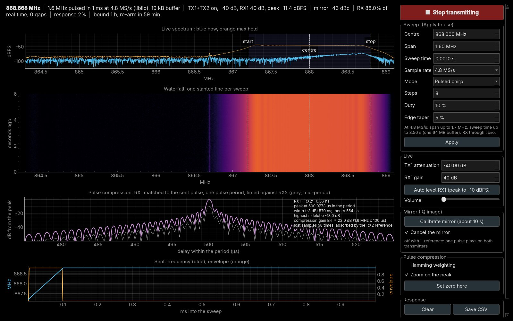

# Watching a sweep live: chirp-view

[`chirp-view`](../tools/chirp-view/README.md) is a program for your PC. It
makes TX1 play a **sweep** (a signal whose frequency moves across a band,
also called a *chirp*) from a [cyclic buffer](cyclic-buffers.md), over and
over, and shows RX1 receiving it through the bench loop, live. It is the
quickest way to see a cyclic buffer at work, to get a feel for different
sweeps, and to measure how flat the loop between TX1 and RX1 is. This page
lists what the window shows, the controls, the modes and the measurements. To
start it, see [watch a sweep live](radio/watch-a-sweep.md).

- **needs:** TX1 → **20 dB attenuator** → RX1, the Debian root, and `zc-stream` on the board for 20 MS/s
- **default sweep:** 7 MHz up-sweep, 864.5 to 871.5 MHz, every 0.8 s, at 20 MS/s
- **sweep limit:** one 64 MB DMA block: 0.83 s at 20 MS/s, 3.4 s at 4.8 MS/s
- **after auto level:** the sweep stands 73 dB above the noise
- **pulse compression:** 123 ns peak (theory 127 ns) for 7 MHz × 100 µs pulses
- **`--reference`:** ranging timed against RX2, so lost samples cannot move it; at most 5.5 MS/s
- **safety:** attenuation set after the buffer starts and read back; muted before every teardown


## What you need

- **TX1 cabled to RX1 through a 20 dB attenuator.**

    !!! danger "Never without one"
        The board puts out about +19 dBm and RX1 survives +2.5 dBm
        ([transmitter safety](transmitter-safety.md)). The program refuses a TX1
        attenuation above −10 dB, so even at that setting RX1 sees at most about
        −11 dBm.

- **The board on Ethernet,** running the modern firmware (the Debian root).
- **[`zc-stream`](../tools/stream-paths/zc-stream/README.md) installed on the
  board** for the default 20 MS/s: libiio carries about 10 MS/s at most
  ([faster streaming](streaming-paths.md)). Without it, run at 4.8 MS/s with
  `--rate 4.8e6 --span 1e6 --period 3`.
- **On the PC:** Python 3.8 or later and the packages in
  `tools/chirp-view/requirements.txt` (pyadi-iio, numpy, scipy, pyqtgraph,
  PyQt6, sounddevice).
- **No other program receiving from the board,** such as SDR++ or a Hardware
  CI run: the board has one receive buffer.

## Running it

The three commands (a venv, its packages, `chirp_view.py --fullscreen`):
[watch a sweep live](radio/watch-a-sweep.md).

The window opens transmitting: by default a 7 MHz up-sweep from 864.5 to
871.5 MHz every 0.8 s, sampled at 20 MS/s. It sets RX1's gain by itself
within a couple of seconds (*auto level*, below). **Esc** or **Q** quits; so
does closing the window or Ctrl+C in the terminal. Every way out mutes TX1 and
reads the mute back before anything else is torn down.

`--help` lists every option, grouped into the sweep, the radio, the window,
and running without a window. Everything in the sweep group can also be
changed in the window.

**The second pair.** `--channel 2` runs everything on TX2 → attenuator → RX2
instead, with TX1 held muted; the window's labels follow. It receives from
`zc-stream`'s RX2 port (5556), and keeps its own mirror calibration, because
each transmitter has its own image. The same 20 dB rule applies to that loop.

```bash
# run from: tools/chirp-view on your PC
.venv/bin/python chirp_view.py --channel 2
```

Measured on this bench with 30 dB in the TX2 loop: auto level settled RX2 at
50 dB, the sweep 65 dB over the floor, no gaps; TX2's mirror went from −51 dBc
to −64…−69 dBc with **Calibrate mirror**.

## What the window shows

| Chart | What it is |
|---|---|
| **Live spectrum** | blue: RX1's spectrum right now; orange: the highest level seen at each frequency (*max hold*). The shaded band and the dashed **start**, **centre** and **stop** lines mark the sweep you asked for |
| **Waterfall** | time runs downwards, newest at the bottom: each sweep draws one slanted line. The steady line just left of the sweep is the radios' own leakage (below) |
| **Response** | RX1's level at each frequency the sweep passes, averaged over the sweeps so far: how flat the loop is. Relative dBFS, not calibrated power |
| **Sent (theory)** | one period of what TX1 is told to send: the frequency (blue) and the amplitude envelope (orange), computed from the same numbers that make the samples |

The status line above them reads the frequency the sweep is at, the
settings, the RX1 peak level, how much of the signal arrives (*RX % of real
time*, and any *gaps* where samples were lost), the mirror level, and how
much of the response curve is filled in.

## The controls

| Control | What it does |
|---|---|
| **Start / Stop transmitting** | stop mutes TX1 and removes its buffer; the receiver keeps running, so you see the band without the sweep |
| **Centre, Span, Sweep time, Sample rate** | the sweep. The line under them says what fits at the chosen rate; Apply refuses a sweep that does not, and says why |
| **Mode, Steps, Duty, Edge taper** | the sweep's shape (below). Steps and Duty light up only for the modes that use them |
| **Apply** | re-tunes and uploads the new sweep, about 2 s; the sound goes quiet meanwhile |
| **TX1 attenuation** | live, −89.75 dB (muted) to −10 dB, written and read back from the chip |
| **RX1 gain**, **Auto level** | live. Auto level moves the gain until the sweep peaks near −10 dBFS |
| **Volume** | the sweep as a whistle: low frequencies low in pitch, high ones high |
| **Calibrate mirror**, **Cancel the mirror** | measures and removes the radios' mirror image of the sweep (below), about 10 s |
| **Clear**, **Save CSV** | restart the response curve, or save it as frequency and level |
| **Hamming weighting**, **Zoom on the peak**, **Set zero here** | the pulse-compression view (below), for short pulsed sweeps |

## Sweep modes


| Mode | What it does |
|---|---|
| **Sawtooth up / down** | a straight line across the span, then a jump back to the start |
| **Triangle** | up, then down: no jump anywhere |
| **Logarithmic** | rises in equal ratios rather than equal steps: slow at the bottom, fast at the top |
| **Sine (FM)** | the frequency swings smoothly up and down around the centre |
| **Stepped** | a staircase of *Steps* fixed frequencies, each held for an equal time |
| **Random hops** | the same frequencies in a shuffled order that repeats every period, like a frequency-hopping radio |
| **Pulsed chirp** | an up-sweep during the *Duty* fraction of the period, then silence, as a radar sends. Choosing it sets a 1 ms period and 10% duty: 100 µs pulses, 1000 a second. Periods from 0.1 ms; up to 10 ms the pulse-compression view replaces the response chart |

In the stepped and hopping modes the response curve fills in only at the
step frequencies; use a sweeping mode to measure the loop.

## Pulse compression: radar ranging on the bench

A radar has to send a **long** pulse, to put enough energy into a faint
echo, yet resolve targets as if the pulse were **short**. A chirp gives both:
the pulse lasts T, sweeps across a bandwidth B, and the receiver correlates
each echo against a copy of what was sent (a *matched filter*). The echo
collapses into a sharp peak about 1/B wide, 0.886/B at its −3 dB points, and
gains B·T in signal over noise. Two targets closer than c/(2B) merge into one
peak: that is the radar's range resolution.


In **Pulsed chirp** mode with a period up to 10 ms, the third chart becomes
the compression view: RX1 matched to the sent pulse, with every pulse folded
onto one period and averaged. Measured with the defaults (7 MHz, 100 µs
pulses, 1 ms apart):

| | Measured | Theory |
|---|---|---|
| Peak width (−3 dB) | 123 ns | 0.886/B = 127 ns |
| Highest sidelobe | −18 dB | about −13 dB for a flat-topped chirp; the soft pulse edges lower it |
| Compression gain B·T | | 28.5 dB (7 MHz × 100 µs) |

- **Hamming weighting** shapes the matched filter: sidelobes drop towards
  −40 dB and the peak gets about 1.5 times wider, the classic radar trade.
- **Set zero here** marks the peak. Add a length of cable to the loop and the
  peak moves: the readout gives the shift in nanoseconds, as metres of coax
  (signals travel at about 0.66 c in it), and as the range a radar target
  would have moved. Interpolation places the peak to a fraction of a
  sample (one sample is 50 ns at 20 MS/s); how fine that is on your bench
  is worth checking with a known cable.
- **Where the peak sits is not a distance by itself.** It includes the
  arbitrary offset between when TX1's buffer and RX1's stream started, which
  changes at every Apply. Only shifts from a zero mean anything.
- **Lost samples move the peak** (without `--reference`, below). The view counts samples to know where each
  pulse belongs. When RX1 loses some, the peak lands elsewhere: the view then
  starts its average afresh instead of smearing two positions together,
  counts the event (*re-aligned N times*), and says when a zero set earlier
  no longer holds. At 20 MS/s over Wi-Fi this happened about once a second,
  so set the zero and add the cable promptly.

### A reference receiver: ranging that lost samples cannot move

`--reference` times RX1's compressed pulse against RX2's instead of against
a sample count. Both receivers come from **one libiio buffer**, so the board
samples them at the same instants and a lost block removes the same samples
from both. Each block, the RX2 peak is put at mid-period and RX1 is moved by
the same amount; the readout is **RX1 − RX2** in nanoseconds.

```bash
# run from: tools/chirp-view on your PC
.venv/bin/python chirp_view.py --reference loops    # TX1 and TX2 play the same pulse, one per bench loop
.venv/bin/python chirp_view.py --reference split    # TX1 only, through a splitter to RX1 and RX2
```

| | |
|---|---|
| `loops` | the pulse on **TX1 and TX2 at once**, the same samples from one buffer. RX1 hears the TX1 loop, RX2 the TX2 loop, so RX1 − RX2 is the difference between the two loops. Add a cable to the TX1 loop and the readout grows by its delay. Works with the bench's two loops as they are |
| `split` | the pulse on **TX1 only**, through a splitter to both receivers, the cable under test in front of RX1. TX2 stays muted |
| rate | both receivers at 16 bits through libiio: **at most 5.5 MS/s**; it starts at 4.8 MS/s with a 1.6 MHz chirp (572 ns peak, theory 554 ns) |
| not with it | mirror calibration (one pulse plays on both transmitters), and `zc-stream`, whose two ports open the receive buffer separately |



**Measured with lost samples**, 5.5 MS/s and a 1.8 MHz chirp on the bench's
two loops, with every core of the PC loaded for 40 s so the receiver fell
behind:

| | Without `--reference` | With `--reference loops` |
|---|---|---|
| samples that arrived | (same load; not logged) | 42–77 % |
| what the losses did | peak jumped across the 1 ms period: 342, 64, 138, 192, 916 µs; 97 re-alignments | 138 losses absorbed |
| the reading | none that holds | **RX1 − RX2 = −0.44 to −0.49 ns** throughout |

The two loops' difference here is about half a nanosecond: the same cable
lengths, and the 20 dB and 30 dB pads. Even unloaded, two receivers through
libiio over Wi-Fi lost samples two or three times a second at 4.8 MS/s, and
the reading stayed at −0.56 ns.

## How it works


**One period in the board's memory.** The program computes one full period
of the sweep, uploads it as a cyclic buffer, and the FPGA replays it with
nothing more from the PC. One DMA block holds 64 MB at 4 bytes a sample, so
the sample rate decides the longest sweep: 0.83 s at 20 MS/s, 3.4 s at
4.8 MS/s. The phase is made to end exactly where it began, so the sweep
repeats without a click.

**20 MS/s on the receive side.** At 20 MS/s the samples come from
[`zc-stream`](../tools/stream-paths/zc-stream/README.md) as 8-bit samples, and
everything that touches them runs in its own process, so neither the window
nor the sound can make it miss a block. Measured over Wi-Fi: no gaps once
running.

**Offset tuning.** Both TX1 and RX1 are tuned a little below the bottom of the
sweep (0.8 MHz at 20 MS/s, 0.5 MHz at the lower rates), and the sweep is built off-centre in the transmitter's own band. Two
radio effects sit at the tuning frequency itself: the transmitter's carrier
leakage and the receiver's DC offset. Tuned this way, both land together on
the steady line left of the sweep, instead of in the middle of it.

**Edge taper, against splatter.** A sawtooth jumps from the top of the span
straight back to the bottom, and an abrupt change spreads energy across MHz
for an instant: a smear across the waterfall at every wrap. The taper fades
the sweep out over its last 2.5% and back in over its first 2.5%, so the jump
happens while the signal is nearly silent. In the generated signal it moved
the splatter more than 1 MHz from the sweep from −60 dB below the sweep to far
below anything the radio can show. Stepped and hopping sweeps smooth each
frequency change instead; pulses get soft edges.

**Auto level.** The 8-bit samples keep the top 8 of the radio's 12 bits. With
the sweep peaking at −28 dBFS it used only a few of those steps, and rounding
noise set the floor. Raised to peak near −10 dBFS, the sweep stands 73 dB
above the noise instead of 55.

## The mirror, and cancelling it

A faint copy of the sweep can appear reflected across the tuning frequency,
sweeping the other way: an **IQ image**. The radio makes I and Q, two copies
of the signal 90° apart, with analog circuits that are never perfectly
matched in gain and phase, and any mismatch leaves such a mirror. Both radios
make one. Measured with a single tone, and the two radios tuned apart so
their images separate (`mirror_test.py`):

| | Mirror, relative to the signal |
|---|---|
| Transmitter (TX1) | −58 to −61 dBc |
| Receiver (RX1), with its quadrature tracking on (the default) | −76 to −86 dBc |
| Transmitter, after **Calibrate mirror** | −78 to −84 dBc |

dBc means decibels relative to the signal itself: −60 dBc is a millionth of
its power. That is normal for this chip; the mirror shows in the waterfall
only because the waterfall's colours span most of the 73 dB between the
sweep and the noise.

**Calibrate mirror** cancels the transmitter's part. It tunes TX1 0.3 MHz
away from RX1, so that only the transmitter's image is measured, and plays a
test tone at five frequencies across the sweep. At each it measures the
image with a correction of zero and nudged four ways, and solves for the
correction that cancels it. The correction is a tiny mirrored copy of the
signal, subtracted from what is sent; each sample of the sweep gets the
correction for the frequency it is at in that instant.

- A calibration belongs to one tuning, sample rate and span. It is saved in
  `~/.cache/fishball7020/chirp_view_mirror.json` and used again
  automatically; after **Apply** with new values, calibrate once more.
!!! warning "Leave RX1's quadrature tracking on"
    Switched off, the chip drops its correction instead of holding it, and the
    receiver's own mirror rose to −32 dBc.

- The *mirror* figure in the status line cannot go below about −70 dBc at
  20 MS/s: the 8-bit samples' noise sits there. The calibration's own numbers
  are the measure.

## Running without a window

```bash
# run from: tools/chirp-view on your PC
.venv/bin/python chirp_view.py --check                       # build and check the buffer: no board
.venv/bin/python chirp_view.py --measure 5                   # measure 5 sweeps on RX1: span, period, gaps
.venv/bin/python chirp_view.py --calibrate-mirror            # calibrate the mirror for these settings
.venv/bin/python chirp_view.py --shape triangle --save       # window; response saved to CSV on exit
```

`--measure` reads the span about 5% short with the default edge taper: the
faded first and last 2.5% of each sweep are left out on purpose.

## Safety, and the 60 s bound

- TX1's attenuation is set only after the buffer starts, read back, and
  rewritten until the chip agrees; TX2 stays muted.
- Every way out, and every Apply, mutes TX1 and reads the mute back
  **before** the buffer is torn down.
- The firmware mutes any cyclic transmit after 60 s
  (`tx_cyclic_timeout_ms`), so a forgotten one cannot run for days. While
  chirp-view runs it raises that to **one hour** and re-arms the buffer once
  an hour; on exit it puts the old value back.
- If the program is killed outright, the board mutes TX1 by itself when the
  connection drops, and its receiver process ends with it. The bound then
  stays at one hour until the next reboot, or until you put it back:

    ```bash
    # run from: the board
    echo 60000 > /sys/bus/iio/devices/iio:device2/tx_cyclic_timeout_ms
    ```

## When something is wrong

| Symptom | Cause | Fix |
|---|---|---|
| "zc-stream closed the stream: is another program receiving?" | another program holds the board's receive buffer: SDR++, a script, a Hardware CI run | close it; the window restarts its receiver by itself, up to five times |
| "RX: … Connection refused", and nothing arrives at 20 MS/s | the `zc-stream` service is not installed or not running on the board | [install it](../tools/stream-paths/zc-stream/README.md), or run at `--rate 4.8e6` |
| Apply refuses the sweep | it does not fit beside DC at that rate, or its period needs more than 64 MB | the line under the controls says what fits; lower the period or raise the rate |
| The mirror shows again after changing the sweep | the calibration belongs to the previous settings | press **Calibrate mirror** |
| "CLIPPING" in the status line | RX1's gain is too high for the signal | press **Auto level**, or lower RX1 gain |
| The window opens tiled instead of full screen | the window manager ignores the program's full-screen request | use the window manager's own full-screen key |
