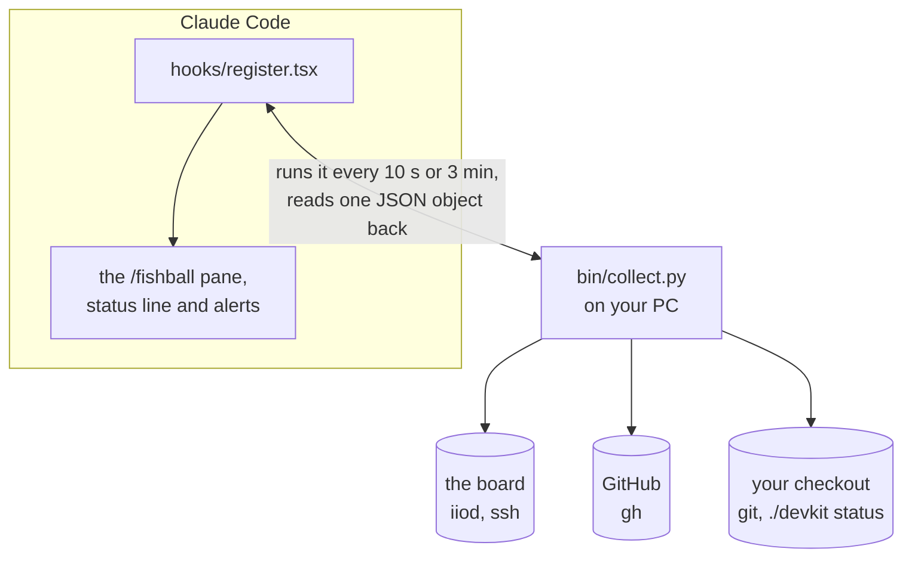

# The board in a Claude Code pane

A side pane in [Claude Code](https://claude.com/claude-code) that shows the
board while you work: which links reach it, both die temperatures, the radio's
settings, CI, and the firmware it runs against the build in your checkout. It
refreshes on its own, puts a one-line summary under the prompt, and pops up an
alert when something changes. The short version is
[watch the board from Claude Code](radio/watch-from-claude-code.md).

The words, first:

- **Claude Code** is Anthropic's AI coding assistant. It runs in a terminal,
  and also in VS Code and a desktop app.
- A **plugin** is a folder Claude Code loads when it starts, adding commands
  and panels to it. This one is [`tools/claude-pane/`](../tools/claude-pane/).
- A **pane** is a panel beside the conversation. `/fishball`, typed at Claude
  Code's prompt, opens this one.
- **CI** (continuous integration) is the set of GitHub Actions checks that run
  on every push to this repo.

> [!NOTE]
> It only reads. Nothing in it writes a radio attribute, starts a buffer or
> changes the board; on ssh it runs one command, `cat /proc/uptime /proc/loadavg`.
> It is safe to leave open while another program transmits.

## What you need

- **Claude Code.** The plugin is tested against version 2.1.289
  (`claude --version`). Its plugin interface is early access and can change
  between releases.
- **`python3`** on your PC: it runs the collector that reads the board.
- For the 🐙 GitHub section, the GitHub CLI logged in: `gh auth login`.
- For the 🔗 libiio link, libiio's `iio_info`, from the `libiio-utils`
  package.
- For uptime and load, the board's ssh key: `./devkit ssh-key`.

Without the last three, the GitHub section shows `gh`'s error, the libiio
link stays ○ and uptime is left out; the rest still works.

## Start it

```bash
# run from: the repo root
./devkit claude-pane start          # Claude Code here, with the pane open
./devkit claude-pane                # where the plugin is, and whether it is installed
./devkit claude-pane install        # load it in every Claude Code session
./devkit claude-pane uninstall      # stop loading it
./devkit claude-pane test           # its manifest check and tests (needs `claude`)
```

`start` runs Claude Code in the repo root, so the devkit's agent skill loads
too, with the plugin for that session (`claude --plugin-dir tools/claude-pane`)
and `/fishball` as its first command. Options after `start` go to Claude Code,
before that command: `./devkit claude-pane start --model sonnet`. It warns when
your Claude Code is not the version CI tests against.

`install` adds `tools/claude-pane` to `CLAUDE_CODE_PLUGIN_DIRS` in the `env`
block of `~/.claude/settings.json`, and changes nothing else in that file.
Every Claude Code session started afterwards loads it, wherever you start it;
type `/fishball` to open the pane. `start` then leaves out `--plugin-dir`, so
the plugin is not loaded twice.

**You should see:** the VMAT mark and `Fishball7020` at the top, then four
sections filling in within a few seconds: 📡 Board, 📻 Radio, 🐙 GitHub and
🔨 Build. The top line says when it last updated and when it next will.

## What it shows

| Section | What | Refreshed |
|---|---|---|
| 📡 Board | each link (🔌 USB, 🌐 Ethernet, 🔗 libiio) as ● up or ○ down, all three at once when the board is on more than one; model, firmware and kernel; ⏱ uptime and ⚡ load; a gauge per die temperature with that die's recent readings under it | every 10 s |
| 📻 Radio | RX and TX LO, sample rate, RX and TX bandwidth, and per channel the RX gain, gain mode and TX attenuation | every 10 s |
| 🐙 GitHub | stars, forks, open PRs and issues, the latest run of each workflow on `main`, and the self-hosted runners (the PCs that run CI against a real board) | every 3 min |
| 🔨 Build | `git describe` of your checkout, the last modern build, and the firmware the board runs against it: the same build, or how many commits it is behind | every 3 min |

The temperature gauges are green below 68 °C, yellow from 68 °C and red from
80 °C: 80 % and 94 % of 85 °C, the same levels [`./devkit temps`](../tools/temps.py)
warns at. The board has only the two die sensors; see `./devkit temps --help`.

```text
Zynq   76.7°C ━━━━━━━━━━━━━━━━━━━━━━━━━━━━━━━━━━━━━━━━━━━━━━━━━━━━━━──────
        76–77                                                    ▄▄▄▃▄▄▄▆▅
```

Each gauge spans 0 to 85 °C. The trend under it is a sparkline (a chart of
one bar per reading, newest on the right) as wide as the gauge, up to the
last 60 readings. Each die's trend is scaled to its own lowest and highest
reading, which are printed at its left (`76–77`), so a change of a degree
still shows.

**The status line** under the prompt reads like `fishball ● USB+Ethernet 71°C CI ✓`,
naming every network link that is up (libiio only when none is), and stays
current with the pane closed: a board-only read once a minute.

**Alerts** appear only on a change: the board connecting or disconnecting, a
die crossing 68 °C or 80 °C either way, a workflow on `main` going from
passing to failing or back (a run on a pull request's branch counts for
neither). A read that fails once is not reported as a disconnect.

`R` or the Refresh button reads everything at once.

## How it works

A Claude Code plugin is a folder that Claude Code loads when it starts. This
one has three parts:



1. **The manifest**, [`.claude-plugin/plugin.json`](../tools/claude-pane/.claude-plugin/plugin.json),
   names the plugin (`fishball-stats`), its two [settings](#settings) and its
   hooks module.
2. **The hooks module**, [`hooks/register.tsx`](../tools/claude-pane/hooks/register.tsx),
   answers events from Claude Code:
    - when a session starts, it registers `/fishball` and starts a slow timer:
      a board-only read once a minute, for the status line;
    - `/fishball` opens the pane and switches to the fast timers: board and
      radio every 10 s, GitHub and the build every 3 min;
    - each timer runs the collector and merges what it prints into the
      session's state; a change there redraws the pane, and a transition (the
      board connecting, a die crossing a level, CI on `main` turning) becomes
      an alert;
    - closing the pane goes back to the slow timer.
3. **The collector**, [`bin/collect.py`](../tools/claude-pane/bin/collect.py),
   does all the reading, with the devkit's own tools: `board_addr.py` finds the
   board, `iiod_min.py` speaks to iiod and `board_info.py` names the firmware.
   It prints one JSON object. Each section is read on its own, inside a 20 s
   deadline, so a missing board or a logged-out `gh` empties only its own
   section.

The hooks module is TypeScript, and Claude Code runs it in a sandbox of its
own, without Node: it reaches timers, processes and the screen only through
Claude Code's interface. That is why the reading is a Python program it
starts, and why you can run that program yourself and see exactly what the
pane sees.

In an interactive session Claude Code watches the plugin's folder: saving a
file reloads the hooks module. The pane keeps its last snapshot across a
reload, because that lives in the session's state, not in the module.

## How it finds the board

It knows no address of its own. It looks everywhere
[`tools/board_addr.py`](../tools/board_addr.py) looks (`fishball.local`,
`Fishball7020.local`, `pluto.local`, the USB address, and `$BOARD` or
`$SDR_URI` when set), all at once, and probes every address each name
resolves to, not only the first.

With the USB cable and Ethernet both in, the board has an address on each,
and your PC's name lookup often hands back only one of them for
`fishball.local`. So once one link answers, the collector also asks the
board which addresses it holds (in the ssh command that reads its uptime)
and probes those too. Each address that answers is sorted by the interface
the route to it leaves on:

| Link | It is | Read over |
|---|---|---|
| 🔌 USB | the route leaves on the board's own USB network interface (vendor `0456`) | iiod, the board's server for radio settings |
| 🌐 Ethernet | any other route: a direct cable, a switch, your LAN | iiod |
| 🔗 libiio | `iio_info -s` lists the board as a `usb:` context, with no network involved | `iio_attr` over USB (libiio is the library programs use to reach the radio) |

It reads over the first of USB and Ethernet that answers, and falls back to
libiio over USB. Over libiio there is no ssh, so uptime and load are missing.

| If | Then |
|---|---|
| **libiio is ● but USB is ○** | the cable is in, but your PC's USB network interface has no address. Give it one in the board's USB subnet, e.g. `192.168.2.10/24`, and set that profile to connect by itself: `nmcli con mod <profile> connection.autoconnect yes`, then `nmcli con up <profile>` |
| **Ethernet is ○ on a direct cable** | set up the PC's side as in [a direct cable to your PC](networking.md#a-direct-cable-to-your-pc) |
| **Ethernet says `<address> on the board, no answer from here`** | the board has a network address, but your PC cannot reach it: the two are on different networks, or a firewall is in between. Put the PC on the board's network, or use the USB link |
| **everything is ○** | the board is off, still booting (about 40 s), or on a USB port that cannot power it; see [reaching the board](networking.md#reaching-the-board) |
| **the board's ● but uptime is missing** | ssh did not log in with `~/.ssh/fishball` (or `$FISHBALL_SSH_KEY`); `./devkit ssh-key` sets that up |

## Settings

In Claude Code's `/config` menu, under the plugin:

| Setting | Default | What |
|---|---|---|
| Devkit repo | empty: the checkout the plugin sits in | another checkout to read the build and the tools from |
| Poll the board while the pane is closed | on | the once-a-minute read that keeps the status line current |

## Changing it

| File | What |
|---|---|
| [`bin/collect.py`](../tools/claude-pane/bin/collect.py) | everything it reads, as one JSON object. Run it on its own: `python3 tools/claude-pane/bin/collect.py --sections board,radio` |
| [`hooks/register.tsx`](../tools/claude-pane/hooks/register.tsx) | the pane, the timers, the status line and the alerts |
| [`types/index.d.ts`](../tools/claude-pane/types/index.d.ts) | the shape of what it keeps |
| [`tests/pane.test.ts`](../tools/claude-pane/tests/pane.test.ts) | the tests `./devkit claude-pane test` runs, against a faked collector |

With the plugin loaded through `--plugin-dir` or `install`, Claude Code reloads
it when a file changes; a hook that fails says so in a dim line in the
transcript. The plugin API is early access and moves between Claude Code
releases: CI tests it against one pinned version, named in
[`host-tools.yml`](../.github/workflows/host-tools.yml).
