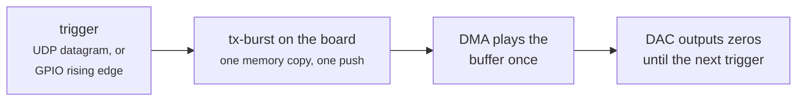

# Cyclic buffers and triggers

The board can transmit in three ways. They differ in who supplies the samples
while the radio runs, and that decides how fast you can go and how precisely you
control timing:

| | **Streaming** | **Cyclic** | **One-shot, triggered** |
|---|---|---|---|
| What happens | your program keeps sending new samples | the board replays one buffer from its own memory until stopped | the board plays a prepared buffer once per trigger, then goes quiet |
| Who feeds the radio while it runs | your PC or program, without pause | the FPGA's DMA engine, alone | the DMA engine, once per trigger |
| Fastest rate | about 5 MS/s from a PC ([throughput](modulation-and-throughput.md)) | 61.44 MS/s on both transmitters | 61.44 MS/s on both transmitters |
| Timing | set by your program and the network | sample-exact repetition; starts when software enables it | starts a software delay after the trigger; plays sample-exact |
| Use it for | live, changing signals: a modem, an audio transmitter | test tones, calibration patterns, beacons, radar chirps, anything periodic | a packet, a chirp or a pulse on demand, from a sensor or another computer |

The **DMA engine** is the FPGA hardware that moves samples between the board's
memory and the radio chip. Once a cyclic or one-shot buffer is in memory, it
needs nothing from the network or the CPU to play, which is why both reach the
radio's full rate.

To see a cyclic buffer at work, with a live waterfall of TX1 heard on RX1,
run [chirp-view](chirp-view.md).

This page covers cyclic buffers, then one-shot bursts on a trigger, then
triggering other equipment. The short version on triggers: the board can send
a trigger **out**, locked to the exact sample. A trigger **in** is
software-timed, because the FPGA design this board ships has no hardware
trigger input.

!!! danger "Read [transmitter safety](transmitter-safety.md) first"
    The board puts out about +19 dBm and its receivers survive only +2.5 dBm: never
    loop TX into RX without at least 20 dB of attenuation, and transmit only where
    you are allowed to. Three rules apply to every example below:

    - **Set the TX attenuation after the buffer starts, and read it back.**
      Starting a buffer restores a cached attenuation, which can be louder than
      what you set before it.
    - **Mute before you stop the buffer, never after.** Stopping caches whatever
      attenuation it finds, for the next buffer to restore.
    - **The devkit's own transmitting tools** refuse to raise the output until you
      run `./devkit tx-guard affirm 0` (or `1`) on your PC. Your own code is not
      checked, so the rules are yours to follow.

## Designing a waveform for a cyclic buffer

A cyclic buffer plays its last sample and goes straight on to its first. Four
things decide whether that join is invisible:

- **Whole periods.** A tone at `f` in a buffer of `N` samples at rate `fs` must
  complete a whole number of cycles: `f × N / fs` must be an integer. At
  30.72 MS/s, a 1 MHz tone fits exactly in 3840 samples (125 cycles); in 4096
  it does not, and each repeat jumps in phase, which spreads spurs across the
  spectrum. For several tones, `N` must work for all of them; for a chirp,
  make the buffer exactly one sweep, or a whole number of them.
- **A length that is a multiple of 16 samples.** The DMA rounds other lengths, so
  a 16385-sample buffer does not play as 16385 samples.
- **Headroom.** Samples are 16-bit, full scale ±32767, and the 12-bit DAC uses
  their top 12 bits. A single tone can use about half of full scale. Signals
  with high peaks (OFDM, several tones added) need more room, or the peaks clip
  and splatter: [the modulation gallery](modulation-gallery.md) shows the effect.
- **Memory.** A buffer takes `4 bytes × samples × channels`: a 1 ms chirp at
  61.44 MS/s on both transmitters is 491 520 bytes. One DMA block holds up to
  64 MB by default, and the board has 1 GB.

## Cyclic buffers from Python

[pyadi-iio](https://github.com/analogdevicesinc/pyadi-iio), Analog Devices'
Python package, plays a cyclic buffer with one setting, `tx_cyclic_buffer`:

```python
# run from: your PC.  pip install pyadi-iio numpy
import adi, numpy as np

sdr = adi.ad9361("ip:192.168.2.1")      # or ip:fishball.local over Ethernet
sdr.tx_enabled_channels = [0]           # TX1
sdr.sample_rate = 30_720_000            # shared by RX and TX on this chip
sdr.tx_lo = 433_920_000                 # a licence-free band
sdr.tx_cyclic_buffer = True             # play the buffer forever

N  = 3840                               # exactly 125 cycles of 1 MHz at 30.72 MS/s
n  = np.arange(N)
iq = 0.5 * 2**15 * np.exp(2j * np.pi * 1e6 * n / sdr.sample_rate)

sdr.tx(iq)                              # starts it; returns at once
for _ in range(10):                     # AFTER the start: set, then read back
    sdr.tx_hardwaregain_chan0 = -40     # dB; -89.75 is muted, 0 is maximum
    if abs(sdr.tx_hardwaregain_chan0 + 40) < 0.3:
        break
else:
    raise RuntimeError("TX attenuation did not apply")

input("transmitting - press Enter to stop")
sdr.tx_hardwaregain_chan0 = -89.75      # mute FIRST...
assert sdr.tx_hardwaregain_chan0 <= -89.0
sdr.tx_destroy_buffer()                 # ...then stop
```

**Both transmitters at once** come from one buffer, so they start together and
stay sample-aligned. This is what beamforming and two-port measurements need:

```python
# run from: your PC, continuing from the example above
sdr.tx_enabled_channels = [0, 1]        # TX1 and TX2
sdr.tx([iq_tx1, iq_tx2])                # two arrays of the same length
# then set and read back tx_hardwaregain_chan0 AND tx_hardwaregain_chan1
```

**To change the waveform**, mute, `tx_destroy_buffer()`, then `tx()` the new one
and set the attenuation again.

!!! note "A running cyclic buffer cannot be swapped seamlessly"
    The output stops for the moment in between. To switch between waveforms without
    a gap, put them all in one long buffer and select between them with the
    sample-locked pins on the receiving side, or use one-shot bursts (below).

## Cyclic buffers from the command line

`iio_writedev` (from the `libiio-utils` package, on your PC or on the board)
plays a file cyclically with `-c`. The file is raw 16-bit samples, I then Q,
for each channel in turn, and `-b` must be its length in samples, so the
whole file is one buffer:

```bash
# run from: the board (or your PC, with -u ip:192.168.2.1 instead of local:)
# tone.iq: 16384 samples of TX1 I,Q as int16 = 65536 bytes
iio_writedev -u local: -c -b 16384 cf-ad9361-dds-core-lpc voltage0 voltage1 < tone.iq &
sleep 0.5
iio_attr -u local: -o -c ad9361-phy voltage0 hardwaregain -40     # after the start
iio_attr -u local: -o -c ad9361-phy voltage0 hardwaregain         # and read it back
# ... and to stop: mute first, then end the writer
iio_attr -u local: -o -c ad9361-phy voltage0 hardwaregain -89.75
kill %1
```

`iio_writedev` keeps running while the buffer plays, and ending it stops the
buffer. `voltage0 voltage1` is TX1; add `voltage2 voltage3` for TX2 as well,
with the file interleaving I1, Q1, I2, Q2.

## The board's limits on cyclic buffers

| Limit | What it does | How to change it |
|---|---|---|
| **60 s bound** (modern firmware) | mutes a cyclic transmit 60 s after it started, so a forgotten one does not run for days | `fw_setenv tx_cyclic_bound 0` on the board turns it off from the next boot; `<ms>` sets another length. This boot only: `echo 0 > /sys/bus/iio/devices/iio:device2/tx_cyclic_timeout_ms` |
| **First-block time** (v2.3 and later) | a large buffer gets 250 ms plus 1 ms per kB to arrive before the starve watchdog may mute it, at most 10 s: a 4.46 MB buffer gets 4.7 s | `fw_setenv tx_starve_ms <ms>` changes the watchdog itself (`0` = off) |
| **Largest buffer** | 64 MB per DMA block by default | `fw_setenv iio_max_block_size <bytes>` |
| **Length** | the DMA rounds some lengths | use a multiple of 16 samples |

Details and the reasoning behind each: [transmitter safety](transmitter-safety.md#cyclic-transmits-and-the-60-s-bound).

!!! danger "Never engage the FPGA's ÷8 transmit interpolator"
    (Setting the DDS core's rate to an eighth of the chip's.) On this board TX1 then emits nothing.

## One-shot bursts on a trigger

Sometimes the signal should go out **once, when something happens**: a radar
pulse when a sensor fires, a packet when another computer asks, a chirp at the
start of each measurement. The board does this with a **non-cyclic** buffer:
the DMA plays it to the end, runs out of samples, and the DAC outputs zeros
until the next one. "Triggering" means pushing the prepared buffer at the right
moment.

[`tools/tx-burst`](https://github.com/matsvandamme/fishball7020-fpga-devkit/tree/main/tools/tx-burst)
is a small program that runs on the board and does exactly that. It loads the
burst once, prepares the transmit buffer, and then waits for a trigger:

- **a network packet:** any UDP datagram to the port you choose;
- **a GPIO edge:** a rising edge on one of the JP5 pins, used as an input.



Running on the board, with no network between the program and the radio, keeps
the copy-and-push short.

```bash
# run from: the board. Build once (apt install gcc make libiio-dev), or copy a binary built elsewhere.
make -C tx-burst
# play burst.iq once per UDP datagram to port 5556, TX1 at -40 dB:
./tx-burst/tx-burst -f burst.iq -u 5556 -a -40
```

```python
# run from: any computer that can reach the board - fires one burst
import socket
s = socket.socket(socket.AF_INET, socket.SOCK_DGRAM)
s.sendto(b"fire", ("fishball.local", 5556))
print(s.recv(64).decode())             # "fired 1 139": burst number, microseconds to queue it
```

| Option | Meaning |
|---|---|
| `-f FILE` | the burst: int16 I,Q per sample for TX1; with `-2`, I1,Q1,I2,Q2 for both transmitters |
| `-u PORT` | trigger on a UDP datagram; the sender gets back `fired N LATENCY_US` |
| `-g LINE` | trigger on a rising edge of GPIO line `LINE`: 72 to 75 are JP5 pins 7, 9, 11 and 13, 3.3 V |
| `-a DB` | TX attenuation while armed, from -89.75 (muted, the default) to 0 |
| `-m` | markers: JP5 pin 11 pulses on each burst's first sample, JP5 pin 13 is high while it plays; bits 0 and 1 (pins 7 and 9) stay whatever your file has |
| `-n COUNT` | exit after COUNT bursts |

**What was measured** (8192-sample burst, TX1 muted, markers on, a Saleae logic
analyser on JP5):

| | Measured |
|---|---|
| **Each trigger plays the burst exactly once**, at its exact length | five UDP triggers gave five bursts of 266.67 µs at 30.72 MS/s, and five of 2730.66 µs at 3 MS/s, both 8192 samples, with every sample present (a counter in bits 0 and 1 shows no gap) and nothing between bursts. The start-of-burst pulse on pin 11 coincides with the burst to the analyser's 20 ns resolution |
| **The board's DMA underflow counter** | went up by exactly one per burst (21 to 26 for five), and not at all while armed and waiting |
| **Trigger to burst queued** | **90 to 200 µs**, on the board's own clock. The time from that to the first sample at the antenna (the DMA start plus the AD9361's own delay) has not been measured, nor has its jitter |
| UDP round trip from a PC on Wi-Fi | 2 to 3 ms: over a network the network decides the timing, not the board |

!!! warning "When a burst ends, the pins can glitch for under 20 ns"
    As they drop to zero (one logic-analyser sample, against 333 ns per sample at
    3 MS/s): seen as a brief high on pin 11 or pin 7 at the end of some bursts. To
    trigger other equipment on a burst, use **pin 13's rising edge**, which is
    clean, rather than pin 11.

Things to know:

| | |
|---|---|
| **The starve watchdog is off while `tx-burst` runs** | between bursts the DAC is starved on purpose, and the watchdog would otherwise mute the transmitter and switch it to its built-in tone generator. `tx-burst` restores it when it exits |
| **The attenuation stays at `-a` while armed** | between bursts the DAC outputs zeros, so only the LO's leakage leaves the port, at that attenuation |
| **A GPIO trigger and the markers cannot share the pins** | the four free 3.3 V pins are the sample-locked marker pins, and with markers on the FPGA drives all four. Use `-m` with a UDP trigger, or `-g` without `-m` |
| **Triggers faster than the bursts play queue up** | in the four kernel blocks it asks for, and then the next trigger waits. That follows from how it is built; it has not been measured |

!!! warning "From your own PC code instead"
    pyadi-iio's `tx_cyclic_buffer = False` plays each `tx()` once. Each call then
    crosses the network, and you must turn the starve watchdog off yourself
    (`fw_setenv tx_starve_ms 0`, or `echo 0 > .../tx_starve_timeout_ms` for this
    boot), or the first gap longer than 250 ms mutes the transmitter.

## Triggering other equipment: a pulse locked to the samples

The board's four **sample-locked GPIO pins** (JP5 pins 7, 9, 11 and 13) carry
the low 4 bits of every transmit sample, bits the 12-bit DAC discards. Set a
bit in the sample where you want a trigger, and that pin goes high for exactly
that sample, every time the buffer plays. A scope, a logic analyser or an
external switch can trigger on it:

```python
# run from: your PC, before sdr.tx() in the cyclic example above
i16 = iq.real.astype(np.int16)
q16 = iq.imag.astype(np.int16)
marker = np.zeros(N, dtype=np.int16)
marker[0] = 0b0100                       # bit 2 = JP5 pin 11, high on sample 0 only
i16 = (i16 & ~np.int16(0x000F)) | marker # LAST step: clear the low 4 bits, put the marker in
iq = i16.astype(np.complex128) + 1j * q16.astype(np.complex128)
# and turn the pins on (an attribute pyadi-iio does not expose):
import iio
iio.Context("ip:192.168.2.1").find_device("cf-ad9361-dds-core-lpc").attrs["tx_sample_gpio_en"].value = "1"
```

- **It is exact to the sample.** Measured with a logic analyser: every marker
  arrives, in order, with both transmitters running a 4.46 MB cyclic buffer at
  40 and 60 MS/s, from the very first block on
  ([measured results](tx-gpio-bitmap.md#measured-results)), and on every
  one-shot burst above.
- **OR the marker in last**, after any scaling or conversion, or those steps
  overwrite it.

!!! warning "The pin leads the RF"
    By a constant delay of roughly a microsecond, the time the samples take through
    the AD9361. That delay has not been measured; calibrate it once in your setup if
    it matters.

Everything else about the pins (levels, all four bits, clocks and frame
signals) is on [sample-locked GPIO](tx-gpio-bitmap.md).

## A hardware trigger in: not in the FPGA design this board ships

A trigger input that starts the DMA in hardware, with no software in between,
does not exist on this board. The radio's FPGA core has an input for one
(`dac_sync_in`), but the block design leaves it unconnected, and the core
reports that it has no external sync. The `sync_start_enable` attribute on both
the transmit and receive cores therefore offers only `arm`, which on this board
just restarts the transmit core's internal timing. It waits for nothing.

So every trigger in is software-timed: `tx-burst` above is the fast form of it.
Two more ways around the limit:

- **Measure the offset instead of triggering.** Both transmitters and both
  receivers share one clock. Once a cyclic transmit and a receive capture are
  both running, the offset between them stays constant until either restarts:
  find it once by correlating the received signal (through a loop with at least
  20 dB of attenuation) against the transmitted one.
- **Wire a trigger in.** Connecting `dac_sync_in` to a free pin in the block
  design and rebuilding the bitstream would add one. That is an FPGA change,
  untested here; [the stock block design](block-design.md) is the place to
  start.
