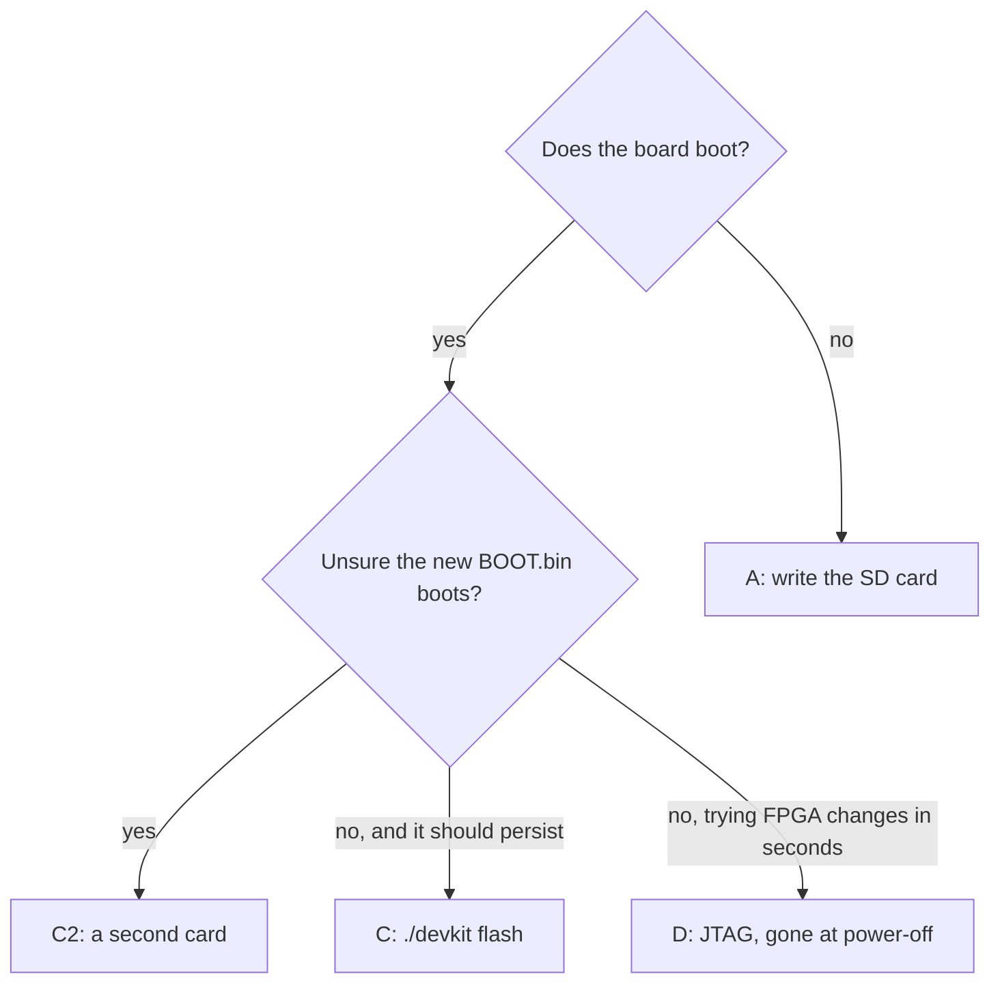

# Flashing the board, and checking what it runs

How to get a build onto the board and confirm afterwards that the board is
running it. Build first: [Building your own firmware](building.md).

!!! danger "Never flash with DFU on this board"
    It has bricked units, and it cannot replace `BOOT.bin` at all.

!!! abstract "Key facts"
    - **`./devkit flash`** rewrites the running board's own SD card: backed up, md5-checked before the swap, about 40 s with the reboot.
    - The old files stay on the card as `*.prev` and on your disk in `firmware/.flash-backups/<stamp>/`.
    - **`./devkit verify --board`** is what proves the board runs your build.
    - The **BOOT switch must be in SD mode** (`0 0`): a board in QSPI mode ignores the card, which looks exactly like a failed build.

## Which way to flash



| | When | Updates `BOOT.bin` (the bitstream)? |
|---|---|---|
| **C: `./devkit flash`** | most of the time; the board is running | yes |
| **A: SD card** | the board no longer boots, or a new Debian card | yes |
| **C2: a second card** | trying a `BOOT.bin` you are unsure of | yes, on the spare card |
| **D: JTAG** | trying FPGA changes in seconds; gone at power-off | no |
| B: DFU | **never on this board** | no |

## Option C — over SSH, from the running board (no card removal)

If the board still boots, it rewrites its own SD card: mount the FAT boot
partition, replace the files, reboot. This is the only remote option that
updates the FPGA bitstream.

```bash
# run from: the repo root
./devkit flash              # BOOT.bin + uImage
./devkit flash --target factory --all   # every file on the boot partition (factory target only)
./devkit flash --boot-only  # BOOT.bin only: an HDL or bitstream change
./devkit flash --kernel-only
./devkit flash --dtb-only
./devkit flash --target factory --kernel-only  # the Linux 5.15 build
```

It backs up the current files, checks the md5 of each new file on the board
before swapping it in, unmounts cleanly and reboots (about 40 seconds). The
previous files stay on the card as `*.prev` and on your disk in
`firmware/.flash-backups/<stamp>/`.

| A new kernel that… | Undo it by |
|---|---|
| does not boot | putting the `.prev` file back from a card reader |
| boots but misbehaves | another `--kernel-only` |

- **Which build:** `firmware-modern/output/` by default (the devkit sets
  `FW_OUTPUT` for `tools/flash.sh`); `--target factory` flashes
  `firmware/output/`. The file names are the same, so the flag is the only
  difference.
- `--all` and `--rootfs-only` are refused for the modern target: the Debian
  root cannot be swapped over the network. Write a card (Option A).
- On Buildroot `/dev/mmcblk0p1` is **unmounted**; on Debian it is **already
  mounted at `/boot`**. `./devkit flash` handles both.

By hand, the same steps:

```bash
# run from: firmware/ on your host (BOARD is the running board)
BOARD=root@192.168.2.1

# 0. Find the boot partition: /boot on Debian; on Buildroot, mount it at /tmp/sd.
SD=$(ssh $BOARD 'findmnt -n -o TARGET -S /dev/mmcblk0p1 || { mkdir -p /tmp/sd && mount /dev/mmcblk0p1 /tmp/sd && echo /tmp/sd; }')
echo "$SD"

# 1. Back up what is on the card now. This is your way back.
ssh $BOARD "cat $SD/BOOT.bin" > BOOT.bin.rollback
ssh $BOARD "md5sum $SD/BOOT.bin"
md5sum BOOT.bin.rollback                      # the two must match

# 2. Copy the new file in beside the old one, and check it before swapping.
scp output/BOOT.bin $BOARD:$SD/BOOT.bin.new
ssh $BOARD "md5sum $SD/BOOT.bin.new"          # must match: md5sum output/BOOT.bin

# 3. Swap, flush, reboot. (If you mounted /tmp/sd yourself, unmount it before rebooting.)
ssh $BOARD "cd $SD && cp BOOT.bin BOOT.bin.prev && mv BOOT.bin.new BOOT.bin && sync && reboot"
```

!!! warning "Do the backup step"
    A bad `BOOT.bin` means the board does not boot, and recovery then needs a card
    reader. Check the md5 *before* the `mv` and keep the rollback copy until the new
    firmware has proved itself.

## Option A — SD card (always works)

=== "firmware-modern/ (Debian)"

    A 128 MB FAT partition for the four boot files, an ext4 partition with the
    unpacked Debian root, and a `uEnv.txt` that boots from it. One command does all
    of it (it runs `firmware-modern/debian/write-card.sh`):

    ```bash
    # run from: the repo root. DESTROYS everything on the card
    ./devkit write-card --dry-run /dev/sdX    # checks the device, writes nothing
    sudo ./devkit write-card /dev/sdX
    ```

    !!! danger "Check the device name yourself"
        It refuses non-removable disks, but this command can destroy data you care about.

=== "firmware/ (Buildroot)"

    One FAT32 partition, five files.

    ```bash
    # run from: firmware/
    cp output/{BOOT.bin,devicetree.dtb,uEnv.txt,uImage,uramdisk.image.gz} /path/to/sd-card/
    ```

=== "Windows"

    With no clone and nothing installed: put `write-card.cmd` from the release next
    to its other files and double-click it. It makes the same two partitions (the
    root as ext3, which the kernel mounts with its ext4 driver) and backs up the
    card first. Step by step: [writing the card on Windows](windows-sd-card.md).

Then eject, insert, power-cycle. If the board comes up with old firmware or not
at all, check the [BOOT switch](#boot-modes-boot-dip-switch) is in SD mode.

## Option C2 — a second card, when you do not want to risk the first

The safest way to try a `BOOT.bin` you are unsure of (a new FSBL especially) is
to boot a different card:

```bash
# run from: the repo root, with a blank card in a reader
./tools/make-sd-card.sh /dev/sdX --dry-run            # check the target first
./tools/make-sd-card.sh /dev/sdX --boot-bin /path/to/BOOT.bin
```

- It writes the factory layout (one FAT32 partition, five files, Buildroot RAM
  disk). Power off, swap cards, power on; if it fails, swap back.
- It refuses anything but a removable USB/MMC whole disk, a disk holding `/` or
  `/home`, or a mounted one, and makes you type the device name back.
- It also gives you the spare bootable card every recovery note here assumes.

## Option D — JTAG (temporary, but the fastest HDL loop)

JTAG is a hardware debug interface that loads a bitstream straight into the
FPGA in seconds.

| | |
|---|---|
| lasts | until power-off (**volatile**); `BOOT.bin` is not updated |
| cable | the **debug port** (JTAG is interface 0), **and keep the USB 2.0 port connected too**: the debug port powers the board and the USB port carries the network |
| D1, halted at U-Boot | quick; fine if the AXI topology has not changed |
| D2, full JTAG bootstrap | robust: initialises the PS for the new bitstream |

**One-time setup**, in a real terminal on the machine the board is plugged into
(`sudo` needs a TTY; rules installed in a VM do not affect the host). Without
it Vivado reports `ERROR: [Labtoolstcl 44-199] No matching targets found`:

```bash
# run from: anywhere, on your host
sudo cp /tools/Xilinx/Vivado/2022.2/data/xicom/cable_drivers/lin64/install_script/install_drivers/*.rules \
        /etc/udev/rules.d/
sudo udevadm control --reload-rules
sudo udevadm trigger
```

Replug the debug cable; the USB node should show `crw-rw-rw-`. In Vivado,
`open_hw_manager; connect_hw_server; get_hw_targets; open_hw_target;
get_hw_devices` should list the Digilent cable, then `arm_dap_0 xc7z020_1`.

!!! danger "Never program while Linux is running"
    Its drivers are bound to the old programmable logic (PL, the FPGA half of the
    chip), and swapping it hangs the system.

**D1. Quick: halted at U-Boot.** Open the debug UART, power-cycle, press a key
within 3 s to stop at `Pluto>`. Program with **Hardware Manager → Auto Connect
→ right-click `xc7z020_1` → Program Device**, or:

```tcl
# run from: the Vivado Tcl console on your host (any directory; the path is absolute)
open_hw_manager
connect_hw_server
open_hw_target
current_hw_device [get_hw_devices xc7z020_1]
set_property PROGRAM.FILE \
  {<repo>/firmware/src/hdl/projects/pluto/pluto.runs/impl_1/system_top.bit} \
  [current_hw_device]
program_hw_devices [current_hw_device]
```

Then type `boot` at `Pluto>`. Success prints `End of startup status: HIGH`;
`LOW` means the bitstream did not load. The PS↔PL level shifters (PS: the ARM
half) were set up for the previous bitstream, which is usually fine if the AXI
topology has not changed; otherwise use D2.

**D2. Robust: full JTAG bootstrap** (ADI's flow; initialises the PS for the new
bitstream). `ps7_post_config` must come after the bitstream, because it enables
the level shifters and releases the PL resets:

```tcl
# run from: firmware/src/hdl/projects/pluto on your host, as: xsdb run-jtag.tcl
connect
target 2
rst
source ps7_init.tcl
ps7_init
fpga -f pluto.runs/impl_1/system_top.bit
ps7_post_config
dow ../../../u-boot-xlnx/u-boot
con
```

When the design works, rebuild and flash with Option A or C so it persists.

## If things go wrong: recovering the factory firmware

The distributor publishes the factory firmware:
**[`OpenSourceSDRLab/PlutoSky_7020_AD936X_SDR`](https://github.com/OpenSourceSDRLab/PlutoSky_7020_AD936X_SDR)**,
byte-identical to a working unit's SD card ([provenance](provenance.md)). Copy
it onto a FAT32 card as in [Option A](#option-a--sd-card-always-works). Keep a
local copy before experimenting.

## Verify your build is actually running

```bash
# run from: the repo root
./devkit verify                                   # modern: is the build sane?
./devkit verify --board                           # ...and is the board running it?
./devkit verify --target factory                  # factory: is the build sane?
./devkit verify --target factory --board          # ...and is the board running it?
./devkit verify --target factory --require-board  # the same, but FAIL if the board is stale or unreadable
```

`./devkit verify --target factory` checks that `firmware/output/`'s five files are present and
not trivially small, that the bitstream is compressed (an uncompressed one
overflows the FSBL's on-chip memory and `BOOT.bin` silently fails to boot), and
that timing is met, then prints what is in the design:

```
== FPGA design ==
  PASS  utilization report present
        DSP48s 94 / 220   Slice LUTs 12521 / 53200
        -> decimator on BOTH RX channels (default)
        block design: no rx_ddc
        RX decimator: both channels (patch 0021)
== bitstream ==
  PASS  compressed (2371856 B < 3.9 MB uncompressed)
== timing ==
  PASS  no failing setup endpoints
        WNS 0.215 ns over 54211 endpoints
```

`STOCK_RX_FILTER=1` gives `72 / 220` and `decimator on RX channel 0 only`; the
optional channelizer gives `96 / 220` with `rx_ddc (Fs/4 shifter) is wired in`.
It exits non-zero on failure. For the modern target, `firmware-modern/verify_dtb.py`
audits the built device tree against sixteen checks (CI runs it on every push).

!!! note "`--board` reports, it does not fail"
    It mounts the board's card and compares every file against `output/` by
    checksum, because a card holding a different build of the same size looks
    entirely normal. It reports without changing the exit status; use
    `--require-board` in a script that must fail on a stale card.

On the board, `cat /opt/VERSIONS` prints `device-fw <git-hash>` plus one line
per component (on Debian, every installed package). Upstream firmware says
`fw_version=v0.38`, so a git hash means your own build. `iio_info` shows the
same `fw_version`, and `hw_model` should read `FISH Ball PlutoSDR Rev.A
(Z7020-AD9361)`.

### Which USB port is which

| | **USB 2.0 (OTG) port** | **Debug port** |
|---|---|---|
| Enumerates as | `0456:b673` Analog Devices, typically `/dev/ttyACM*` (`-if03`) | `0403:6010` **Digilent Adept**, two `/dev/ttyUSB*` |
| Gives you | Network over USB (`192.168.2.1`), libiio, mass storage, a console | **JTAG** (`-if00`) and the board's **real UART console** (`-if01`) |
| Available | Only **after Linux boots** | From **power-on** |

!!! tip "For serial, use the debug port"
    It shows FSBL → U-Boot → kernel → login, even when the board fails to boot.

```bash
# run from: anywhere, on your host
ls -l /dev/serial/by-id/
#  ...Digilent_Adept_USB_Device_<serial>-if00-port0 -> ttyUSB0   <- JTAG
#  ...Digilent_Adept_USB_Device_<serial>-if01-port0 -> ttyUSB1   <- console
screen /dev/serial/by-id/usb-Digilent_Digilent_Adept_USB_Device_<serial>-if01-port0 115200
```

Log in as **`root` / `analog`** (change it with `device_passwd`); exit `screen`
with `Ctrl-A` then `k`, `y`. SSH (`ssh root@192.168.2.1`) needs the USB 2.0
port or Ethernet; the debug port carries no network.

## Boot modes (BOOT DIP switch)

The two-position **`BOOT`** switch, next to `RST` between the `USB2.0` and
`DEBUG` ports, picks the boot source at power-on. `1` means toward the **`ON`**
marking.

!!! warning "Change it only with the board off"
    Boards ship in SD mode, which the devkit needs (the distributor's write-up says
    QSPI; check the switch).

| Mode | SW1 | SW2 | What it does |
|---|---|---|---|
| **SD card** | `0` (GND) | `0` (GND) | Boots `BOOT.bin` from the microSD card: **factory default, what the devkit needs** |
| **QSPI flash** | `1` (VCC3V3) | `0` (GND) | Boots from the onboard 16 MiB flash instead |
| **JTAG** | `1` (VCC3V3) | `1` (VCC3V3) | Debugging and flashing over JTAG |

<table>
<tr>
<td align="center"><br><b>SD card — <code>0 0</code></b></td>
<td align="center"><br><b>QSPI flash — <code>1 0</code></b></td>
<td align="center"><br><b>JTAG — <code>1 1</code></b></td>
</tr>
</table>

<sub>Photographs from the distributor's
<a href="https://blog.opensourcesdrlab.com/archives/PlutoSky-R1">PlutoSky R1 write-up</a>.</sub>

- SD boot never writes the QSPI flash.
- **A board in QSPI mode ignores the card, which looks exactly like a failed build.**

| LED | Meaning |
|---|---|
| `PWR` | Power present |
| `DONE` | FPGA configured (Vivado's `End of startup status: HIGH`) |
| `USER` | Driven by Linux; on these builds it follows the transmitter (`tx-active` trigger), the factory firmware blinks a heartbeat ([how to control it](user-led.md)) |
