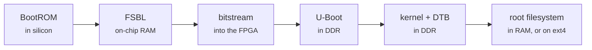
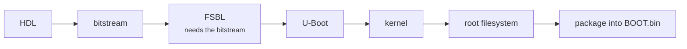

# How it works: from power-on to a running radio

What the files on the SD card are, and what happens between power-on and a
login prompt. No FPGA or embedded-Linux knowledge assumed. To just build and
flash, the [README](../README.md) is enough.

!!! abstract "Key facts"
    - The Zynq-7020 is an **ARM computer (PS)** and an **FPGA (PL)** in one chip. The radio's datapath is in the FPGA.
    - Boot is a chain of six stages; each exists because the one before it physically cannot do the next job.
    - **Any FPGA change means a new `BOOT.bin`**: it carries the FSBL, the bitstream and U-Boot together.
    - A kernel swap changes one file: `./devkit flash --kernel-only`, about six seconds, the old kernel kept as `uImage.prev`.
    - The two targets differ in userspace: Buildroot in RAM (`firmware/`) or Debian on ext4 (`firmware-modern/`).

!!! danger "Never use DFU"
    DFU (updating over USB from U-Boot) cannot replace `BOOT.bin` at all, and has bricked units of this board. Use `./devkit flash` ([flashing](flashing.md)).

## The chip has two halves

On a PC, fixed hardware and firmware you never wrote (BIOS/UEFI) start the
operating system. On this board you build every layer, including the hardware.

| Half | What it is | What runs there |
|---|---|---|
| **PS** ("Processing System") | an ordinary ARM computer: two cores, a memory controller, USB, Ethernet, SD card, serial ports | Linux |
| **PL** ("Programmable Logic") | an **FPGA**: a sea of generic logic elements and reconfigurable wiring | the radio: the interface to the AD9361 radio chip, the DMA engines that move samples into memory, the digital filters, and your own HDL |

You describe a circuit in **HDL** (hardware description language: Verilog, or
blocks wired in Vivado), and it is compiled into a **bitstream**, the
configuration data that makes the blank fabric become that circuit.

## The chain



| # | Stage | Where it runs | What it does | Why the stage before cannot |
|---|---|---|---|---|
| 1 | **BootROM** | burned into the silicon | checks the boot pins (here: SD card), finds `BOOT.bin`, copies its first piece into **OCM** (on-chip memory, 256 KB) | — |
| 2 | **FSBL** ("First Stage Bootloader") | OCM, bare metal | **`ps7_init`**: configures the DDR controller, clocks and pin multiplexing, after which main memory exists; **loads the bitstream into the PL**; **`ps7_post_config`**: enables the level shifters between PS and PL (they run at different voltages), after which the ARM side can reach your logic; then loads U-Boot into DDR and jumps to it | the kernel alone is 4.5 MB against OCM's 256 KB, and the 1 GB of **DDR** main memory does not work until its controller is configured |
| 3 | **U-Boot** | DDR | a full bootloader with drivers, a scripting language and the `Pluto>` prompt (press a key during boot). Reads `uEnv.txt`, loads the kernel, device tree and (factory target) ramdisk into memory, patches things like MAC addresses into the device tree, starts the kernel | the FSBL has no filesystem or scripting |
| 4 | **The kernel** | DDR | `uImage` is Linux with a small U-Boot header (load address and checksum). The factory target runs 5.15 from the vendor's tree; [`firmware-modern/`](../firmware-modern/README.md) builds **6.12 LTS** from Analog Devices | — |
| 5 | **The device tree** (`devicetree.dtb`, "blob") | read by the kernel | tells Linux what hardware exists and where: the AD9361 on SPI port 0, the DMA engines at `0x7c400000` | nothing on this chip announces itself |
| 6 | **The root filesystem** | RAM or ext4 | everything above the kernel: `/bin`, `/etc`, startup scripts, and `libiio`/`iiod`, which let your PC stream samples | — |

- The FSBL's order (DDR, then bitstream, then level shifters, then U-Boot) is
  why the [JTAG procedure](flashing.md#option-d--jtag-temporary-but-the-fastest-hdl-loop)
  looks the way it does.
- A kernel swap changes one file and nothing in stages 1–3, so
  `./devkit flash --kernel-only` swaps kernels over the network in about six
  seconds, keeping the previous one on the card as `uImage.prev`.

!!! warning "The device tree must match the bitstream"
    Change what the FPGA contains and the device tree's description may need to change too.

### The two root filesystems

| | `firmware/` (factory) | `firmware-modern/` |
|---|---|---|
| what it is | `uramdisk.image.gz`, built by **Buildroot** | **Debian 13 (trixie) armhf** with systemd |
| where it lives | decompressed into **RAM** at boot | **ext4 on the second SD partition** |
| survives a reboot? | **no** — except `/mnt/jffs2` | **yes** — it is an ordinary disk |
| installing software | rebuild the whole image, reflash | `apt install` |
| init | busybox SysV, nine `S*` scripts | systemd units |
| size | ~6.7 MB compressed | ~363 MB on a 7.4 GB partition |
| strength | identical on every boot: nothing changed last week can explain today's behaviour | keeps edits, `apt` and persistent `journalctl` logs |
| cost | edits on the board are lost at reboot | a bigger card, and a system that can drift from the repository |

!!! note "`/mnt/jffs2/autorun.sh` runs only on Buildroot"
    `/mnt/jffs2` lives in QSPI flash and is mounted on both, but only Buildroot runs `/mnt/jffs2/autorun.sh`; a script there does nothing on Debian.

```bash
# run from: the board
cat /proc/version
# Linux version 6.12.0-g70fa2c6d3bdd-dirty (arm-linux-gnueabi-gcc ...)
```

## What is on the SD card

=== "firmware-modern/ (default)"

    **Two partitions.** A 128 MB FAT partition with the files below except
    `uramdisk.image.gz` (U-Boot boots the second partition instead), and an ext4
    partition holding Debian in the remaining 7.4 GB of an 8 GB card. The running
    board mounts the FAT partition at `/boot`, which is where `./devkit flash` writes.

=== "firmware/ (factory)"

    **One FAT partition, five files**, below.

| File | What it is |
|---|---|
| `BOOT.bin` | **FSBL + bitstream + U-Boot**, packed by `bootgen` into the one file BootROM expects |
| `uImage` | The Linux kernel |
| `devicetree.dtb` | The description of what hardware exists |
| `uramdisk.image.gz` | The root filesystem (userspace); factory target only |
| `uEnv.txt` | U-Boot settings, read at boot |

- **Any FPGA change means replacing `BOOT.bin`**: `./devkit flash` over the
  network if the board boots, or a card reader if not. **Never use DFU** (see
  [flashing](flashing.md)).
- Make a spare card with `./tools/make-sd-card.sh` before you need one
  ([Option C2](flashing.md#option-c2--a-second-card-when-you-do-not-want-to-risk-the-first)).

## What to rebuild when you change something

| You changed… | Which file changes | How it gets onto the board |
|---|---|---|
| HDL / block design | `BOOT.bin` (contains the bitstream) | `./devkit flash --target factory --boot-only` (network) or card reader |
| Kernel config or a driver | `uImage` | `./devkit flash --kernel-only`, or card |
| Hardware description | `devicetree.dtb` | `./devkit flash --dtb-only`, or card |
| Boot settings | `uEnv.txt` | `./devkit flash --target factory --all` (factory target) or card |
| Userspace, on `firmware/` | `uramdisk.image.gz` | `./devkit flash --target factory --rootfs-only`, or card |
| Userspace, on `firmware-modern/` | *nothing* | `apt install`, or edit the file in place: it is a real disk |

`build_all.sh`'s seven stages are the chain in dependency order:



## Watching it happen

On the serial console ([how to connect](flashing.md#verify-your-build-is-actually-running))
every stage announces itself (a 5.15 board shown):

```
U-Boot PlutoSDR (Sep 12 2026 - 15:31:07 +0200)   ← stage 3: FSBL has run,
DRAM:  ECC disabled 1 GiB                           DDR works, U-Boot is alive

reading uImage                                    ← stage 3 loading stage 4
4541632 bytes read in 417 ms
reading devicetree.dtb
22516 bytes read in 18 ms
reading uramdisk.image.gz
6757376 bytes read in 611 ms

## Booting kernel from Legacy Image at 02080000 ...
   Image Name:   Linux-5.15.0                     ← or Linux-6.12.0
Starting kernel ...                               ← handover to Linux

Linux version 5.15.0 ...                          ← stage 4 running
OF: fdt: Machine model: FISH Ball PlutoSDR Rev.A  ← read from the device tree
ad9361 spi0.0: ad9361_probe : AD936x Rev 0        ← Linux finds the radio,
                successfully initialized             because the DTB told it to look

Welcome to Pluto                                  ← stage 6: userspace is up
fishball7020 login:
```

On 6.12 the transmitter-safety patches also log to `dmesg` when they act. These
are the firmware doing its job, and the first place to look when a transmitter
goes quiet:

```
iio iio:device2: no transmit data for 250 ms - muting the transmitter
ad9361 spi0.0: die at 40.351 C is over the 1.000 C transmit limit - staying muted
```
