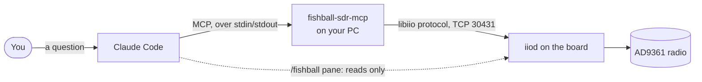

# Claude and the radio: the MCP server

The sibling repository
[Fishball7020-mcp](https://github.com/matsvandamme/Fishball7020-mcp) lets an AI
assistant use the radio. Ask Claude "what is on the air around 433 MHz?" and
it tunes the board, scans the band and answers from what it measured. This page
says what the server is, how to connect it to Claude Code, and what it will and
will not do. The short version is
[let Claude use the radio](radio/let-claude-use-the-radio.md); the server's
[README](https://github.com/matsvandamme/Fishball7020-mcp#readme) is the full
reference.

The words, first:

- **MCP** (Model Context Protocol) is a standard way to give an AI assistant a
  set of tools it can call. A *server* offers the tools; a *client*, such as
  Claude Code or Claude Desktop, lets the assistant call them.
- **`fishball-sdr-mcp`** is the server in that repository. It runs on your PC
  and reaches the board the way libiio programs do, over the network to
  `iiod`, the board's server for radio settings and samples.
- A **tool** is one action the assistant can take, such as `sdr_tune` or
  `sdr_capture_iq`. This server has 21.



It and the [Claude Code pane](claude-code-pane.md) are two halves: the server
lets Claude act on the radio, the pane shows you the board while it does.

## What you need

- **Python 3.10 or newer** on your PC. The server needs only the `mcp`
  package; it speaks the libiio network protocol itself, so there is no
  pylibiio to install.
- **The board reachable over the network:** the USB cable, your router, or a
  [direct cable](networking.md#a-direct-cable-to-your-pc). It looks for
  `fishball.local` unless told otherwise.
- **An MCP client:** [Claude Code](https://claude.com/claude-code) here; Claude
  Desktop works the same way.

## Install and connect

```bash
# run from: wherever you want the server to live (e.g. ~)
git clone https://github.com/matsvandamme/Fishball7020-mcp.git
cd Fishball7020-mcp
python3 -m venv .venv
.venv/bin/pip install -e .
claude mcp add -s user fishball-sdr -- "$PWD/.venv/bin/fishball-sdr-mcp"
```

`-s user` registers it for every Claude Code session you start. Without it,
`claude mcp add` registers it only for sessions started in the folder you ran
it from. The venv records absolute paths: if you move the folder, delete
`.venv` and repeat the last two lines.

```bash
# run from: anywhere
claude mcp list            # fishball-sdr: ... ✔ Connected
```

Then start Claude Code (`./devkit claude-pane start` gives you the pane as
well) and ask *"what is the radio set to?"*. Claude calls `sdr_get_status`
and answers from the board.

## What to ask it

| Ask | Tools it reaches for |
|---|---|
| "What is the radio set to?" | `sdr_get_status` |
| "Is the board healthy?" | `sdr_board_health` |
| "What is on the air between 433 and 435 MHz?" | `sdr_scan_band`, `sdr_spectrum` |
| "Tune to 868 MHz and record one second" | `sdr_configure_rx`, `sdr_capture_iq` |
| "Engage the FPGA channel filter" | `sdr_set_fpga_filter` |
| "Where is my board?" | `sdr_find_board` |
| "Send a tone at 433.92 MHz on TX1" | `sdr_check_rf_setup`, then `sdr_tx_tone`, inside the safety gate below |
| "Stop transmitting" | `sdr_tx_disable`, which is never refused |

All 21, by what they do:

- **Look:** `sdr_get_status`, `sdr_spectrum`, `sdr_scan_band`,
  `sdr_capture_iq`, `sdr_board_health`, `sdr_list_devices`,
  `sdr_read_attribute`, `sdr_find_board`, `sdr_rfid_field`
- **Change:** `sdr_tune`, `sdr_configure_rx`, `sdr_set_fpga_filter`,
  `sdr_sample_gpio`
- **Transmit:** `sdr_tx_tone`, `sdr_transmit_iq`, `sdr_transmit_waveform`,
  `sdr_sample_gpio_clock`, `sdr_check_rf_setup`, `sdr_tx_status`,
  `sdr_tx_chain_state`, `sdr_tx_disable`

A capture is never pasted into the conversation: `sdr_capture_iq` writes a
SigMF pair (`.sigmf-data` samples and `.sigmf-meta` settings, as in
[capturing IQ](capturing-iq.md)) to `~/.cache/fishball-sdr` and returns the
paths. Receive full scale is ±2047, because the converters are 12-bit.

## Transmitting

> [!CAUTION]
> Transmitting is **on** by default. The board reaches about +19 dBm and tunes
> the FM broadcast band, where transmitting without a licence is illegal. Never
> cable a transmit port to a receive port without at least 20 dB of attenuation
> between them; [before you transmit](start/before-you-transmit.md) says why.

Before a tone, an IQ file or a waveform touches the radio, the server checks
that everything it would emit sits inside an EU licence-free band (433, 868,
2400 or 5800 MHz) and under that band's power limit. A transmit that fails is
refused, with the reason. Claude can go ahead only by passing
`override_reason` (a description of a safe setup, such as "TX1 cabled through
30 dB into RX1, no antenna") or `force=true`; both are logged. Every transmit
call must name its channel: `"0"` is TX1, `"1"` is TX2.

To turn transmitting off, register the server with `SDR_MCP_ALLOW_TX=0`, then
restart Claude Code; the variable is read when the server starts, not from
your shell:

```bash
# run from: the Fishball7020-mcp folder
claude mcp remove -s user fishball-sdr
claude mcp add -s user fishball-sdr -e SDR_MCP_ALLOW_TX=0 -- \
    "$PWD/.venv/bin/fishball-sdr-mcp"
```

`sdr_tx_status` says what the running server believes. The server also mutes
the transmitter when it shuts down, so a client that crashes cannot leave a
cyclic buffer playing.

## One radio, several programs

The MCP server, SDR++, the [automation server](automation.md) and the devkit's
streaming tools share one radio. While one of them holds a sample buffer, the
others are refused (`EBUSY`, device busy). Each MCP capture opens its own
buffer and closes it when done; a transmit with `cyclic=true` keeps its buffer,
and keeps transmitting, until `sdr_tx_disable`. `tools/board-busy.sh` names
whatever holds the radio.

The [Claude Code pane](claude-code-pane.md) only reads settings and never
holds a buffer, so it runs alongside any of them.

A setting the server changes stays changed: tune to 868 MHz and the next
program finds the radio at 868 MHz.

## Settings

Each is set when you register the server, with `-e NAME=value`, and read when
Claude Code starts it:

| Variable | Default | What |
|---|---|---|
| `SDR_MCP_URI` | `ip:fishball.local` | where the board is; a name, so it survives the address changing |
| `SDR_MCP_ALLOW_TX` | unset: transmitting allowed | `0` forbids transmitting; `sdr_check_rf_setup` stays passive, and `sdr_tx_disable` and `sdr_tx_status` always work |
| `SDR_MCP_TX_BANDS` | unset | narrows transmitting further, e.g. `2400-2483.5` (MHz) |
| `SDR_MCP_CAPTURE_DIR` | `~/.cache/fishball-sdr` | where captures are written |
| `SDR_MCP_TIMEOUT` | `10` | socket timeout, in seconds |

The [README's configuration](https://github.com/matsvandamme/Fishball7020-mcp#configuration)
lists the rest.

## If it does not work

| If | Then |
|---|---|
| **Claude does not offer the radio tools** | `claude mcp list` does not show `fishball-sdr`, or shows it only in another folder: register it again with `-s user`, then restart Claude Code |
| **`claude mcp list` says it failed to connect** | the path after `--` is wrong, or the folder moved: recreate `.venv` and register again |
| **A tool says the board is not reachable** | ask Claude to run `sdr_find_board`, or run `./devkit net find`; then register with `-e SDR_MCP_URI=ip:<address>` |
| **A tool says the device is busy** | another program holds a buffer; `tools/board-busy.sh` names it |
| **A transmit was refused** | it is outside a licence-free band or over its power limit: see [Transmitting](#transmitting) |

Further reading: the server's
[README](https://github.com/matsvandamme/Fishball7020-mcp#readme), with every
tool, the design decisions and its notes from the hardware.
