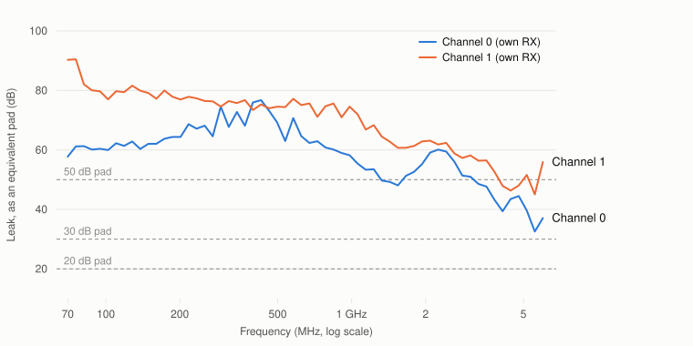

# What this board actually measures

> **Modulation quality is measured separately.** Ten modulations transmitted by
> this board and received on a **HackRF One** — spectra, constellations, EVM,
> PAPR and spur attribution — are in [the modulation
> gallery](modulation-gallery.md), along with the code to repeat them.

Every number on this page came off one board, measured with
`tools/selftest/sdr_selftest.py` on 2026-09-18 running the v1.3 firmware. There
were 28 runs in nine cable setups:

| Setup | Transmit port → receive port | Attenuation in the loop | Runs |
|---|---|---|---|
| straight, channel 0 | TX1A → RX1A | 20 dB · 30 dB · 20 + 30 dB stacked | 3 · 3 · 6 |
| straight, channel 1 | TX2A → RX2A | 20 dB · 30 dB · 20 + 30 dB stacked | 3 · 3 · 3 |
| crossed | TX1A → RX2A, and TX2A → RX1A | 20 dB | 3 and 4 |

After those, one more measurement: how much transmit signal reaches the
receiver with **no cable connected at all**. It explains most of what used to
look like noise in these results, and it has
[its own section](#the-boards-own-tx-to-rx-leak).

"Channel 0" is the TX1A/RX1A pair on the case and "channel 1" is TX2A/RX2A,
because the software counts from zero and the case label counts from one.

All the raw results, and the scripts that draw the figures from them, are in
[`img/data/measured-performance.json`](img/data/measured-performance.json) and
`img/make_*.py`. Read the [caveats](#what-these-numbers-are-not) before quoting
any of it.

## The units, first

The numbers below use four RF conventions. If any are unfamiliar, this is all
you need.

**dBFS: how loud, relative to the maximum.** The receiver's converter has a
largest number it can represent; 0 dBFS is that, and everything real is
negative. −20 dBFS is a tenth of full scale in voltage. A signal at −90 dBFS is
close to the noise.

**dBc: how far below the wanted signal.** Used for unwanted products. If a
tone is at −20 dBFS and an unwanted copy of it sits at −70 dBFS, the copy is
50 dBc down. Bigger is better, and it does not depend on how loud you were
transmitting.

**dB per dB: does the control do what it says?** Turn the gain down 6 dB and
the signal should drop 6 dB. That is 1.000 dB per dB. Anything else means the
setting is lying to you, and by how much.

**Decibels are ratios, so they add.** 10 dB is ten times the power, 20 dB is a
hundred times, 30 dB a thousand. Two attenuators of 20 dB and 30 dB in series
give 50 dB. That is why an attenuator's value can simply be subtracted from a
measurement.

Three measurements below need a sentence each:

- **Image rejection.** A radio like this handles a signal as two streams called
  I and Q. If they are not perfectly balanced, a signal at +250 kHz also
  produces a faint mirror at −250 kHz that was never on the air. Image rejection
  is how far down that mirror is. Poor rejection means a strong station can put
  a ghost on top of a weak one you actually want.
- **Harmonic distortion.** Any real amplifier is slightly non-linear, so a pure
  tone at 250 kHz also generates a little energy at 500 kHz, 750 kHz and so on.
  The 2nd and 3rd harmonics are the ones quoted; further down is better.
- **Loop gain.** With transmit cabled to receive through an attenuator (a
  "pad"), this is what the signal gained or lost going round the loop. The
  figures here add the pad's value back, so they describe the board: its two
  amplifiers, minus its losses.

## The short version

The board is well behaved. Gain settings do what they say to within 1.7%, the
transmitter is clean, the two transmitters are nearly identical, and the second
receiver is about 1.5 dB more sensitive than the first.

| | |
|---|---|
| **Gain accuracy** (does the setting tell the truth?) | 56 slope measurements, every one within **1.7% of 1.000 dB per dB** |
| **Image rejection** (mirror suppression) | **44–60 dBc** after calibration, **31–54 dBc** as found; worse into RX2 |
| **Harmonic distortion** | 2nd **−64 to −80 dBc**, 3rd **−71 to −85 dBc** |
| **Transmit mute depth** | **at least 75 dB**: the tone vanished into the receiver's noise every time |
| **Loop gain, 200 MHz – 1 GHz** | **+19 to +21 dB** (channel 0), **+20 to +22.5 dB** (channel 1) |
| **Transmitter vs transmitter** | within **0.2 dB** of each other |
| **Receiver vs receiver** | RX2 is **1.5 dB** more sensitive than RX1 |
| **Supply rails** | all six within **1.6%** of nominal |
| **FPGA** | 72 of 220 DSP48s used, timing met with **+0.205 ns** to spare (with patch `0009`) |

Transmit power at full drive is **not** in this table because none of these
runs measured it. The self-test estimates it by scaling up from a quiet
measurement, then caps the estimate at +19 dBm, the power amplifier's
compression point (+17.5 dBm) plus 1.5 dB. So the "+19 dBm" it prints on
nearly every run is that cap. Treat +19 dBm as a safe upper figure for
planning, which is how the safety advice uses it, and not as a measured output
power.

## Gain accuracy: the number that matters most in practice

Each run measures two slopes: the transmit attenuator (step it and watch the
received tone) and the receive gain (step it with the transmitter fixed).

| | TX attenuator, dB per dB | RX gain, dB per dB |
|---|---|---|
| Channel 0, straight (12 runs) | 1.001 – 1.014 | 0.995 – 1.004 |
| Channel 1, straight (9 runs) | 1.003 – 1.017 | 0.995 – 1.001 |
| Crossed (7 runs) | 1.002 – 1.009 | 0.987 – 1.003 |

The worst of all 56 is 1.7% from ideal. The largest wobble around a straight
line is **0.18 dB**.

This is the figure to care about if you are doing anything quantitative. It
means **a link budget you compute is the one you get**: ask for 6 dB less and
you get 6.0, not 5.2. Calibrations hold, and a measurement taken at one gain
setting can be compared against one taken at another without a correction
table.

The receive slope is measured over 38–51 dB of gain on purpose. The AD9361's
gain table switches its internal amplifier stages at several points, and there
the real gain jumps by up to 10 dB while the setting says it moved 1 dB. Fit a
line across the whole range and a perfectly healthy receiver reports 0.65 dB per
dB. 38–51 dB is the widest window with no such switch in it.

## Transmit chain

Ranges over all the runs in each setup:

| | Channel 0 straight | Channel 1 straight | TX1A → RX2A | TX2A → RX1A |
|---|---|---|---|---|
| Image rejection, calibrated (dBc) | 49.2 – 59.9 | 43.6 – 57.3 | 45.3 – 55.5 | 50.7 – 56.9 |
| Image rejection, as found (dBc) | 36.6 – 53.6 | 31.0 – 41.5 | 30.6 – 37.3 | 37.2 – 40.9 |
| 2nd harmonic (dBc) | −63.8 to −80.2 | −67.3 to −77.4 | −71.8 to −73.6 | −67.3 to −72.1 |
| 3rd harmonic (dBc) | −72.5 to −82.7 | −70.8 to −77.7 | −76.5 to −77.7 | −78.9 to −85.0 |
| Mute depth (dB) | 63.2 – 74.9 | 61.8 – 70.7 | 65.5 – 69.0 | 68.2 – 73.5 |

**Image rejection belongs mostly to the receiver.** A loopback measures the
mirror created by both chains together, so it cannot say which one made it.
The crossed runs can: whatever goes into RX2 comes out 5–7 dB worse (comparing
medians) than the same transmitter into RX1. Most of the imbalance is in RX2's
receive chain.

**Image rejection also drifts.** The self-test measures it twice. The first
figure ("as found") is before any correction. The second is right after it
forces the AD9361 to recalibrate its transmit I/Q balance, and that is 10–15 dB
better. Even so, the same cable and settings gave numbers up to 10 dB apart
from one run to the next. If the mirror of a strong signal matters to you,
recalibrate just before measuring and measure it yourself. Do not rely on a
figure from a table like this.

**The 2nd harmonic also moves between runs.** On channel 0 through 20 dB, three
back-to-back runs gave −64, −80 and −64 dBc. Plan for the worst figure, −64 dBc.

**The transmitter really does go quiet.** When a transmit stream closes, the
firmware sets both transmit attenuators to maximum. In every run, the received
tone then dropped into the receiver's noise. So the mute-depth numbers show
how far above the noise the tone started, not how deep the mute is. The deepest
reading, 74.9 dB, is therefore a lower limit. Setups with less signal to start
with (the 50 dB loops) read lower for that reason alone.

A separate measurement at 900 MHz shows what remains. The receiver was tuned
1 MHz away so the transmitter's leftover carrier could be told apart from the
receiver's own offset. With the attenuators muted, a residual carrier remained
26 dB above the noise. Powering down the transmit synthesiser as well removed a
further 19.9 dB, to within 6 dB of the noise: about −89 dBm at the port. Both
steps earn their place, and neither is enough alone. See
[Transmitter safety](transmitter-safety.md).

## Frequency response

<picture>
  <source media="(prefers-color-scheme: dark)" srcset="img/loop-gain-dark.svg">
  
</picture>

Both channels through the same single 20 dB pad, 60 frequencies from 70 MHz to
6 GHz, three passes each. The line is the median of the passes and the band is
their spread.

| MHz | Channel 0 (dB) | Channel 1 (dB) |
|---|---|---|
| 70 | +12.4 | +14.3 |
| 102 | +15.5 | +16.7 |
| 201 | +20.1 | +21.1 |
| 293 | +19.8 | +21.5 |
| 498 | +19.7 | +22.1 |
| 726 | +19.4 | +20.1 |
| 981 | +18.9 | +20.3 |
| 1543 | +16.9 | +18.5 |
| 1935 | +16.4 | +17.8 |
| 2427 | +13.8 | +16.1 |
| 3043 | +11.3 | +12.3 |
| 3281 | +9.0 | +9.5 |
| 3816 | +6.1 | +8.3 |
| 4115 | +11.0 | +15.2 |
| 4437 | +10.5 | +15.1 |
| 5160 | +3.5 | +7.0 |
| 6000 | +1.6 | +2.4 |

**The board works best between about 200 MHz and 1 GHz.** Loop gain is flat
there to about 2 dB, near +20 dB, which is where the PGA-102+ power amplifier
has most of its gain.

**Channel 1 runs 1.3 dB hotter** (median; from −0.6 to +4.5 dB across the
sweep). The crossed runs, [below](#which-chain-is-it-separating-transmit-from-receive),
show that this is the receiver.

**The step at 4 GHz is the AD9361, not the board.** Between 3816 and 4115 MHz,
channel 0 jumps 4.9 dB and channel 1 jumps 6.9 dB. The AD9361 switches to a
different receive gain table at 4 GHz, and the two tables label their steps
differently: the manual gain range changes from −3…71 dB to −10…62 dB across the
boundary, so the same gain setting means a different real gain on each side. In
practice, **a gain calibration made below 4 GHz is wrong above it**, by about
5 dB on channel 0 and 7 dB on channel 1. Those two sizes differ, so you can't
remove it with a single correction for both channels.

### How repeatable it is

The passes differ from each other by different amounts across the band:

| Band | Pass-to-pass spread, median | worst |
|---|---|---|
| 70 – 200 MHz | 1.2 dB | 5.3 dB |
| 200 MHz – 1 GHz | 0.7 dB | 1.8 dB |
| 1 – 2 GHz | 0.3 dB | 0.6 dB |
| 2 – 6 GHz | **0.06 dB** | 0.17 dB |

Above 2 GHz, re-running without touching the cable gives the same answer to a
few hundredths of a dB. Lower down, the spread grows steadily. The cause was
not pinned down. The likeliest one is off-air signals, which are strongest in
the lower bands, getting into an unshielded loop. So treat 70–200 MHz as good
to about ±3 dB.

**Changing the pad does not change the result.** Swapping the 20 dB pad for the
30 dB one should lower the loop by exactly 10 dB everywhere. Measured above
200 MHz, it lowered it by a median of **10.05 dB on channel 0 and 9.99 dB on
channel 1**. Individual frequencies were off by up to about 2.7 dB. A cable
setup that changes shape when you change the pad would show up here, and this
one does not.

**Stacking two pads did change the result.** At first that looked like a
reflection between the two pads. It wasn't: taking the pair apart and screwing
it back together moved nothing by more than 0.2 dB. The real cause is in the
next section. It limits every loopback measurement on this board, so read it
before designing your own.

## The board's own TX-to-RX leak

<picture>
  <source media="(prefers-color-scheme: dark)" srcset="img/tx-rx-leak-dark.svg">
  
</picture>

Some of the transmit signal reaches the receiver **inside the board**, without
going through your cable. You can show it by taking the cable off the receive
port: the tone is still there, 35–59 dB above the noise on channel 0.

The chart gives that leak as an **equivalent pad**: the attenuator a cable loop
would need to be exactly as strong as the leak. A higher number means a weaker
leak.

| Leak path | 70 MHz – 1 GHz | 1 – 3 GHz | 3 – 6 GHz |
|---|---|---|---|
| TX1A → RX1A (channel 0) | 58 – 77 dB | 48 – 60 dB | **33 – 51 dB** |
| TX2A → RX2A (channel 1) | 71 – 90 dB | 57 – 72 dB | 45 – 58 dB |
| TX1A → RX2A | 92 dB or more* | 74 – 96 dB | 56 – 76 dB |
| TX2A → RX1A | 88 dB or more* | 78 – 100 dB | 53 – 86 dB |

\* The leak was too close to the noise to measure properly, so these figures
only say it is at least this weak.

**What it does to a measurement.** A loopback measures the cable path and the
leak together. When the pad is much smaller than the leak figure, the leak is
negligible. When they are close, the two add up or cancel depending on
frequency, and the result can be several dB too high or too low. It comes out
the same every time, so re-running will not reveal it.

- **Through 20 dB**, the leak is at least about 13 dB weaker than the loop at
  every frequency. That is good for about ±2 dB at channel 0's worst points
  above 3 GHz, and far better elsewhere.
- **Through 50 dB on channel 0**, the leak is about as strong as the loop above
  1.5 GHz. Those runs were off by up to 13 dB.
- **The crossed paths leak 10–35 dB less** than a channel into its own
  receiver, typically 20–30. So a crossed loop is the cleanest way to measure above 3 GHz.

**The rule:** for a clean measurement at a given frequency, fit a pad at least
20 dB below the leak figure there. For RF safety, fit at least 20 dB in every
loopback, no matter what. Both rules together point to **20 dB for
measurement**.

This also explains the self-test's one large miss estimating a pad (the
[next section](#how-well-the-tool-knows-your-attenuator)). And it is why the
self-test's frequency-response check compares against a
**baseline you record yourself**, with your own cable and pad, not against
absolute limits: the leak adds a fixed pattern to each setup, and comparing
setup against setup cancels it.

Two limits on these numbers. The receive port was left open, not fitted with a
50 Ω terminator, while the leak was measured, and that can change the leak
somewhat. Converting the leak to an equivalent pad also carries about ±2 dB of
uncertainty.

## Which chain is it? Separating transmit from receive

A loopback measures a **sum**: the transmit chain and the receive chain of
one channel, added together. Nothing in a straight loopback can say which of the
two an asymmetry belongs to. Measuring a **crossed** loop as well makes the
differences solvable:

```
L00 = T0 + R0     straight, channel 0
L11 = T1 + R1     straight, channel 1
L01 = T0 + R1     crossed, TX1A into RX2A
L10 = T1 + R0     crossed, TX2A into RX1A

  R0 − R1 = L00 − L01  (or L10 − L11)
  T0 − T1 = L01 − L11  (or L00 − L10)
```

The absolute `T` and `R` stay unknown. The four equations are not independent,
and no amount of loopback fixes that without an external calibrated reference.
But the *differences* are fully determined, each two independent ways, and
they are what the questions turn on.

<picture>
  <source media="(prefers-color-scheme: dark)" srcset="img/chain-separation-dark.svg">
  
</picture>

All four setups through the same 20 dB pad, 200 MHz – 3.95 GHz:

| | first route | second route |
|---|---|---|
| `R0 − R1` (receivers) | −1.48 dB | −1.59 dB |
| `T0 − T1` (transmitters) | +0.10 dB | +0.25 dB |

**The two transmitters are nearly identical:** 0.1–0.25 dB apart.

**The receivers are not.** RX2's chain is about **1.5 dB more sensitive** than
RX1's. So the 1.3 dB by which channel 1's loop runs hotter is **the receiver,
not the transmitter**. A straight loopback could never have told you that.

**This also pins the 4 GHz step on the receiver.** If the step comes from the
AD9361's receive gain table, it must show in the receive difference and not in
the transmit difference, because the transmitter knows nothing about receive
gain tables. Comparing the median below 4 GHz (2–3.95 GHz) with the median
above it (4–5 GHz), `R0 − R1` moves by **−3.1 dB** and `T0 − T1` by **+0.1 dB**.
The step is in the receiver. That test could have failed, and it didn't.

### The closure check

With all four loops measured, the results must satisfy

```
L00 + L11  =  L01 + L10
```

because both sides contain each chain exactly once. Any departure is drift, a
cable that changed between setups, or error. Over the 60 frequencies the
departure is **+0.03 dB median**, from −2.5 to +2.3 dB at individual points. The
big ones fall in the two places already known to be noisy: below 1 GHz, where
passes scatter, and above 3 GHz, where channel 0's leak is strongest. The
measurements agree with each other, and the separation above does not depend
on how any one cable was connected.

```bash
# run from: tools/selftest/
./sdr_selftest.py --ssh --loopback --pad 20 --tx-channel 0 --rx-channel 1 \
    --sweep-points 60 --sweep-start 70e6 --sweep-stop 6e9
```

## How well the tool knows your attenuator

The self-test works out how much attenuation is in the loop, at 900 MHz, and
checks it against the value you declared:

| Declared | Channel 0 measured | Channel 1 measured | Crossed |
|---|---|---|---|
| 20 dB | 20.8 | 19.2 – 19.6 | 19.0 – 21.1 |
| 30 dB | 30.5 – 30.8 | 29.1 – 29.2 | |
| 50 dB (20 + 30) | **51.8 – 53.9** | 51.1 – 51.2 | |

Every single pad is read within 1.1 dB of its label. The one large miss is the
50 dB stack on channel 0, up to 3.9 dB high. That is the leak again: at
900 MHz, channel 0's leak equals roughly a 58 dB pad, only 8 dB below the loop, enough
to throw the estimate off. The tool documents its estimate as ±4 dB. The
estimate exists to catch a missing or wrong attenuator, the mistake that
destroys receivers, and its warning only fires above 8 dB of disagreement, so
this error costs nothing.

## Digital and power

Over all 28 runs:

| | |
|---|---|
| Digital interface eye | 157 – 158 of 256 clock/data delay positions pass |
| Internal digital loopback | tone returns at exactly the amplitude sent |
| Supply rails | vccint 0.992–0.999 V, vccaux 1.781–1.786 V, vccbram 0.995–0.999 V, vccpint 0.990–0.998 V, vccpaux 1.781–1.786 V, vccoddr 1.329–1.346 V |
| Die temperature | Zynq 67–71 °C, AD9361 45–50 °C |

For the eye scan, the AD9361 tries all 16×16 clock and data delay combinations
while a test pattern runs. 157 passing positions is a wide margin: a link on the
edge of working loses passing positions long before it starts corrupting
samples.

## What this page does not cover

These are tone measurements from the self-test: gain, linearity, harmonics and
leak. How the board behaves with **modulated signals at high sample rates** — EVM
for QPSK, 16-QAM and OFDM, capture integrity, and where the throughput limits
really sit — is measured separately in
[modulation-and-throughput.md](modulation-and-throughput.md).

## What these numbers are not

- **One board, one evening, room temperature.** Nothing here is a
  specification, a guarantee, or a sample of production spread.
- **A loopback measures TX and RX together.** Image rejection and harmonics are
  the combined result of both chains. The crossed runs separate the loop gain,
  and they suggest the image is mostly the receiver's, but this is not a
  separate measurement of each chain.
- **Absolute power rests on an assumption:** that receive full scale is
  +2.5 dBm at 0 dB gain. Treat any dBm figure as ±3 dB. The *ratios* (slopes,
  dBc, mute depth, loop gain differences) carry no such assumption and are the
  trustworthy part.
- **Every loopback includes the board's own leak.** With a 20 dB pad that is
  worth up to ±2 dB on channel 0 above 3 GHz. With larger pads it is worth more.

## Reproducing it

```bash
# run from: the repo root
cd tools/selftest
./sdr_selftest.py --ssh                                    # no cable, never transmits
./sdr_selftest.py --ssh --loopback --pad 20 --channel 0 \
    --sweep-points 60 --sweep-start 70e6 --sweep-stop 6e9 --json run1.json
```

Use **a single 20 dB pad**. It is the minimum for safety (this board can put
out about +19 dBm, and its receive port is rated to +2.5 dBm), and it is the
largest pad that keeps the board's own leak out of the result. Details in
[`tools/selftest/README.md`](../tools/selftest/README.md).
