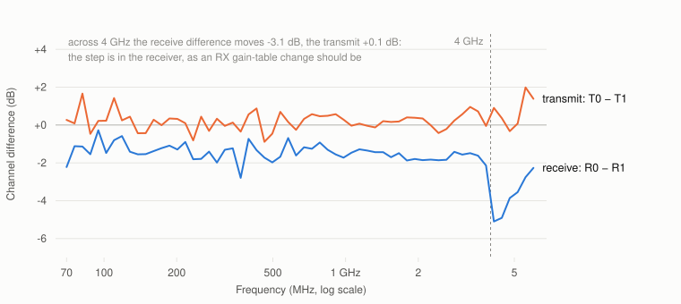

# What this board actually measures

Every number here came off one unit with `tools/selftest/sdr_selftest.py`. The
tables below are six runs: both TX/RX channel pairs, each looped back through a 20 dB, a 30 dB
and a 50 dB attenuator. Recording it three ways was not thoroughness for its own
sake — it is what separates a property of the *board* from a property of the
*cable*, and the two are easy to confuse.

Firmware [v1.1](../../releases/tag/v1.1), room temperature, one afternoon, one
board. Read the [caveats](#what-these-numbers-are-not) before quoting any of it.

## The units, first

The numbers below use four RF conventions. If any are unfamiliar, this is all
you need.

**dBFS — "how loud, relative to the maximum".** The receiver's converter has a
largest number it can represent; 0 dBFS is that, and everything real is
negative. −20 dBFS is a tenth of full scale in voltage. A signal at −90 dBFS is
close to the noise.

**dBc — "how far below the wanted signal".** Used for unwanted products. If a
tone is at −20 dBFS and an unwanted copy of it sits at −70 dBFS, the copy is
50 dBc down. Bigger is better, and it does not depend on how loud you were
transmitting.

**dB per dB — "does the control do what it says?"** Turn the gain down 6 dB and
the signal should drop 6 dB. That is 1.000 dB per dB. Anything else means the
dial is lying to you, and by how much.

**Decibels are ratios, so they add.** 10 dB is ten times the power, 20 dB is a
hundred times, 30 dB a thousand. Two 10 dB attenuators in series give 20 dB.
That is why an attenuator's value can simply be subtracted from a measurement.

Three measurements below need a sentence each:

- **Image rejection.** A radio like this handles a signal as two streams called
  I and Q. If they are not perfectly balanced, a signal at +250 kHz also
  produces a faint mirror at −250 kHz that was never on the air. Image rejection
  is how far down that mirror is. Poor rejection means a strong station can put
  a ghost on top of a weak one you actually want.
- **Harmonic distortion.** Any real amplifier is slightly non-linear, so a pure
  tone at 250 kHz also generates a little energy at 500 kHz, 750 kHz and so on.
  The 2nd and 3rd harmonics are the ones quoted; further down is better.
- **Loop gain / path loss.** With transmit cabled to receive through an
  attenuator, this is what the signal gained or lost going round the loop. It
  describes the board's amplifiers *plus* your cable — which is why separating
  those two matters, and why a whole section below is about it.

## The short version

The board is well behaved and the two channels are closely matched. Programmable
gain does what it says to within 1.4%, the transmitter is clean, and the FPGA has
most of its capacity free.

| | |
|---|---|
| **Gain accuracy** (does the dial tell the truth?) | 12 slope measurements, every one within **1.4% of unity** |
| **Image rejection** (mirror suppression) | **55–63 dBc** after calibration (41–48 dBc as found) |
| **Harmonic distortion** | **−67 to −79 dBc** |
| **Transmit power** | **+19 dBm** flat out, agreeing to 0.7 dB across six runs |
| **Transmit mute depth** | **63–70 dB**, into the noise floor |
| **Supply rails** | all six within **1.1%** of nominal |
| **FPGA** | 72 of 220 DSP48s used, timing met with **+0.214 ns** to spare on the build measured here (the v1.2 default, with the sample-locked GPIO feature, meets at **+0.231 ns**) |

## Gain accuracy — the number that matters most in practice

| | ch0@20 | ch1@20 | ch0@30 | ch1@30 | ch0@50 | ch1@50 |
|---|---|---|---|---|---|---|
| TX attenuator, dB per dB | 0.999 | 1.007 | 1.003 | 0.998 | 1.012 | 1.016 |
| RX gain, dB per dB | 0.998 | 0.998 | 1.003 | 0.986 | 1.007 | 0.992 |

Worst-case deviation from an ideal 1.000 across all twelve: **1.6%**, and worst
residual from the straight-line fit **0.16 dB**.

This is the figure to care about if you are doing anything quantitative. It means
**a link budget you compute is the one you get**: ask for 6 dB less and you get
6.0, not 5.2. Calibrations hold, and a measurement taken at one gain setting can
be compared against one taken at another without a correction table.

The RX figure is quoted over 38–51 dB, which is deliberate. The AD9361's gain
table changes its LNA/mixer state at several indices, and the real gain steps by
up to 10 dB there while the label still claims 1 dB. Fit a line across the whole
range and a perfectly healthy front end reports 0.65 dB per dB. 38–51 dB is the
widest window with no such transition in it, and it is the only span where the
question "is the gain control linear?" has a meaningful answer.

## Transmit chain

| | ch0@20 | ch1@20 | ch0@30 | ch1@30 | ch0@50 | ch1@50 |
|---|---|---|---|---|---|---|
| Image rejection, recalibrated (dBc) | 55.5 | 62.7 | 60.2 | 58.0 | 54.9 | 54.8 |
| Image rejection, as found (dBc) | 41.6 | 41.3 | 47.3 | 44.3 | 44.2 | 41.1 |
| 2nd harmonic (dBc) | −70.3 | −66.8 | −68.6 | −73.2 | −71.5 | −73.2 |
| Mute depth (dB) | 69.8 | 62.7 | 70.4 | 65.0 | 65.3 | 63.0 |
| Power flat out (dBm) | +19.0 | +19.0 | +19.0 | +19.0 | +18.3 | +19.0 |

**Image rejection degrades between calibrations.** As found it sits around
41–48 dBc; immediately after a forced TX quadrature calibration it is 55–63.
That is a 14 dB difference on the same hardware minutes apart, and it is worth
knowing if you care about the mirror image of a strong signal landing on a weak
one. If you do, recalibrate rather than assume the datasheet figure — the
self-test does exactly this before measuring, which is why it reports both.

**The transmitter really does go quiet.** Closing a DMA stream drops output by
63–70 dB, into the noise floor. Measured separately at 900 MHz with the receive
LO offset by 1 MHz so leakage could be told apart from the receiver's own DC
offset: muting the attenuators leaves residual LO 26 dB above the floor, and
powering the synthesiser down as well takes it a further **19.9 dB** to within
6 dB of the floor — about −89 dBm at the port. Both mechanisms earn their place;
neither is sufficient alone. See [Transmitter safety](../README.md#transmitter-safety).

## Frequency response, and the limits of measuring it this way

<picture>
  <source media="(prefers-color-scheme: dark)" srcset="img/loop-gain-dark.svg">
  
</picture>

Both channels through the same 20 dB attenuator, **105 frequencies each** from
70 MHz to 6 GHz — a 60-point sweep over the whole range plus a 45-point pass
concentrated on 2.6–5.6 GHz, where the structure is. The band is the spread over
repeated passes: **median 0.06 dB on channel 0, 0.07 dB on channel 1**.

| MHz | Channel 0 (dB) | Channel 1 (dB) |
|---|---|---|
| 70 | +14.1 | +14.3 |
| 102 | +16.5 | +17.3 |
| 201 | +20.7 | +20.8 |
| 293 | +21.2 | +22.6 |
| 498 | +20.8 | +20.8 |
| 726 | +20.0 | +20.9 |
| 981 | +19.3 | +20.3 |
| 1543 | +16.6 | +18.4 |
| 1935 | +16.5 | +17.8 |
| 2427 | +14.2 | +16.4 |
| 2989 | +11.7 | +12.6 |
| 3281 | +9.6 | +10.9 |
| 3951 | +6.2 | +8.4 |
| 4021 | +10.8 | +15.7 |
| 4464 | +11.0 | +15.3 |
| 4957 | +4.9 | +9.1 |
| 6000 | +3.0 | +4.0 |

Channel 1 runs **+1.8 dB hotter on average**, ranging from −2.8 to +4.9 dB
across the sweep. Both curves have the same shape.

Three things the sparse 8-point version could not show.

**A plateau near +20 dB from roughly 180 MHz to 1 GHz**, flat to about a
decibel. That is the band this board is happiest in, and it is where the
PGA-102+ has most of its gain.

**A step at 4 GHz — 4.6 dB on channel 0, 7.4 dB on channel 1.** Channel 0 goes
from +6.2 dB at 3951 MHz to +10.8 dB at 4021; channel 1 from +8.4 to +15.7.
Repeatable to 0.02 dB, and **not the hardware**. The AD9361 swaps RX gain table
at 4 GHz, and the two tables label their steps differently: the available manual
gain range changes from `[-3, 71]` to `[-10, 62]` dB across that boundary, so a
commanded 46 dB means a different real gain either side. Verified by reading
`hardwaregain_available` at 3.95 and 4.02 GHz.

The practical consequence: **a gain calibration made below 4 GHz is wrong above
it**, by about 5 dB on channel 0 and 7 dB on channel 1. That the two channels
disagree on the size of the step is itself worth knowing — it is not a single
constant you can correct out globally.

**70 MHz is the one point not to trust.** It spreads 4.7 dB across passes where
every other point is inside 1.6 dB — the very bottom of the tuning range.

### What the spread means

Repeatability **without touching the cable** is 0.06 dB median, and better than
0.11 dB everywhere above 2 GHz. Across three *different* attenuators, the same
frequencies scattered by 6–8 dB up there. Same instrument, same board — the
variable is the SMA connectors.

So above 2 GHz, absolute path loss measured this way is dominated by your
cabling, and that is exactly why the self-test compares against a **baseline you
record with your own cable** rather than against absolute thresholds. Below
2 GHz the three cable configurations agreed to 1–2 dB, so a measurement there is
genuinely about the board.

## Which chain is it? Separating transmit from receive

A loopback measures a **product**: the transmit chain and the receive chain of
one channel, added. Nothing in a straight loopback can say which of the two an
asymmetry belongs to. Measuring a **crossed** loop as well makes the differences
solvable:

```
L00 = T0 + R0     straight, channel 0
L11 = T1 + R1     straight, channel 1
L01 = T0 + R1     crossed, TX0 into RX1

  R0 − R1 = L00 − L01          T0 − T1 = L01 − L11
```

Absolute `T` and `R` stay unknown — three equations, four unknowns, and no
amount of loopback fixes that without an external calibrated reference. But the
differences are fully determined, and they are what the questions turn on.

Measuring **both** crosses over-determines the system, which buys two things: an
independent route to each difference, and a closure check that needs no external
reference at all.

<picture>
  <source media="(prefers-color-scheme: dark)" srcset="img/chain-separation-dark.svg">
  
</picture>

**The two transmitters are nearly identical.** `T0 − T1` sits at **+0.25 dB**
below 4 GHz — flat, within the measurement's own scatter.

**The receivers are not.** `R0 − R1` is **−1.48 dB**: channel 1's receive chain
is about 1.5 dB more sensitive. So the +1.8 dB by which channel 1's loop runs
hotter is **the receiver, not the transmitter** — which a straight loopback
could never have told you.

**And it locates the 4 GHz step.** Earlier the step was attributed to the AD9361
swapping RX gain table. That is falsifiable: if true, the step must appear in the
receive difference and *not* in the transmit difference, because a transmitter
knows nothing about an RX gain table. Across 4 GHz:

| | change across 4 GHz |
|---|---|
| `R0 − R1` | **−2.40 dB** |
| `T0 − T1` | **+0.27 dB** |

The step is in the receiver and the transmitters barely move. It could have come
out the other way.

### The closure check

With all four configurations measured, the system is over-determined and must
satisfy

```
L00 + L11  =  L01 + L10
```

Any departure is drift, non-reciprocity or error. Over 105 frequencies the
residual is **−0.05 dB mean, +0.06 dB median**. The two independent routes to
each difference agree to **0.04 dB**:

| | route 1 | route 2 | agreement |
|---|---|---|---|
| `R0 − R1` (below 4 GHz) | −1.46 dB | −1.50 dB | 0.04 dB |
| `T0 − T1` (below 4 GHz) | +0.23 dB | +0.27 dB | 0.04 dB |

Individual frequencies reach 2.6 dB of residual — the same handful of weak,
low-frequency points that scatter elsewhere — but the central tendency is at the
level of the per-point repeatability. The measurements are self-consistent, and
the separation above is not an artefact of one particular cabling.

```bash
# run from: tools/selftest/
./sdr_selftest.py --loopback --pad 20 --tx-channel 0 --rx-channel 1 \
    --sweep-points 60 --sweep-start 70e6 --sweep-stop 6e9
```

## How well the tool knows your attenuator

The self-test infers how much attenuation is in the loop and checks it against
what you declared. Six runs at three known values:

| Declared | 20 dB | 20 dB | 30 dB | 30 dB | 50 dB | 50 dB |
|---|---|---|---|---|---|---|
| Measured | 21 | 19 | 30 | 29 | 54 | 51 |
| Error | +1 | −1 | 0 | −1 | **+4** | +1 |

Five of six within ±1 dB; one at +4 dB. The estimate is documented as ±3 dB, and
on this evidence **±4 dB is the honest figure** at the high-attenuation end,
where the loop is weakest and the estimate leans hardest on assumed constants.
It is used to catch a missing or wrong attenuator — a failure that destroys
receivers — and the check only fires above 8 dB of disagreement, so 4 dB of
error costs nothing.

## Digital and power

| | |
|---|---|
| Digital interface eye | 157–181 of 256 clock/data delay positions pass |
| Internal digital loopback | tone returns at the amplitude sent, spurious-free by >120 dB |
| Supply rails | vccint 0.995 V, vccaux 1.783 V, vccbram 0.997 V, vccpint 0.992 V, vccpaux 1.780 V, vccoddr 1.342 V |
| Die temperature | Zynq 65–70 °C, AD9361 42–47 °C |

The eye scan is the AD9361 walking all 16×16 clock and data delay combinations
with a PRBS running. 157–181 passing positions is a wide margin; a link on the
edge of working shrinks that number long before it starts corrupting samples.

## What these numbers are not

- **One board, one afternoon, one temperature.** Nothing here is a
  specification, a guarantee, or a sample of production spread.
- **Loopback measures TX and RX together.** Image rejection is the combination
  of both chains' quadrature balance, not either one alone.
- **Absolute power rests on a calibration assumption** — receive full scale
  taken as +2.5 dBm at 0 dB gain — so treat the dBm figures as ±3 dB. The
  *ratios* (slopes, dBc, mute depth) carry no such assumption and are the
  trustworthy part.
- **Above 2 GHz the frequency response is cable-dominated**, as the spread shows.

## Reproducing it

```bash
# run from: the repo root
cd tools/selftest
./sdr_selftest.py --ssh                                    # no cable, never transmits
./sdr_selftest.py --ssh --loopback --pad 30 --channel 0     # add the RF tests
```

Fit **at least 20 dB** of attenuation in any loopback: this board reaches about
+19 dBm and its own receive port is rated to +2.5 dBm. Details in
[`tools/selftest/README.md`](../tools/selftest/README.md).
