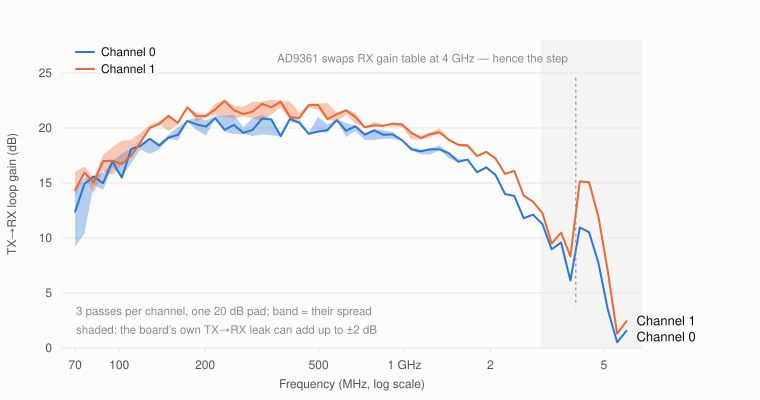
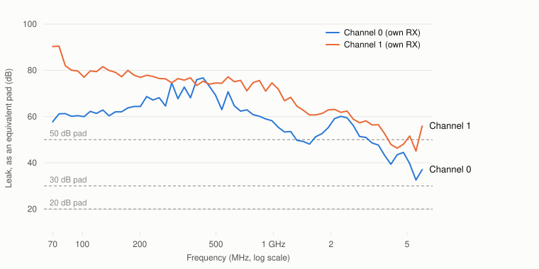
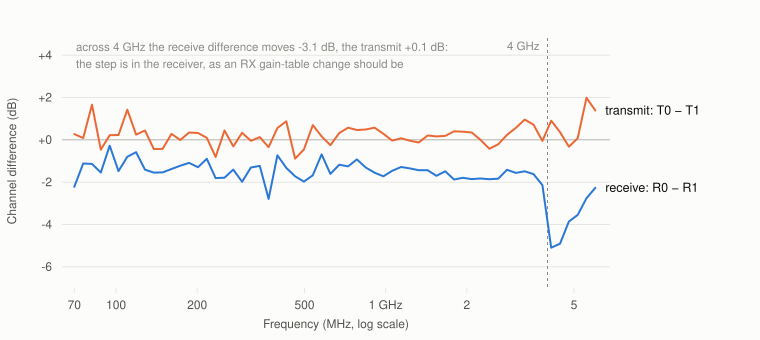

# Board performance: loopback measurements

What one board does as a radio: gain accuracy, image rejection, harmonics,
transmit mute depth, loop gain from 70 MHz to 6 GHz, and how much it leaks from
its transmitter into its own receiver. Read it before you design a measurement,
set up a loopback, or quote a figure for this board.

Every figure comes from the self-test, `tools/selftest/sdr_selftest.py`
(`./devkit selftest` runs the same script). To reproduce them:

```bash
# run from: the repo root
./devkit selftest --ssh                                    # no cable, never transmits
./devkit selftest --ssh --loopback --pad 20 --channel 0 \
    --sweep-points 60 --sweep-start 70e6 --sweep-stop 6e9 --json run1.json
```

!!! danger "`--loopback` transmits"
    Cable a transmit port to a receive port through **at least 20 dB of
    attenuation** first, and use **a single 20 dB pad**: it is the safety minimum
    (the board puts out about +19 dBm; its receive port is rated to +2.5 dBm) and
    the largest pad that keeps the board's own leak out of the result. Details in
    [`tools/selftest/README.md`](../tools/selftest/README.md).

## Conditions

One board, v1.3 firmware (factory 5.15 kernel), room temperature, 28 self-test
runs. "Channel 0" is TX1A/RX1A and "channel 1" is TX2A/RX2A (software counts
from zero, the case label from one).

| Setup | Transmit port → receive port | Attenuation in the loop | Runs |
|---|---|---|---|
| straight, channel 0 | TX1A → RX1A | 20 dB · 30 dB · 20 + 30 dB stacked | 3 · 3 · 6 |
| straight, channel 1 | TX2A → RX2A | 20 dB · 30 dB · 20 + 30 dB stacked | 3 · 3 · 3 |
| crossed | TX1A → RX2A, and TX2A → RX1A | 20 dB | 3 and 4 |

Plus one setup with **no cable**, to measure [the leak](#the-boards-own-tx-to-rx-leak).
Raw results: [`img/data/measured-performance.json`](img/data/measured-performance.json);
the figures are drawn by `img/make_*.py`.

| Unit | Meaning |
|---|---|
| **dBFS** | level relative to the converter's full scale (0 dBFS is the maximum, everything real is negative) |
| **dBc** | how far an unwanted product sits below the wanted tone; bigger is better |
| **dB per dB** | how well a gain control does what it says (1.000 is perfect) |
| **Image rejection** | how far down the mirror of a signal sits on the other side of the centre frequency, caused by I/Q imbalance |
| **Loop gain** | what a tone gains going TX → pad → RX, with the pad's value added back so it describes the board |

## The short version

| | |
|---|---|
| **Gain accuracy** (does the setting match the change?) | 56 slopes, every one within **1.7% of 1.000 dB per dB** |
| **Image rejection** (mirror suppression) | **44–60 dBc** after calibration, **31–54 dBc** as found; worse into RX2 |
| **Harmonic distortion** | 2nd **−64 to −80 dBc**, 3rd **−71 to −85 dBc** |
| **Transmit mute depth** | **at least 75 dB**: the tone dropped into the receiver's noise every time |
| **Loop gain, 200 MHz – 1 GHz** | **+19 to +21 dB** (channel 0), **+20 to +22.5 dB** (channel 1) |
| **Transmitter vs transmitter** | within **0.2 dB** of each other |
| **Receiver vs receiver** | RX2 is **1.5 dB** more sensitive than RX1 |
| **Supply rails** | all six within **1.6%** of nominal |
| **FPGA** | 94 of 220 DSP48s used, timing met with **+0.215 ns** to spare (default build, with patches `0009` and `0021`; `STOCK_RX_FILTER=1` gives 72 DSP48s and +0.205 ns) |
| **Streaming to a host** | the USB link carries about **20 MB/s: 5 MS/s** arrives complete, 6 MS/s 84%, 10 MS/s 50% ([SDR++ page](sdrpp.md#best-performance-over-usb)); the network figures in [modulation-and-throughput.md](modulation-and-throughput.md) were all measured from a host on WiFi |

!!! warning "Transmit power at full drive is not measured"
    The self-test scales up from a quiet measurement and caps the estimate at
    +19 dBm (the amplifier's +17.5 dBm compression point plus 1.5 dB). Use +19 dBm
    as a safe upper figure for planning, not as an output power.

Modulation quality is on [the modulation gallery](modulation-gallery.md);
throughput and EVM at high sample rates on
[modulation-and-throughput.md](modulation-and-throughput.md).

## Does the kernel change any of this?

No. The same board on ADI's 6.12 kernel ([`firmware-modern/`](../firmware-modern/README.md)),
TX1A → RX1A through 20 dB (`./devkit selftest --loopback --pad 20`). Quote 6.12
figures by field name from the committed run,
[`firmware-modern/baseline/6.12-patched-selftest.json`](../firmware-modern/baseline/6.12-patched-selftest.json).

| | 5.15, this page | 6.12 | field in the baseline |
|---|---|---|---|
| TX attenuator linearity | within 1.7% of 1.000 dB/dB | **1.0068 dB/dB** | `ch0_tx_atten_linearity/slope` |
| RX gain, in the 38–51 dB window | ~1.000 dB/dB | **0.9937 dB/dB** | `ch0_rx_gain_linearity/slope` |
| image rejection, after a fresh TX quad cal | 44–60 dBc | **72.7 dBc**, a bound: the image was under the capture floor | `ch0_image_rejection_dbc` |
| image rejection, as found | 31–54 dBc | **55.5 dBc** | `ch0_image_rejection_asfound_dbc` |
| harmonics | 2nd −64…−80, 3rd −71…−85 dBc | **2nd −65.6, 3rd −82.1 dBc** | `ch0_harmonics_dbc` |
| TX mute depth | at least 75 dB | **70.8 dB** | `ch0_tx_mute_depth_db` |
| loop gain through the declared pad | ~+20 dB | **system gain −0.21 dB**, implied pad 20.4 dB | `ch0_system_gain_db`, `ch0_implied_pad_db` |
| digital interface eye | 157–158 of 256 | **157** | `dig_eye_passes` |
| digital loopback error | 0.0 dB | **0.0 dB** | `digital_loopback_error_db` |
| selftest verdict | pass | **32 passed, 1 warning, 0 failed** | — |

The warning is the starve-mute safety patch working. 70.8 dB against "at least
75 dB" is not a regression: both are that run's noise floor.

## Gain accuracy

| | TX attenuator, dB per dB | RX gain, dB per dB |
|---|---|---|
| Channel 0, straight (12 runs) | 1.001 – 1.014 | 0.995 – 1.004 |
| Channel 1, straight (9 runs) | 1.003 – 1.017 | 0.995 – 1.001 |
| Crossed (7 runs) | 1.002 – 1.009 | 0.987 – 1.003 |

The worst of all 56 slopes is 1.7% from ideal; the largest wobble around a
straight line is **0.18 dB**. Ask for 6 dB less and you get 6.0, so link budgets
and calibrations hold across gain settings.

!!! note "The receive slope is fitted over 38–51 dB of gain only"
    The AD9361's gain table switches amplifier stages at several points, where real
    gain jumps by up to 10 dB for a 1 dB step; a fit across the whole range reports
    0.65 dB per dB on a healthy receiver.

## Transmit chain

Ranges over all the runs in each setup:

| | Channel 0 straight | Channel 1 straight | TX1A → RX2A | TX2A → RX1A |
|---|---|---|---|---|
| Image rejection, calibrated (dBc) | 49.2 – 59.9 | 43.6 – 57.3 | 45.3 – 55.5 | 50.7 – 56.9 |
| Image rejection, as found (dBc) | 36.6 – 53.6 | 31.0 – 41.5 | 30.6 – 37.3 | 37.2 – 40.9 |
| 2nd harmonic (dBc) | −63.8 to −80.2 | −67.3 to −77.4 | −71.8 to −73.6 | −67.3 to −72.1 |
| 3rd harmonic (dBc) | −72.5 to −82.7 | −70.8 to −77.7 | −76.5 to −77.7 | −78.9 to −85.0 |
| Mute depth (dB) | 63.2 – 74.9 | 61.8 – 70.7 | 65.5 – 69.0 | 68.2 – 73.5 |

- **Image rejection belongs mostly to the receiver.** Into RX2 it is 5–7 dB
  worse (medians) than the same transmitter into RX1.
- **Image rejection drifts.** "Calibrated" (right after a forced TX I/Q
  recalibration) is 10–15 dB better than "as found", and the same setup varies by
  up to 10 dB run to run. Recalibrate and measure it yourself if it matters.
- **The 2nd harmonic moves between runs** (−64, −80, −64 dBc back to back). Plan
  for −64 dBc.
- **Mute depth is a lower limit**: the tone always dropped into the noise, so the
  figure is how far above the noise it started.
!!! warning "What remains after the mute: both steps are needed"
    At 900 MHz (receiver tuned 1 MHz away): with the attenuators at maximum a
    residual carrier stays 26 dB above the noise; powering down the TX synthesiser
    removes a further 19.9 dB, to about −89 dBm at the port. See
    [Transmitter safety](transmitter-safety.md).

## Frequency response

<picture>
  <source media="(prefers-color-scheme: dark)" srcset="img/loop-gain-dark.svg">
  
</picture>

Both channels through one 20 dB pad, 60 frequencies, three passes each (median):

| MHz | Channel 0 (dB) | Channel 1 (dB) |
|---|---|---|
| 70 | +12.4 | +14.3 |
| 102 | +15.5 | +16.7 |
| 201 | +20.1 | +21.1 |
| 293 | +19.8 | +21.5 |
| 498 | +19.7 | +22.1 |
| 726 | +19.4 | +20.1 |
| 981 | +18.9 | +20.3 |
| 1543 | +16.9 | +18.5 |
| 1935 | +16.4 | +17.8 |
| 2427 | +13.8 | +16.1 |
| 3043 | +11.3 | +12.3 |
| 3281 | +9.0 | +9.5 |
| 3816 | +6.1 | +8.3 |
| 4115 | +11.0 | +15.2 |
| 4437 | +10.5 | +15.1 |
| 5160 | +3.5 | +7.0 |
| 6000 | +1.6 | +2.4 |

- **The board works best between about 200 MHz and 1 GHz**: flat to about 2 dB,
  near +20 dB, where the PGA-102+ amplifier has most of its gain.
- **Channel 1 runs 1.3 dB hotter** (median; −0.6 to +4.5 dB across the sweep),
  and [the crossed runs](#which-chain-is-it-separating-transmit-from-receive) show
  that this is the receiver.
- **The step at 4 GHz is the AD9361 switching receive gain table** (manual range
  −3…71 dB below, −10…62 dB above).

!!! warning "A gain calibration made below 4 GHz is wrong above it"
    By about 5 dB on channel 0 and 7 dB on channel 1.

### How repeatable it is

Pass-to-pass spread (median / worst): 1.2 / 5.3 dB at 70–200 MHz, 0.7 / 1.8 dB
at 200 MHz–1 GHz, 0.3 / 0.6 dB at 1–2 GHz, **0.06** / 0.17 dB at 2–6 GHz. Treat
70–200 MHz as good to about ±3 dB. Swapping the 20 dB pad for 30 dB lowers
the loop by a median of 10.05 dB (channel 0) and 9.99 dB (channel 1) above
200 MHz. Stacking 20 + 30 dB does change the shape, because of the board's own
leak.

## The board's own TX-to-RX leak

<picture>
  <source media="(prefers-color-scheme: dark)" srcset="img/tx-rx-leak-dark.svg">
  
</picture>

Some transmit signal reaches the receiver **inside the board**: with the cable
removed, the tone is still 35–59 dB above the noise on channel 0.


```mermaid
flowchart LR
    T[TX port] -->|"cable + pad"| R[RX port]
    T -.->|"leak inside the board"| R
```

The table gives it as an **equivalent pad** (the attenuator a cable loop would
need to be as strong); higher means a weaker leak.

| Leak path | 70 MHz – 1 GHz | 1 – 3 GHz | 3 – 6 GHz |
|---|---|---|---|
| TX1A → RX1A (channel 0) | 58 – 77 dB | 48 – 60 dB | **33 – 51 dB** |
| TX2A → RX2A (channel 1) | 71 – 90 dB | 57 – 72 dB | 45 – 58 dB |
| TX1A → RX2A | 92 dB or more* | 74 – 96 dB | 56 – 76 dB |
| TX2A → RX1A | 88 dB or more* | 78 – 100 dB | 53 – 86 dB |

\* Too close to the noise to measure; at least this weak. Receive port left open
(unterminated); conversion uncertainty about ±2 dB.

A loopback measures cable path and leak together; when they are close they add
or cancel by frequency, the same way every run, so re-running does not reveal it.

- **Through 20 dB** the leak is at least about 13 dB weaker than the loop
  everywhere: about ±2 dB at channel 0's worst points above 3 GHz.
- **Through 50 dB on channel 0** the leak equals the loop above 1.5 GHz; those
  runs were off by up to 13 dB.
- **Crossed paths leak 10–35 dB less**; a crossed loop is the cleanest way to
  measure above 3 GHz.

!!! tip "The rule: 20 dB for measurement"
    Fit a pad at least 20 dB below the leak figure for a clean measurement, and at
    least 20 dB in every loopback for safety. For the same reason the self-test's
    frequency-response check compares against a **baseline you record yourself**
    (`--save-baseline`, then `--baseline`).

## Which chain is it? Separating transmit from receive

A straight loop measures transmit and receive chains added together. With the
crossed loops too, the differences are solvable (absolute `T` and `R` are not):

```
# the four loops, in dB (T = transmit chain, R = receive chain)
L00 = T0 + R0     straight, channel 0
L11 = T1 + R1     straight, channel 1
L01 = T0 + R1     crossed, TX1A into RX2A
L10 = T1 + R0     crossed, TX2A into RX1A

  R0 − R1 = L00 − L01  (or L10 − L11)
  T0 − T1 = L01 − L11  (or L00 − L10)
```

<picture>
  <source media="(prefers-color-scheme: dark)" srcset="img/chain-separation-dark.svg">
  
</picture>

All four setups through one 20 dB pad, 200 MHz – 3.95 GHz:

| | first route | second route |
|---|---|---|
| `R0 − R1` (receivers) | −1.48 dB | −1.59 dB |
| `T0 − T1` (transmitters) | +0.10 dB | +0.25 dB |

The transmitters are nearly identical; RX2 is about **1.5 dB more sensitive**
than RX1. Across 4 GHz, `R0 − R1` moves by **−3.1 dB** and `T0 − T1` by
**+0.1 dB**, so the 4 GHz step is in the receiver. The closure check
`L00 + L11 = L01 + L10` departs by **+0.03 dB median** (−2.5 to +2.3 dB at
individual points, all in known-noisy bands).

```bash
# run from: tools/selftest/ - a crossed loop
./sdr_selftest.py --ssh --loopback --pad 20 --tx-channel 0 --rx-channel 1 \
    --sweep-points 60 --sweep-start 70e6 --sweep-stop 6e9
```

## How well the tool knows your attenuator

The self-test estimates the loop attenuation at 900 MHz and checks it against
`--pad`, to catch a missing or wrong attenuator. Every single pad (20 or 30 dB,
either channel, crossed) read within 1.1 dB of its label; the 50 dB stack read
**51.8–53.9 dB** on channel 0 (the leak) and 51.1–51.2 dB on channel 1. The
estimate is documented as ±4 dB and warns only above 8 dB of disagreement.

## Digital and power

Over all 28 runs:

| | |
|---|---|
| Digital interface eye | 157 – 158 of 256 clock/data delay positions pass (a wide margin) |
| Internal digital loopback | tone returns at exactly the amplitude sent |
| Supply rails | vccint 0.992–0.999 V, vccaux 1.781–1.786 V, vccbram 0.995–0.999 V, vccpint 0.990–0.998 V, vccpaux 1.781–1.786 V, vccoddr 1.329–1.346 V |
| Die temperature | Zynq 67–71 °C, AD9361 45–50 °C |

## What these numbers are not

- **One board, one session, room temperature.** Not a specification.
- **Tone measurements only.** Modulated signals are in
  [modulation-and-throughput.md](modulation-and-throughput.md).
- **A loopback measures TX and RX together**; image rejection and harmonics are
  the combined result.
- **Absolute power assumes** receive full scale is +2.5 dBm at 0 dB gain: treat
  any dBm figure as ±3 dB. Ratios carry no such assumption.
- **Every loopback includes the board's own leak**: up to ±2 dB on channel 0
  above 3 GHz through 20 dB, more with larger pads.
