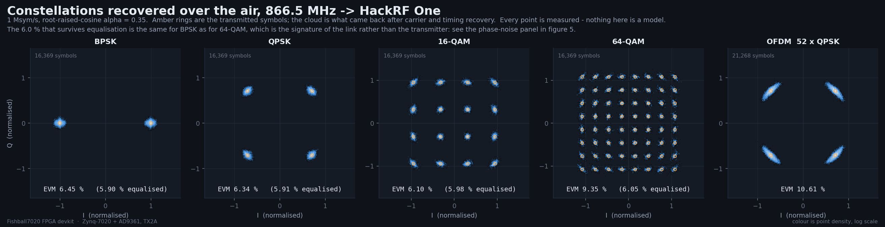
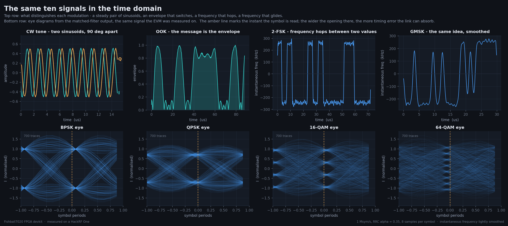

# Ten modulations, measured on a HackRF One

This page is what one Fishball7020 actually puts on the air, received on a
separate radio and measured. Nothing here is simulated, and nothing is quoted
from a datasheet: every number comes from the captures the figures are drawn
from, and the code that produced all of it is in
[`tools/modulation-gallery/`](../tools/modulation-gallery/).

The receiver is a **HackRF One** — a deliberately independent instrument. A
board that receives its own transmission shares one clock with itself, which
hides every oscillator problem there is. Two radios that have never met hide
nothing.


## The setup

| | |
|---|---|
| Transmitter | Fishball7020, Zynq XC7Z020 + AD9361, **TX2A**, 866.5 MHz, 4 MSPS, −16 dB attenuation |
| Receiver | **HackRF One**, 16 MSPS, 12 MHz analog filter, LNA 24 dB / VGA 24 dB, tuned **4.8 MHz above** the transmitter |
| Band | 866.5 MHz, inside the European 863–870 MHz ISM band |
| Link | over the air, a short hop across a desk |

**Jargon, once.** *EVM* (error vector magnitude) is how far each received symbol
lands from where it should, as a percentage of the signal's own size — smaller is
better. *PAPR* (peak-to-average power ratio) is how much louder the loudest
moment is than the average; it decides how much headroom an amplifier must keep
in reserve. *Constellation* is a plot of every received symbol as a dot, so the
pattern shows the modulation and the blur shows the damage.

## What was measured

| Signal | Tier | Occupied BW | PAPR | EVM | |
|---|---|---|---|---|---|
| CW tone | simple | 0.003 MHz | 0.22 dB | — | the reference |
| OOK | simple | 0.304 MHz | 4.95 dB | — | 250 kbaud |
| 2-FSK | simple | 0.854 MHz | 0.32 dB | — | 250 kbaud, ±250 kHz |
| BPSK | moderate | 1.164 MHz | 4.02 dB | 6.45 % | 5.90 % equalised |
| QPSK | moderate | 1.163 MHz | 3.69 dB | 6.34 % | 5.91 % equalised |
| GMSK | moderate | 0.994 MHz | 0.30 dB | — | BT = 0.3 |
| 16-QAM | complex | 1.165 MHz | 5.58 dB | 6.10 % | 5.98 % equalised |
| 64-QAM | complex | 1.164 MHz | 6.06 dB | 9.35 % | 6.05 % equalised |
| OFDM, 52 × QPSK | complex | 1.648 MHz | 9.47 dB | 10.61 % | 128-point FFT, ¼ cyclic prefix |
| LoRa-style CSS | complex | 0.990 MHz | 4.84 dB | — | **128 of 128 symbols decoded** |

All the linear modulations run at 1 Msym/s with root-raised-cosine shaping,
α = 0.35.

## Constellations



The 64-QAM grid is fully resolved — all 64 points separate cleanly — which is the
useful thing to look at here, more than the EVM number beside it.

## The number that does not improve

Every linear modulation lands at **5.9–6.1 % EVM after equalisation**, and it is
the same figure for BPSK as for 64-QAM. That flatness is the whole story. A
transmitter running out of linearity punishes dense constellations far harder
than sparse ones; an impairment that is identical across four modulation orders
is additive, and comes from the link rather than from the board.

Three measurements pin it down, and all three are in the figure below:

- **An unmodulated carrier through the same path already measures 8.7 %
  equivalent EVM**, of which 4.97° is RMS phase error and only 0.78 % is
  amplitude. A CW tone has no modulation to get wrong, so whatever that is, the
  transmitter's modulator did not cause it. (An earlier run of the same
  measurement gave 7.4 % and 4.22°. That it wanders between runs is itself
  evidence: a fixed impairment would not.)
- **In-band signal-to-noise is 42–45 dB**, which on its own would allow
  0.6–0.8 % EVM. Noise is not the limit either.
- **Image rejection is 55.0–64.9 dB**, measured by fitting the received symbols
  to `a·s + b·conj(s)` — a widely linear fit, which catches I/Q imbalance
  precisely because no ordinary equaliser can. The board's I/Q balance is fine.

What is left is phase noise between two independent oscillators, and it is a
property of the measurement, not of the radio. On the OFDM constellation you can
see it directly: the clouds are stretched tangentially, around the origin,
which is what a phase error does and what an amplitude error does not.


## Whose spur is it?

The CW spectrum has a comb of companions around the carrier, and a plot on its
own cannot say which radio made them. The obvious test — turn the transmitter
down and see whether the ratio in dBc holds — is **not sufficient**, and this
page got it wrong at first. It does separate an *additive* receiver artefact,
which grows faster than the signal, from anything multiplicative. But a spur
that a **receiver's** local oscillator stamps onto a carrier scales with that
carrier exactly as a transmitter's own sideband does, so a constant dBc ratio is
equally consistent with either radio.

What does separate them is a **second receiver**. The board has its own, and
internal TX→RX leakage is strong enough to use it without any antenna. A feature
present in the transmitted signal appears on both receivers at the same level
relative to the carrier; one manufactured inside a receiver appears on that one
alone.

Measured at the gallery's operating point, with both receivers set for the same
70 dB of dynamic range and neither clipping:

| Feature, relative to the transmit LO | Board's own receiver | Through the HackRF | |
|---|---|---|---|
| carrier feedthrough (on the LO) | −46.9 dBc | −47.3 dBc | **the board's** |
| I/Q image of the tone (−600 kHz) | −57.9 dBc | −57.6 dBc | **the board's** |
| 2nd harmonic of the tone (−1200 kHz) | −64.5 dBc | −65.7 dBc | the board's, near the floor |
| 3rd harmonic of the tone (−1800 kHz) | −40.8 dBc | −43.5 dBc | **the board's** |
| tone − 1.000 MHz | −68.5 dBc | −42.0 dBc | **not the board's** |
| tone + 1.000 MHz | −66.5 dBc | −42.0 dBc | **not the board's** |

The board's own noise floor in that measurement is −68.6 dBc, so the last two
rows are *at* its floor: absent. The first four agree between two independent
receivers to within 3 dB, which is also what validates the method.

So the board's own contributions to a CW spectrum are carrier feedthrough at
about −47 dBc, an I/Q image at −58 dBc, and a third-order product at −41 dBc.
The ±1 MHz pair is not among them.

## The comb that is not the board's

Around the carrier sits a comb of lines spaced **exactly 8.000 kHz**, each
flanked by satellites ±1.95 kHz away, plus the pair at exactly ±1.000 MHz. What
they are, in order of what the measurements rule out:

- **They are pure phase modulation.** Decomposing the sidebands into amplitude
  and phase puts every one of them 40–50 dB further down in AM than in PM — at
  40 kHz, −91 dBc of AM against −48 dBc of PM. Something is modulating an
  oscillator's phase, not the amplitude of anything.
- **Not a sampling artefact.** The comb stays at 8.000 kHz with the transmit
  rate at 4, 5 or 8 MSPS and the receive rate at 12, 16 or 20 MSPS.
- **Not a fractional-N synthesiser spur.** Those move when the synthesiser is
  retuned; these do not, for either radio, at any tuning tried.
- **Not at a quarter of the transmit rate.** An earlier version of this page
  said the ±1 MHz pair sat at fs/4 of the 4 MSPS transmit rate. That was a
  coincidence of 4/4 = 1. Changing the transmit rate leaves the pair at exactly
  1.000 MHz (−43.2 dBc at 4, 5 and 8 MSPS) while fs/4 of the new rates holds
  nothing (−72 to −75 dBc).
- **Not in what the board transmits**, by the two-receiver table above: 26 dB
  weaker through the board's own receiver, which is to say at its noise floor.

**What this page cannot tell you is which oscillator.** The board's transmit and
receive synthesisers are derived from one 40 MHz reference, so a perturbation
*of that reference* would appear on both and largely cancel in the board's own
loopback — by 20·log₁₀(866.5/2.0) ≈ 53 dB at the 2 MHz separation used, which is
enough to hide it. "Absent from the board's receiver" therefore means *either*
the HackRF's oscillator *or* the board's shared reference, and this measurement
cannot choose between them.

Separating the two needs a third path. Repeating at 2.45 GHz, where the HackRF
bypasses a conversion stage, was the attempt; the antenna is badly matched there,
the phase-noise floor came out 33 dB worse and two runs disagreed, so it settles
nothing. **A receive antenna on the board would settle it in one measurement** —
the board could then hear the HackRF transmit, two genuinely independent
oscillators with nothing shared. The board under test has none.

`whoselo.py`, `combclock.py`, `fs4.py`, `twoears.py` and `atlas2.py` in
[`tools/modulation-gallery/`](../tools/modulation-gallery/) reproduce each step.

## The peak that was not a signal

The first version of these measurements had a sharp peak **1.5 MHz below centre
in every single spectrum**, modulated or not. It was present with the
transmitter muted and unmoved by 20 dB of transmit power, so it was not the
board — but "it's the receiver" is not an explanation, and it turned out to be
worth chasing.

It is at 865.0 MHz, which is inside the European UHF RFID band, so the obvious
reading is an external transmitter. That reading is wrong, and one experiment
shows it. **Retune the receiver and a real signal stays at the same absolute
frequency.** This one did not:

| Receiver tuned to | 865.0 MHz would appear at | measured, above the noise floor |
|---|---|---|
| 858.0 MHz | +7.000 MHz | 1.3 dB |
| 861.0 MHz | +4.000 MHz | 4.9 dB |
| **863.0 MHz** | **+2.000 MHz** | **26.7 dB** |
| 867.0 MHz | −2.000 MHz | 3.2 dB |
| 870.0 MHz | −5.000 MHz | 2.5 dB |

Present at one tuning and absent at the other four. Nothing is at 865.0 MHz.

What *is* there is a strong carrier at **864.0 MHz** — that one shows up at every
tuning, at exactly 864.0 MHz each time (+7.000 from an 857 MHz tuning, +4.000
from 860, +1.000 from 863, −2.000 from 866, −5.000 from 869). And 865.0 MHz is
precisely twice its offset from a receiver tuned to 863.0.

That is the signature of **second-order distortion in the receiver's mixer**: a
strong input at baseband offset *d* reappears at *2d*. The prediction is that the
product moves at twice the rate the carrier does, in the same direction, and it
does, at every tuning tried:

| Receiver tuned to | 864.0 MHz sits at | product predicted at | measured there | a control bin 400 kHz away |
|---|---|---|---|---|
| 862.5 MHz | +1.500 MHz | +3.000 MHz | 18.1 dB | 11.3 dB |
| 863.0 MHz | +1.000 MHz | +2.000 MHz | 29.0 dB | 2.2 dB |
| 863.5 MHz | +0.500 MHz | +1.000 MHz | 15.1 dB | 3.1 dB |
| 864.5 MHz | −0.500 MHz | −1.000 MHz | 15.3 dB | 2.2 dB |
| 865.0 MHz | −1.000 MHz | −2.000 MHz | 14.6 dB | 2.5 dB |

No real signal behaves like that.

**The fix follows from the arithmetic.** The product lands at `2 × carrier − LO`,
so it is the *receiver's* tuning that decides where it falls, not the
transmitter's. Offset tuning was already in use to move the receiver's DC spike
out of the way; it was simply pointed the wrong way. Tuning **4.8 MHz above**
the transmitter instead of 3.5 MHz below moves the product from 865.0 MHz to
856.7 MHz — 9.8 MHz from the signal, deep in the digital filter's stopband.

Measured at −1.5 MHz, before and after: **21.5 dB above the noise floor → 3.8 dB**,
which is nothing. Every spectrum on this page is from the retuned run.

Two things improved as a side effect, both because the interferer was no longer
sitting in the measurement. The board's own ±1 MHz spur now reads −41.8 to
−42.0 dBc across the whole 20 dB sweep instead of drifting to −30.5 dBc at the
lowest power, where the old contamination dominated. And the equalised EVM
figures tightened from 6.01–6.17 % to 5.90–6.05 %.

`spurhunt.py`, `band.py`, `ip2.py` and `pickLO.py` in
[`tools/modulation-gallery/`](../tools/modulation-gallery/) reproduce all of
this, and none of them transmits — it is entirely a receiver question.

## The chirp


Spreading factor 9 over 1 MHz: 512 possible symbols, each the same up-chirp
cyclically shifted. Dechirping collapses each one to a single tone whose FFT bin
*is* the symbol, and here that peak stands **55.6 dB above the median bin**. All
128 symbols in the buffer came back correct.

A chirp is nominally constant-envelope, and this one measures 4.84 dB of PAPR.
That is not an error: band-limiting it to its own 1 MHz channel turns the
frequency wrap at each symbol boundary — a genuine discontinuity — into envelope
ripple.

## Time domain



The eye diagrams are drawn from the same matched-filter output the EVM was
computed on, so they are the same signal, not an illustration of it. The number
of distinct levels at the sampling instant — two, two, four, eight — is the
modulation order showing itself.

## Keeping the pictures honest

Three things had to be right before any of these plots meant anything.

**No DC spike, and no distortion products either.** A direct-conversion
receiver puts a large artefact at its own local-oscillator frequency, and on most
SDR screenshots it sits in the middle of the signal. Here the HackRF is
deliberately tuned **4.8 MHz above** the transmitter, so that artefact lands in
the stopband of the digital filter that follows and is rejected by 144 dB rather
than cosmetically blanked. The same choice of tuning — above rather than below —
also throws the mixer's second-order products clear of the band, which is a
separate problem with the same knob and is worked through in [the section
above](#the-peak-that-was-not-a-signal).

**No aliasing.** 16 MSPS with a 12 MHz analog filter puts the fold point 2 MHz
inside the analog stopband; the digital filter that follows passes 2 MHz, stops
at 2.6 MHz, and reaches 120 dB, and decimation to 8 MSPS then has 2 MHz of pure
margin. Pushed through this chain, a DC artefact twelve times the wanted signal
and an interferer six times it come out 113 dB down. The plots are reduced for
display by per-pixel min and max rather than by dropping points, because drawing
32 768 spectrum bins into 1 100 pixels aliases the *picture* too.

**A measurement chain that was checked before it was believed.** The spectrum
estimator is calibrated against signals with analytic answers — a full-scale tone
must read 0 dBFS, unit-variance noise must read −10·log₁₀(fs) dBFS/Hz. The
demodulator is run against a synthetic channel at a known signal-to-noise ratio
and has to return the EVM that the noise implies, including the processing gain
of the matched filter, before it is allowed near a real capture. Both checks run
from the command line:

```bash
# run from: tools/modulation-gallery/
python3 dsp.py          # spectrum calibration against known answers
python3 waveforms.py    # every waveform normalised and cyclic-seamless
python3 rx.py           # the demodulator, against a known synthetic channel
python3 chain.py        # anti-alias filter, and what it does to an interferer
```

That discipline earned its keep. The demodulator's first version reported 17.5 %
EVM at every signal-to-noise ratio; the fault was in the *test*, which rolled the
signal after applying the frequency offset and so created a phase discontinuity
no real transmission has.

## Repeating it

Everything the board transmits is generated from a fixed seed, so the reference
regenerates exactly and the captures can be re-analysed without transmitting
again.

```bash
# run from: tools/modulation-gallery/
python3 campaign.py            # transmit each signal, capture it, measure it
python3 fig1.py                # ... through fig5.py, redraw the figures
```

You need a HackRF (or any SoapySDR receiver, by editing `hackrf_cap.py`), GNU
Radio for the capture, and the board reachable over libiio. `board.py` takes the
board's address as its argument — see [changing the board's IP
address](networking.md) if it is not on the default.

> **Transmitting.** These runs put a real signal on a real antenna. 866.5 MHz is
> inside the European ISM band, and the levels here are low, but the band has
> duty-cycle and power limits and the rules differ by country. What leaves the
> antenna port is the operator's responsibility — see [transmitter
> safety](transmitter-safety.md).

## What this page does not establish

- **Absolute transmit power.** Nothing here is metered in dBm; every level is
  relative to the receiver's full scale. The board's output power is estimated
  elsewhere and never measured with a power meter — see
  [measured performance](measured-performance.md).
- **The board's true EVM.** The link's own 7.4 % floor sits above whatever the
  transmitter contributes, so these figures are an upper bound on the board's
  modulation error, not a measurement of it. Separating the two needs either a
  shared reference clock between the two radios or a better receiver.
- **How it behaves at full power.** Everything here is at −16 dB attenuation,
  comfortably inside the amplifier's linear region. Compression is a different
  experiment.
