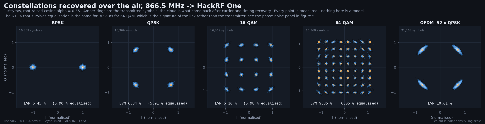
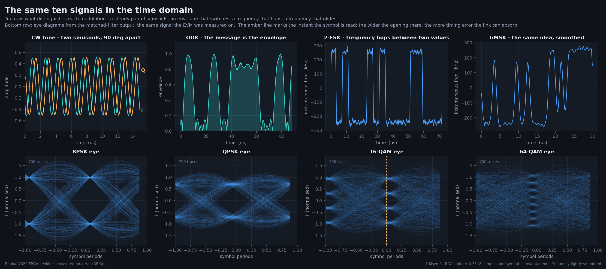

# Ten modulations, received on a HackRF One

What one Fishball7020 transmits for ten modulations, from a CW tone to 64-QAM,
OFDM and a LoRa-style chirp, received over the air on a separate radio: spectra,
constellations, EVM, PAPR, and which spurs belong to the board. Use it to see
what the transmitter can do, and as a method for attributing spurs between two
radios; the code is in [`tools/modulation-gallery/`](../tools/modulation-gallery/).

!!! abstract "Key facts"
    | | |
    |---|---|
    | linear modulations, after equalisation | **5.9–6.1 % EVM**, BPSK to 64-QAM alike: the floor belongs to the link, not the board |
    | the board's I/Q balance | image rejection **55.0–64.9 dB** |
    | the board's own CW spurs | carrier feedthrough about **−47 dBc**, I/Q image **−58 dBc**, third-order product **−41 dBc** |
    | LoRa-style chirp | **128 of 128 symbols decoded** |
    | not established | absolute transmit power, the board's true EVM, behaviour at full power |

## Repeating it

!!! danger "This transmits"
    866.5 MHz is inside the European ISM band and the levels are low, but the band
    has duty-cycle and power limits that differ by country; what leaves the antenna
    port is the operator's responsibility (see [transmitter safety](transmitter-safety.md)).

```bash
# run from: tools/modulation-gallery/
python3 campaign.py            # transmit each signal, capture it, measure it
python3 fig1.py                # ... through fig5.py, redraw the figures
```

You need a HackRF (or any SoapySDR receiver, by editing `hackrf_cap.py`), GNU
Radio for the capture, and the board reachable over libiio. `board.py` takes the
board's address as its argument ([changing the board's IP](networking.md)).
Every waveform comes from a fixed seed, so captures can be re-analysed without
transmitting again. The measurement chain is checked against known answers:

```bash
# run from: tools/modulation-gallery/
python3 dsp.py          # spectrum calibration against known answers
python3 waveforms.py    # every waveform normalised and cyclic-seamless
python3 rx.py           # the demodulator, against a known synthetic channel
python3 chain.py        # anti-alias filter, and what it does to an interferer
```

## The setup


| | |
|---|---|
| Transmitter | Fishball7020, Zynq XC7Z020 + AD9361, **TX2A**, 866.5 MHz, 4 MSPS, −16 dB attenuation |
| Receiver | **HackRF One**, 16 MSPS, 12 MHz analog filter, LNA 24 dB / VGA 24 dB, tuned **4.8 MHz above** the transmitter |
| Band | 866.5 MHz, inside the European 863–870 MHz ISM band |
| Link | over the air, a short hop across a desk |

The receiver is a separate instrument because a board receiving itself shares
one clock, which hides every oscillator problem. *EVM* (error vector magnitude)
is how far received symbols land from where they should, as a percentage;
*PAPR* (peak-to-average power ratio) is how much louder the peak is than the
average; *equalised* EVM is after a filter that removes the link's linear
distortion.

The HackRF is tuned 4.8 MHz above the transmitter so its own DC artefact lands in
the digital filter's stopband (rejected by 144 dB, not blanked) and its
second-order mixer products fall clear of the band
([below](#the-peak-that-was-not-a-signal)). 16 MSPS with a 12 MHz analog filter
plus a 2 MHz / 2.6 MHz / 120 dB digital filter leaves no aliasing; plots are
reduced per pixel by min and max so the picture does not alias either.

## Results

| Signal | Tier | Occupied BW | PAPR | EVM | |
|---|---|---|---|---|---|
| CW tone | simple | 0.003 MHz | 0.22 dB | — | the reference |
| OOK | simple | 0.304 MHz | 4.95 dB | — | 250 kbaud |
| 2-FSK | simple | 0.854 MHz | 0.32 dB | — | 250 kbaud, ±250 kHz |
| BPSK | moderate | 1.164 MHz | 4.02 dB | 6.45 % | 5.90 % equalised |
| QPSK | moderate | 1.163 MHz | 3.69 dB | 6.34 % | 5.91 % equalised |
| GMSK | moderate | 0.994 MHz | 0.30 dB | — | BT = 0.3 |
| 16-QAM | complex | 1.165 MHz | 5.58 dB | 6.10 % | 5.98 % equalised |
| 64-QAM | complex | 1.164 MHz | 6.06 dB | 9.35 % | 6.05 % equalised |
| OFDM, 52 × QPSK | complex | 1.648 MHz | 9.47 dB | 10.61 % | 128-point FFT, ¼ cyclic prefix |
| LoRa-style CSS | complex | 0.990 MHz | 4.84 dB | — | **128 of 128 symbols decoded** |

Linear modulations run at 1 Msym/s with root-raised-cosine shaping, α = 0.35.



The 64-QAM grid is fully resolved: all 64 points separate cleanly.



The eye diagrams come from the same matched-filter output the EVM is computed on.

**The chirp** (spreading factor 9 over 1 MHz, 512 possible symbols) dechirps to a
single FFT peak **55.6 dB above the median bin**, and all 128 symbols decode. Its
4.84 dB PAPR comes from band-limiting the frequency wrap at each symbol boundary.


## The EVM floor belongs to the link

Every linear modulation lands at **5.9–6.1 % EVM after equalisation**, BPSK as
much as 64-QAM. A transmitter out of linearity punishes dense constellations far
harder, so an impairment identical across four orders comes from the link:

| Evidence | Measured | So |
|---|---|---|
| an unmodulated carrier | **8.7 % equivalent EVM** (7.4 % on another run), mostly 4.97° RMS phase error, only 0.78 % amplitude | the floor is there before any modulation |
| in-band SNR | **42–45 dB**, enough for 0.6–0.8 % EVM | noise is not the limit |
| image rejection | **55.0–64.9 dB** (a widely linear fit to `a·s + b·conj(s)`) | the board's I/Q balance is fine |

What remains is phase noise between two independent oscillators, a property of
the setup; the OFDM clouds are stretched tangentially, as phase error does.


## Whose spur is it?

Turning the transmitter down cannot attribute a spur: one that a receiver's
oscillator stamps onto a carrier scales with it exactly as a transmitter
sideband does. **A second receiver can.** The board's own receiver hears its
transmitter through internal leakage; a feature in the transmitted signal appears
on both receivers at the same level, one made inside a receiver on that one only.
Both receivers at 70 dB of dynamic range, neither clipping:

| Feature, relative to the transmit LO | Board's own receiver | Through the HackRF | |
|---|---|---|---|
| carrier feedthrough (on the LO) | −46.9 dBc | −47.3 dBc | **the board's** |
| I/Q image of the tone (−600 kHz) | −57.9 dBc | −57.6 dBc | **the board's** |
| 2nd harmonic of the tone (−1200 kHz) | −64.5 dBc | −65.7 dBc | the board's, near the floor |
| 3rd harmonic of the tone (−1800 kHz) | −40.8 dBc | −43.5 dBc | **the board's** |
| tone − 1.000 MHz | −68.5 dBc | −42.0 dBc | **not the board's** |
| tone + 1.000 MHz | −66.5 dBc | −42.0 dBc | **not the board's** |

The board's floor there is −68.6 dBc, so the ±1 MHz pair is absent from what it
transmits. **The board's own contributions** to a CW spectrum are carrier
feedthrough at about −47 dBc, an I/Q image at −58 dBc and a third-order product
at −41 dBc.

**The 8 kHz comb** (lines spaced exactly 8.000 kHz, satellites ±1.95 kHz) is pure
phase modulation, independent of sample rate and tuning, and **belongs to the
HackRF**: with the HackRF transmitting and the board receiving it comes back
18 dB weaker (−66 against −48 dBc), where a board-side origin would show at full
strength. **The ±1 MHz pair** (−43.2 dBc, fixed at 1.000 MHz at transmit rates
4, 5 and 8 MSPS, so not fs/4) is not in what the board transmits; its origin
(probably the HackRF) is unresolved. `whoselo.py`, `combclock.py`, `fs4.py`,
`twoears.py`, `atlas2.py` and `decisive.py` reproduce each step.

## The peak that was not a signal

With the receiver tuned below the transmitter, every spectrum showed a sharp peak
1.5 MHz below centre (865.0 MHz), present with the transmitter muted. A real
signal stays put when the receiver retunes; this one appeared at only one tuning
(26.7 dB above the floor at 863.0 MHz, under 5 dB elsewhere).

| | |
|---|---|
| **cause** | second-order distortion in the HackRF's mixer. A strong carrier at **864.0 MHz** produces a product at `2 × carrier − LO`, which moves at twice the rate of the carrier as the receiver retunes, as measured at five tunings |
| **fix** | tune the receiver above the transmitter. At 4.8 MHz above, the product lands at 856.7 MHz, deep in the stopband, and the peak drops from 21.5 dB to 3.8 dB above the floor. Every spectrum on this page uses that tuning |
| reproduce | `spurhunt.py`, `band.py`, `ip2.py` and `pickLO.py`, without transmitting |

## What this page does not establish

- **Absolute transmit power.** Every level is relative to the receiver's full
  scale; see [board performance](measured-performance.md).
- **The board's true EVM.** The link floor (7.4–8.7 %) sits above the
  transmitter's contribution, so these are upper bounds; separating them needs a
  shared reference clock or a better receiver.
- **Behaviour at full power.** Everything is at −16 dB attenuation, in the
  amplifier's linear region.
