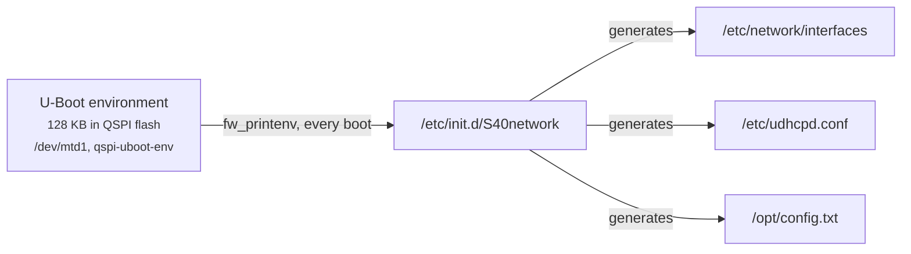

# Reaching the board and changing its IP address

Finding the board, changing either of its addresses, and where those settings
are stored, which decides what survives a reboot or a reflash.

- **USB cable:** **192.168.2.1**, always: the way back in
- **Ethernet:** asks your router (DHCP) by default
- **Name:** **`fishball.local`** (mDNS)
- **Settings live in:** **Buildroot:** the U-Boot environment in QSPI flash, so they survive reflashing the SD card. **Debian:** `/etc/network/interfaces`, an ordinary file
- **Security:** **no packet filter, `iiod` (port 30431) has no authentication**: anyone on your LAN can tune, receive and transmit

| Term | Meaning |
|---|---|
| *DHCP* | a router handing out addresses automatically |
| *static* address | one you fix yourself |
| *default route* (*gateway*) | where a device sends traffic for other networks; without one it reaches only its neighbours |
| *mDNS* | lets a device answer to `name.local` without a DNS server |
| *U-Boot* | the small program that loads Linux |

## The short version

```bash
# run from: the repo root
./devkit net                          # what is it doing now?
./devkit net find                     # locate it without knowing the address
./devkit net dhcp                     # ask the router for an address (the default)
./devkit net static 192.168.1.50      # pin it to one address; an optional second argument is the netmask
./devkit net name mysdr               # change the name it answers to (mysdr.local)
```

- `dhcp` and `static` write the setting, **read it back before rebooting**, then
  find the board again by name, since switching discards the address you were on.
- On the Debian rootfs, `dhcp`, `static` and `name` refuse and print the
  equivalent command instead; `find` and the status display work on both.

## Which userspace is your board running?

!!! note "Most of this page describes the Buildroot rootfs"
    On the **Debian** rootfs from [`firmware-modern/debian`](../firmware-modern/debian/README.md)
    the U-Boot variables, `S40network`, `config.txt` and `autorun.sh` do not apply.

```bash
# run from: the board
cat /etc/os-release      # "Debian GNU/Linux 13" -> see the Debian column
```

| | Buildroot | Debian |
|---|---|---|
| who configures `eth0` | `S40network`, from U-Boot variables | `/etc/network/interfaces`, a fixed file |
| static address | `fw_setenv ipaddr_eth …` | **edit `/etc/network/interfaces`**; `ipaddr_eth` is read by nothing |
| hostname / mDNS | `fw_setenv hostname` | `hostnamectl set-hostname`; avahi reads `/etc/hostname` |
| boot-time extras | `/mnt/jffs2/autorun.sh` | a systemd unit; `autorun.sh` is **never run** |
| `config.txt` on a USB drive | yes | **no**: there is no mass-storage gadget |
| USB network at **192.168.2.1** | yes, always the way back in | yes, always the way back in; also a serial console on the same cable (`/dev/ttyACM0`) |

## Reaching the board

In rough order of how well these work:

| # | Route | Notes |
|---|---|---|
| 1 | **USB, at 192.168.2.1** | `ipaddr_eth` only touches `eth0`; the USB interface keeps its own address. **The recovery route** |
| 2 | **mDNS: `fishball.local`** | the name follows the `hostname` variable, default `fishball` (patch `0014`). Without `0014`: `Fishball7020.local` (patch `0013` only) or `pluto.local` (neither). `./devkit net name pluto` restores compatibility with tools that look for `pluto.local`. mDNS can answer with an old address for a while after a new DHCP lease; `./devkit net find` handles that, or look for the board's MAC in `ip neigh` |
| 3 | **libiio discovery** | the board advertises the IIO service over DNS-SD (service discovery on mDNS); `ip:fishball.local` works as a libiio URI |
| 4 | **The serial console** | 115200 baud on one of the FT2232H's two ports, independent of any network setting |
| 5 | **Your router's DHCP lease table** | the MAC is the `ethaddr` variable and begins with Xilinx's `00:0a:35` |
| 6 | **`/opt/ipaddr-usb0`** | copied onto the USB drive by `update.sh`. There is no `/opt/ipaddr-eth0` when `eth0` is configured at boot |

```bash
# run from: your HOST
avahi-resolve -n fishball.local     # fishball.local  192.168.129.142
iio_info -s                         # address, model and serial, [ip:fishball.local]
avahi-browse -tpr _iio._tcp         # the iiod service on port 30431
```

## Four ways to change the address (Buildroot)

All four end in the U-Boot environment in QSPI flash
([below](#where-the-address-lives)). On Debian, edit `/etc/network/interfaces`.

| Route | Needs | Persists |
|---|---|---|
| 1. `fw_setenv` over ssh | a working network | yes |
| 2. `config.txt` on the board's USB drive | the USB cable, no ssh | yes |
| 3. the U-Boot console | the serial console | yes |
| 4. `ip addr add` | a shell on the board | no, lost at reboot |

### Route 1: over ssh, with `fw_setenv`

`./devkit net` wraps this. `fw_setenv` with no value deletes a variable, which
means DHCP. **It writes flash immediately**, so check before rebooting:

```bash
# run from: the board
fw_setenv ipaddr_eth 192.168.1.50      # static; or `fw_setenv ipaddr_eth` for DHCP
fw_setenv netmask_eth 255.255.255.0    # or `fw_setenv netmask_eth` for DHCP
fw_printenv ipaddr_eth netmask_eth     # check before you reboot
reboot
```

- Log in with `ssh root@192.168.2.1` (password `analog`).
- `S40network` regenerates the config only at startup. Instead of a reboot,
  `/etc/init.d/S40network restart` reconfigures every interface, dropping your ssh
  session if it runs over the interface you changed.

### Route 2: `config.txt` on the board's USB drive

Plugged into a PC, the board's USB port also appears as a drive called
`PlutoSDR` holding **`config.txt`**. No ssh needed. Buildroot only.

1. Open `config.txt` in a text editor.
2. Edit the values, set `reset = 1` under `[ACTIONS]`, save.
3. **Eject the drive.** Nothing happens until you eject.

```ini
# config.txt on the PlutoSDR USB drive (excerpt)
[NETWORK]
hostname = pluto
ipaddr = 192.168.2.1
ipaddr_host = 192.168.2.10
netmask = 255.255.255.0

[USB_ETHERNET]
ipaddr_eth =
netmask_eth = 255.255.255.0

[ACTIONS]
reset = 1
```

- **`[USB_ETHERNET]` configures the RJ45 gigabit socket** (the RTL8211F PHY); the
  name is inherited from the ADALM-Pluto. A blank `ipaddr_eth` selects DHCP.
- `/sbin/update.sh` writes the values with `fw_setenv -s` and reboots if `reset = 1`.
- **Check the result on the drive:** `SUCCESS_ENV_UPDATE` if it worked,
  `FAILED_INVALID_UBOOT_ENV` if not.

### Route 3: the U-Boot console

From the serial console at 115200 baud, interrupt the 3-second boot delay.
`saveenv` writes the same QSPI environment as `fw_setenv`; use it when Linux is
unreachable.

```
# run from: the U-Boot prompt (serial console, 115200 baud)
setenv ipaddr_eth 192.168.1.50
saveenv
boot
```

### Route 4: temporary, nothing written

```bash
# run from: the board - lost at reboot; undo with `ip addr del ...` or reboot
ip addr add 192.168.1.50/24 dev eth0     # add a second address, keep the old one
ip route add default via 192.168.1.1     # give it a gateway too
```

## Where the address lives

On Buildroot the addresses are **not in any file on the SD card**:



(`/dev/mtd1`, `"qspi-uboot-env"`, per `/etc/fw_env.config`.) So:

- **Editing `/etc/network/interfaces` does not survive a reboot.**
- **Defaults are compiled into the script.** `"ipaddr" not defined` still means
  192.168.2.1.
- **Address settings survive reflashing the SD card**, including
  `./devkit flash --target factory --all`.

| Variable | Default if unset | What it sets |
|---|---|---|
| `ipaddr_eth` | *(unset)* | **The Ethernet socket. Set it for a static address; leave it unset for DHCP.** |
| `netmask_eth` | `255.255.255.0` | The Ethernet netmask, used only when `ipaddr_eth` is set |
| `ipaddr` | `192.168.2.1` | The board's own address on the USB cable (`usb0`) |
| `ipaddr_host` | `192.168.2.10` | The single address the board's DHCP server hands *your PC* over USB |
| `netmask` | `255.255.255.0` | The USB netmask |
| `hostname` | the contents of `/etc/hostname`: `fishball` | The hostname, and therefore the mDNS name `fishball.local` |
| `usb_ethernet_mode` | `rndis` | USB Ethernet flavour: `rndis`, `ncm` or `ecm` |
| `ethaddr` | *(stored in the environment)* | The Ethernet MAC; Linux uses it for `eth0` with patch `0013` |
| `ssid_wlan`, `pwd_wlan`, `ipaddr_wlan` | *(unset)* | A USB Wi-Fi dongle, if you fit one |

`S40network` writes `iface eth0 inet static` when `ipaddr_eth` has a value and
`iface eth0 inet dhcp` otherwise, so "back to DHCP" means *deleting*
`ipaddr_eth`.

!!! warning "Editing `uEnv.txt` on the SD card does nothing"
    U-Boot imports it into its RAM environment only (`env import`, no `saveenv`),
    and this U-Boot has no network stack (`# CONFIG_NET is not set`). Linux's
    `fw_printenv` reads `/dev/mtd1`. An edit that seemed to work did so because
    192.168.2.1 is also `S40network`'s built-in default. Use Route 1 or Route 3.

## A static address has no gateway and no DNS

On Buildroot the static branch writes only `address` and `netmask`, and nothing
writes `/etc/resolv.conf`. The board reaches its own subnet and nothing else:
libiio is unaffected, but `git`, `wget` and anything that resolves a name fail.
DHCP sets both (udhcpc's `default.script`).

!!! tip "A DHCP reservation is usually the right answer"
    Leave `ipaddr_eth` unset and have your router always give this board the same address.

For a static address *with* internet access on Buildroot:

```bash
# run from: the board
cat >> /mnt/jffs2/autorun.sh <<'EOF'
ip route add default via 192.168.1.1
echo "nameserver 192.168.1.1" > /etc/resolv.conf
EOF
```

- `/mnt/jffs2` is Buildroot's only writable, persistent partition. `autorun.sh`
  runs at every boot after the network is up and survives reflashing: it is the
  first place to look when the board does something the source cannot explain
  ([troubleshooting](troubleshooting.md)).
- **On Debian `autorun.sh` is never run**: use a drop-in file or a systemd unit
  next to `fishball-identity.service`.

## The router shows a MAC address instead of a name

| | |
|---|---|
| symptom | the router lists the board by MAC, and a DHCP reservation is impossible |
| cause | the name a router lists comes from DHCP option 12, which stock udhcpc does not send; stock firmware also picks a random MAC every boot (`macb e000b000.ethernet: invalid hw address, using random`) |
| fix | `firmware/patches/0013` adds both to the generated stanza, below. The Debian rootfs does the same in its fixed file |

```
# /etc/network/interfaces as generated with patch 0013
iface eth0 inet dhcp
	hostname fishball
	hwaddress ether 00:0a:35:00:01:22
```

The MAC is the `ethaddr` variable (omitted if unset). A static stanza gets
`hwaddress` but not `hostname`, so the router lists a pinned board by MAC;
`fishball.local` works either way.

!!! tip "Running two boards on one network?"
    Check they do not share an `ethaddr`; `fw_setenv ethaddr <mac>` changes one.

## What DHCP exposes

| Direction | Exposure |
|---|---|
| **Outbound** | everything (with DHCP's gateway). No service on the board uses it |
| **Inbound from the internet** | no route in behind ordinary NAT. The addresses are private and **the kernel has no IPv6 stack** |
| **Inbound from your LAN** | **wide open**, and there is **no packet filter on the board** |

| Port | Service | Authentication |
|---|---|---|
| 22/tcp | dropbear, root shell | password `analog`, the documented default |
| 30431/tcp | `iiod` | **none** |
| 80/tcp | httpd, the info page | none; discloses serial, MACs, kernel and firmware versions |
| 5353/udp | avahi (mDNS) | n/a |
| 67/udp | udhcpd | limited to `usb0` by its config, so it does not serve your LAN |

!!! danger "Anyone who reaches port 30431 can tune, receive and transmit"
    Isolate the board on a separate VLAN or behind the router's firewall. A static
    address keeps it off the internet.

!!! note "A changed root password does not survive a reboot on Buildroot"
    Unless you copy `/etc/{passwd,shadow,group}` to `/mnt/jffs2/etc/` with a
    matching `password.md5`, which `S21misc` checks before restoring them.

## Logging in without a password

```bash
# run from: the repo root
./devkit ssh-key            # idempotent; --check reports whether it is done
ssh fishball
```

| | |
|---|---|
| `~/.ssh/fishball` | an ed25519 key used for **nothing else** |
| the board's `/root/.ssh/authorized_keys` | the public half, mode 600, root-owned |
| `~/.ssh/config` | a `Host fishball` block, appended without touching what is already there |

The key is dedicated because the board has a published root password. The last
step logs in with `BatchMode=yes`, so a pass proves the key works. The password
stays enabled; on Debian, turn it off only after key login is proven:

```bash
# run from: the board - Debian only, and ONLY after key login is proven
echo 'PasswordAuthentication no' > /etc/ssh/sshd_config.d/no-password.conf
systemctl restart ssh
```

!!! warning "A typo there locks you out"
    Recovery means taking the card out: logind is masked, so there is no
    `systemctl reboot`, and the console needs the FTDI `DEBUG` cable.

## If you have locked yourself out

In order of effort (Buildroot):

1. the USB cable and `fw_setenv` (unless you changed `ipaddr` too);
2. `config.txt` (Route 2);
3. the serial console at 115200 baud and `fw_setenv`;
4. the U-Boot console (Route 3).

Reflashing the SD card does *not* help: the addresses are in QSPI flash.

!!! warning "The environment can reset itself"
    U-Boot is built with `CONFIG_MISC_INIT_R`, and if **MIO 10 reads low at boot**
    it restores the compiled-in defaults: every `fw_setenv` value (`ethaddr`,
    `hostname`, `ipaddr_eth`, `tx_quiesce`) is gone, with one line on the serial
    console as the only notice. MIO 10 reads high on this board, but nothing
    guarantees it. **Symptom:** a board that has forgotten its settings and takes a
    random MAC every boot.

## Further reading

- [Flashing the board](flashing.md): which does *not* change these settings
- [Troubleshooting](troubleshooting.md): `/mnt/jffs2` and other invisible state
- [Capturing IQ](capturing-iq.md): using `ip:fishball.local` instead of an address
