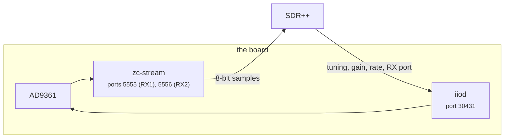
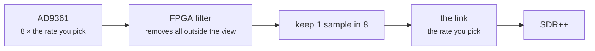

# Using SDR++ with this board

[SDR++](https://www.sdrpp.org/) is a fast, simple receiver for listening and
watching a band. This page gets stock SDR++ playing an FM station from this
board on any OS, then covers the settings that decide how well it works and
the extra controls a patched build adds. Every number here was measured on one
board over the USB cable, with SDR++ receiving the Paris FM band.

!!! abstract "Key facts"
    | | |
    |---|---|
    | USB | carries about **20 MB/s = 5 MS/s**; above that whole blocks are lost, with no error anywhere |
    | network, libiio | about **10 MS/s** for one receiver |
    | network, Fast TCP (patched SDR++ + `zc-stream`) | **20 MS/s**, 8-bit samples: about 48 dB visible dynamic range instead of 72 dB |
    | one station | use the FPGA /8 decimator at 500 kHz: 2 MB/s on the link |
    | one program at a time | the board has one receive buffer |
    | stock SDR++ | RX1 only, and never transmits |


## Quick start: stock SDR++, any OS

1. Install SDR++ from [sdrpp.org](https://www.sdrpp.org/) or your distribution.
2. Connect the board's **USB 2.0** socket and power it from a mains charger.
   After about 40 s it answers at `192.168.2.1`.
3. Start SDR++. Under **Source**, choose **PlutoSDR**, press **Refresh**, and
   pick the device named `FISH Ball PlutoSDR Rev.A (Z7020/AD9361)`.
4. Set the sample rate to **2.0 MHz**, **Bandwidth** to **Auto**, **Gain Mode**
   to **Manual** and **Gain** to about **40 dB**.
5. Under **Radio**, choose **WFM**. Type a station's frequency in the box at the
   top (101.5 MHz in the picture) and press play.

!!! note "Stock SDR++ receives on RX1 only, and nothing here transmits"
    SDR++'s PlutoSDR source powers the transmitter's local oscillator down.

## Settings that decide the result

| setting | what it does | start with |
|---|---|---|
| **Sample rate** | how much spectrum you see and how much data crosses the cable: 4 bytes per sample | 2 MHz; at most **5 MHz over USB** (below) |
| **Bandwidth** | the AD9361's analog filter in front of the converters | **Auto**, which follows the sample rate |
| **Gain Mode** / **Gain** | manual gain, or the AD9361's automatic gain (*slow attack* suits broadcast) | Manual, 40 dB for FM with a small antenna; lower it if the strongest station's peak spreads or the noise floor rises with it |
| **WFM bandwidth** (Radio) | how wide a slice the demodulator takes | 200000 for broadcast FM |
| **FFT size / rate** (Display) | how fine and how often the waterfall is drawn | 8192 at 20 frames/s; larger and faster costs your PC more CPU |

## Best performance over USB

The USB link carries about **20 MB/s**, which is **5 MS/s**. Measured with
`iio_readdev`, 12 s per rate:

| rate delivered | FPGA /8 | samples arriving |
|---|---|---|
| 0.25, 0.5, 1, 2, 3 MS/s | on | 99% |
| 5 MS/s | on or off | 98% |
| 6 MS/s | off | 84% |
| 7.68 MS/s | on | 65% |
| 8 MS/s | off | 63% |
| 10 MS/s | off | 50% |

98–99% is all of it: the rest is the stream starting inside the 12 s window.

!!! warning "Above 5 MS/s whole blocks are lost, with no error anywhere"
    It shows as streaks across the waterfall and clicks in the audio.

- **Stay at or below 5 MHz over USB.** For more, use Ethernet.
- **For one station, use the FPGA /8 decimator at 500 kHz** (patched SDR++,
  below). The FPGA filters it, the link carries 2 MB/s, and SDR++ has far less
  to process. RDS decodes cleanly at this rate.
- **Run one program on the radio at a time.** A second SDR++, GNU Radio or
  `iio_readdev` streaming from the board halves what each gets and both stutter.
- **Power the board from a mains charger.** On a laptop's USB port it can hang
  under load.


## This board's controls: the patched SDR++

SDR++'s PlutoSDR source does not know this board's second receiver or its FPGA.
[`tools/sdrpp/`](../tools/sdrpp/README.md) builds SDR++ with a patch that adds
them to the same source panel:


| control | what it does | when to change it |
|---|---|---|
| **Sample rate list** and **Custom (kHz)** | the 500 kHz steps plus the rates other SDR tools default to (2.048, 2.304, 2.4, 3.072, 3.84, 4.8, 6.144 MHz …); or type any rate and press **Set rate**: 521 kHz to 61.44 MHz, or 261 kHz to 7.68 MHz with the /8. A typed rate is saved | a rate the list lacks |
| **RX Port** | RX1 or RX2, one at a time | the antenna is on RX2 |
| **Gain** | live in every gain mode. Moving it in an automatic mode switches to Manual, because the chip takes a gain only there; in an automatic mode it shows the gain the chip chose, once a second. **Hybrid** leaves the gain at 73 dB on this board, the maximum, so a strong band clips: use Manual or Slow Attack | the noise floor rises with the strongest signal: lower it |
| **FPGA /8 decimator** | the AD9361 samples at 8× the rate you pick and the FPGA filters and keeps one sample in eight, so rates of 250 kHz to 7.68 MHz reach SDR++ with an eighth of the data | listening to one station, or any rate below 2 MHz |
| **Quadrature tracking** | the AD9361 keeps I and Q balanced, which suppresses the mirror image of each signal | leave on |
| **RF DC tracking**, **Baseband DC tracking** | the AD9361 removes its own DC offset, the spike at the centre of the spectrum | leave on |
| **Freq. corr. (ppm)** | corrects the 40 MHz reference (`xo_correction`), so stations sit exactly on their frequency | after measuring the board with `./devkit clock measure` |
| **Board / Firmware / Temp** | what you are connected to, and both chips' temperatures, once a second | read only |
| **Transport** | where the samples come from: **libiio** (as every SDR program does), or **Fast TCP, 8-bit (zc-stream)**, a small server on the board. Every setting above still goes through libiio either way | you want more than about 10 MS/s over the network: [below](#faster-the-fast-tcp-transport) |

- The tracking controls are the AD9361's own correction loops. SDR++'s **IQ
  Correction** further down the same menu is a different thing: a DC blocker
  running on your PC.
- **Frequency correction** shows the board's own value until you move it. Once
  moved, SDR++ writes your value at every start, because the board forgets it at
  reboot. Ctrl+click the slider to type a value.
- Every setting is saved per device.

!!! note "Stop, change, play"
    **RX Port**, the sample rate and the decimator change only while stopped, like the device menu.

### Faster: the Fast TCP transport

| Transport | Most for one receiver | Why |
|---|---|---|
| libiio | about **10 MS/s** over the network | each block is a round trip to the board. This build fetches 50 ms blocks; SDR++'s usual 5 ms blocks lost samples from 5 MS/s up (83% arrived at 7.68 MS/s, enough to stop a DAB+ decode) |
| **Fast TCP** | **20 MS/s**, a live 20 MHz-wide view | 8-bit samples instead of 16-bit ones, from [`zc-stream`](../tools/stream-paths/zc-stream/README.md) on the board |



Tuning, gain, rate, RX port and the rest still go through libiio, so the panel
works exactly as before. [Faster streaming](streaming-paths.md) has the
measurements.

1. Once: build and install `zc-stream` on the board as a service. It then
   starts at every boot and waits, idle, for SDR++. It needs the Debian root
   (`firmware-modern/`), which has systemd and a compiler.

    ```bash
    # run from: the repo root, on your PC
    scp -r tools/stream-paths/zc-stream root@192.168.2.1:
    ```

    ```bash
    # run from: the board, in ~/zc-stream
    apt install gcc make libiio-dev
    make && make install
    systemctl enable --now zc-stream
    ```

2. In SDR++, stop, set **Transport** to **Fast TCP, 8-bit (zc-stream)**, pick
   a rate up to 20 MHz, and play. Leave **zc-stream port** at 5555: RX1 comes
   from port 5555 and RX2 from 5556.

What it costs and where it stops:

| | |
|---|---|
| **Dynamic range** | 8 bits keep the top 8 of the radio's 12: about 48 dB between the strongest and weakest signal you can see at once, instead of 72 dB. Levels on screen are the same as with libiio. Set the gain so the strongest signal is near the top; a weak signal next to a strong one fades sooner than with libiio |
| **The network only** | it needs the board's address (an `ip:` device); over USB, use libiio |
| **One program receives at a time** | the board has one receive buffer. While SDR++ streams with Fast TCP, another program that tries to stream (pyadi-iio, `iio_readdev`, GNU Radio, a Hardware CI run) is refused with "Device or resource busy", and the reverse: SDR++ shows "zc-stream closed the stream: is another program receiving?". Settings from other programs still apply, to the same receiver. Idle, `zc-stream` holds nothing |
| **Up to 20 MS/s** | above that, samples go missing: the board cannot send more than about 42 MB/s. At 20 MS/s over Wi-Fi, up to 5% went missing in a bad minute; at 19 MS/s, 0.1%. **Pick 19 MS/s when every sample counts** |

The DAB+ decoder works the same on either transport.

### Installing it

=== "Arch"

    ```bash
    # run from: tools/sdrpp/
    makepkg -f
    sudo pacman -U sdrpp-git-*-x86_64.pkg.tar.zst
    ```

=== "Another Linux"

    Build SDR++ from source at the same commit with the patch applied:

    ```bash
    # run from: wherever you build software
    git clone https://github.com/AlexandreRouma/SDRPlusPlus.git && cd SDRPlusPlus
    git checkout 8c9f5ee8fe405775bfcd62c8c8f8c0fc928a64af
    patch -p1 < /path/to/fishball7020-fpga-devkit/tools/sdrpp/plutosdr-fishball.patch
    cmake -B build -DCMAKE_BUILD_TYPE=Release && make -C build -j"$(nproc)"
    sudo make -C build install
    ```

    Its dependencies are SDR++'s own (`fftw`, `glfw`, `glew`, `volk`, `libiio`,
    `libad9361`, an audio library); its
    [build instructions](https://github.com/AlexandreRouma/SDRPlusPlus#building-on-linux--bsd)
    list them per distribution.

## DAB+ radio

The patched build also carries a **DAB+ decoder**, F4JTV's `dab_decoder`
module, which uses welle.io's receiver. DAB+ is digital radio in Band III
(174–240 MHz): one 1.536 MHz-wide block, a *multiplex*, carries a dozen or so
stations at once.

1. Point the board at a Band III antenna, on RX2 or whichever input is
   cabled, and set a sample rate of **2.4 MS/s or more**. The decoder takes
   its own 2.048 MS/s slice from whatever SDR++ receives.
2. **Module Manager**: add an instance of `dab_decoder`, if there is not one
   already.
3. In the DAB Decoder panel, pick a block from the dropdown (`8C` is
   199.360 MHz). This tunes the radio.
4. Wait for **SYNC LOCKED**. The multiplex name and its stations appear within
   a few seconds; click a station to hear it.

In Paris, block 8C carries "Métropolitain 2": France Inter, FIP, RMC and ten
more.

!!! tip "A good antenna matters more than gain"
    A block at 25 dB above the noise decoded cleanly.

## How the decimator and the sample rate fit together

With **FPGA /8 decimator** off, the rate you pick is the AD9361's: the link
carries all of it. With it on, the rate you pick is still what reaches SDR++,
but the AD9361 runs eight times faster and the FPGA's filter removes everything
outside the view before discarding seven samples in eight:



| you pick | AD9361 samples at | on the cable |
|---|---|---|
| 500 kHz | 4 MS/s | 2 MB/s |
| 4 MHz | 32 MS/s | 16 MB/s |
| 7.68 MHz (the most) | 61.44 MS/s | 30.7 MB/s: more than USB carries |

The waterfall always spans the rate you picked. Stopping SDR++, or closing it,
puts the decimator back to bypass, so the next program finds the board as
usual.

## When something is wrong

| symptom | cause and fix |
|---|---|
| no PlutoSDR device after **Refresh** | the board is not answering on USB; `./devkit status` says why. On the Debian firmware, see [ssh works, but nothing can open the radio](troubleshooting.md#ssh-works-but-nothing-can-open-the-radio-debian-root) |
| streaks across the waterfall, clicks in the audio | samples lost: the rate is above what USB carries, or another program is streaming from the board |
| play does nothing, the log says the FPGA did not engage the /8 decimator | the board's FPGA design has no decimator; untick **FPGA /8 decimator** |
| play does nothing with RX2 selected | the board has one receiver (a one-receiver Pluto) |
| stations sit slightly off their frequency | set **Freq. corr. (ppm)** from `./devkit clock measure` |
| occasional clicks at any rate, with `audio write error, underrun` in SDR++'s log | the PC's audio output ran dry, not the radio: seen a few times a minute at every rate in these measurements |
