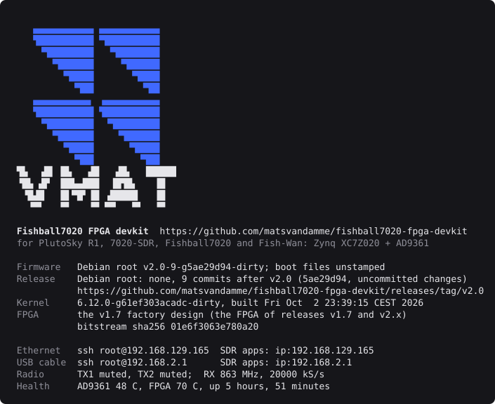

# Check what it runs

Log in and look:

```bash
# run on the board
cat /etc/os-release      # first line: PRETTY_NAME="Debian GNU/Linux 13 (trixie)"
uname -r                 # 6.12.0-...
cat /opt/VERSIONS        # device-fw <git-hash>, plus one line per component
```

| You see | It means |
|---|---|
| Debian 13 and kernel `6.12.0-…` | the modern firmware |
| Buildroot and `5.15.0` | the factory firmware |
| `device-fw` with a git hash | a devkit build (upstream firmware says `fw_version=v0.38`) |

The login message says the same, and names the release the firmware
corresponds to, with a link to it:



*Captured from a development board, so it names a build between releases;
a release card names its release.*

`iio_info` shows the same `fw_version`, and `hw_model` should read
`FISH Ball PlutoSDR Rev.A (Z7020-AD9361)`.

**Built it yourself?** Compare the card with your build:

```bash
# run from: the repo root
./devkit verify --board
```

**Next:** [before you transmit](before-you-transmit.md).
