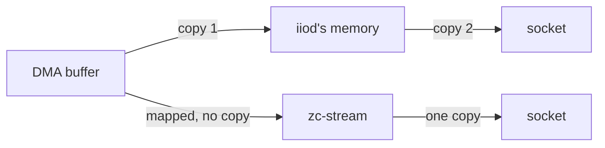

# Faster streaming: what was tried

**The question:** can the board stream one receiver to a PC at about 20 MS/s,
enough for a live 20 MHz view in SDR++, instead of the 11 MS/s it manages
through `iiod` today? **The answer is yes, with 8-bit samples.** Three paths
that keep the radio's 16-bit samples were built and measured, and the best
sustains 12 MS/s. Sending 8 bits per I and Q instead, from
[`zc-stream`](https://github.com/matsvandamme/fishball7020-fpga-devkit/tree/main/tools/stream-paths/zc-stream)
on two cores, reaches 20 MS/s, and 19 MS/s with margin. The patched SDR++ uses it as its
[Fast TCP transport](sdrpp.md#faster-the-fast-tcp-transport). This page
records what was measured, so nobody has to repeat it.

!!! abstract "Key facts"
    | | |
    |---|---|
    | 16-bit paths | at most **11–12 MS/s**: one ARM core at 100% copying samples into the network |
    | 8-bit `zc-stream -8`, two cores | **19–20 MS/s**; 19 MS/s when every sample counts |
    | ceiling | the kernel's network send path, about **42.7 MB/s** |
    | cost of 8 bits | about **48 dB** visible dynamic range instead of 72 dB |
    | every number | crossed Wi-Fi; a wired PC was not tried |

| Term | Meaning |
|---|---|
| `iiod` | the board's IIO server: the program SDR++, pyadi-iio, GNU Radio and MATLAB talk to over the network |
| **DMA** | the FPGA hardware that moves samples from the radio into the board's memory |

## The result

Every path was measured the same way: RX2 only, the board on gigabit
Ethernet, the PC on Wi-Fi, 12 s per rate timed over seconds 3 to 12, and a
60 s run at the highest passing rate. "Sustained" means at least 99.5% of the
samples arrived over those 60 s.
[`tools/stream-paths/rx-rate.py`](https://github.com/matsvandamme/fishball7020-fpga-devkit/tree/main/tools/stream-paths)
repeats any of it (`--bps 2` for 8-bit samples).

| Path | Sustained RX2 | Highest rate seen | Board CPU at the limit | Works with today's apps |
|---|---|---|---|---|
| **Stock `iiod` 0.26**, 16-bit | **11 MS/s** (100% over 60 s; 12 MS/s gave 95.4%) | 44–46 MB/s | `iiod` at 90–100% of one core | yes |
| **libiio 1.0 `iiod`**, 16-bit | **11 MS/s** (12 MS/s gave 97.5% over 60 s) | 48–50 MB/s | `iiod` at 100% of one core | the 0.26 `iio_attr` and `iio_readdev` work against it unchanged; pyadi-iio and SDR++ use the same 0.26 library but were not tried |
| **`zc-stream`**, raw TCP, 16-bit | **12 MS/s** (99.9% over 60 s; 13 MS/s gave 96.7%) | 52–57 MB/s | `zc-stream` at 100% of one core | SDR++'s Network Source, GNU Radio or a script; tuning stays in `iiod` |
| **`zc-stream -8`**, raw TCP, 8-bit, two cores | **19–20 MS/s** (19: 99.9%; 20: 99.7% over 60 s, but not every time, below) | 42.7 MB/s ≈ 21 MS/s | both cores: board 88%, `zc-stream` 175% | the patched SDR++, with every control; Network Source; a script |

The 8-bit path was built up in steps, each measured the same way:

| `zc-stream -8` | Sustained RX2 |
|---|---|
| one thread: wait for the DMA, convert, send | 17 MS/s (99.8%) |
| two threads: one converts while the other sends | 19 MS/s |
| two threads, the sender pinned to CPU1 | **20 MS/s** (99.7% over 60 s) |
| the same, sending with `MSG_ZEROCOPY` from the converted buffer | no gain (~42 MB/s) |

!!! note "At 20 MS/s the margin is thin, and Wi-Fi decides the rest"
    Later runs at 20 MS/s gave 99.7% over 45 s into SDR++, 99.8% over 33 s, and
    98.8% and 95.1% over two 60 s runs. In the 98.8% run `zc-stream` used 120% of
    the 200% available, so the board was keeping up. A sweep straight after gave
    99.9% at 19 MS/s, 99.1% at 20 and 97.6% at 21. So 20 MS/s works, and **19 MS/s
    is the rate to choose when every sample counts**.

**Block size matters for libiio.** The 16-bit rows were measured with blocks
of 1 M samples. Each block is a request to `iiod` and back, so small blocks
cost rate:

| libiio block | 5 MS/s | 7.68 MS/s | 10 MS/s |
|---|---|---|---|
| 1/200 s (SDR++'s stock PlutoSDR source) | 96.5% | 83% | |
| 1/20 s (the patched SDR++) | 99.9% | 99.9% | in full |

For comparison, on the same board and network:

| | |
|---|---|
| Plain TCP from the board to the PC, no radio, from Python | 75 MB/s ≈ 19 MS/s at 16 bits |
| Capture on the board itself (`local:`), no network | 30.72 MS/s with no loss |
| Gigabit Ethernet's own limit for one receiver | about 29 MS/s at 16 bits |

## Why the 16-bit paths stop at 11–12 MS/s

**The limit is the board's CPU copying samples into the network**, not the
network and not the radio. Every 16-bit path ends with one ARM Cortex-A9 core
at 100% while the second core has little to do.

- **`iiod` copies each sample twice**: from the DMA buffer into its own
  memory, then into the socket. One thread does both.
- **libiio 1.0** keeps several blocks in flight and can hand DMA buffers around
  by reference (DMABUF, which the 6.12 kernel supports and 5.15 does not). But
  its zero-copy path is for **USB only**: over the network it still copies each
  block into the socket, and the extra threads did not spread that over both
  cores. Whether DMABUF was used at all could not be confirmed.
- **`zc-stream`** reads the DMA blocks without copying (libiio maps them into
  the program) and copies once, into the socket. That buys one MS/s.
- **True zero-copy is not possible here.** Asking Linux to send the DMA block
  without copying it (`MSG_ZEROCOPY`) fails with `EFAULT`: the network stack
  cannot pin the radio's DMA memory. Bigger blocks, more blocks in flight and
  a larger socket buffer made `zc-stream` slower, not faster.

## How 8 bits get to 20 MS/s, and what stops them there

**Half the bytes.** The radio's samples are 12 bits, sent in 16. `-8` keeps
the top 8 (a shift right by 4), so 20 MS/s is 40 MB/s instead of 80.

**Both cores.** One thread waits for each DMA block and converts it; a second
sends the converted block, from a ring of four, while the first converts the
next. The sender is pinned to CPU1, because every interrupt, the network's
included, lands on CPU0. That last step was worth 1 MS/s.

**The ceiling is the kernel's network send path**, at about 42.7 MB/s:

- Reading the DMA memory is not it. Read on its own, a DMA block streams at
  265 MB/s (236 MB/s copied), against 353/301 MB/s for normal memory: slower,
  because it is mapped uncached, but six times what 20 MS/s needs.
- With the radio taken out (`zc-stream` sending numbered synthetic blocks),
  the stream still stops at about 42 MB/s.
- `MSG_ZEROCOPY` from the converted buffer, which is normal memory, works, but
  gains nothing: the copy was not the cost.

!!! warning "Open point"
    The plain-TCP test from Python above reached 75 MB/s on the same link, while the
    synthetic C sender stops at 42. Neither the block size, the Wi-Fi on the day nor
    the reader (`nc` here) has been ruled out. Rerun both back to back before quoting
    either as the link's limit.

**The cost** is dynamic range: about 48 dB between the strongest and weakest
signal visible at once, against 72 dB for 12 bits. Strong signals are
unaffected; set the gain so the strongest one sits near the top, because the
four bits dropped are where a weak signal lives. Decoding DAB+ through SDR++,
the 8-bit path and libiio gave the same SNR (1.3 and 1.4 dB on a weak block).

*The patched SDR++'s PlutoSDR source at 20 MS/s on the Fast TCP transport: the
whole FM band live, tuned and controlled from the source panel as usual.*

## What else works for more bandwidth

- **Send fewer samples.** The FPGA's ÷8 decimator filters in hardware and sends
  an eighth of the rate: up to 7.68 MS/s of clean bandwidth, well inside every
  limit here ([SDR++](sdrpp.md#how-the-decimator-and-the-sample-rate-fit-together)).
  It works on the Fast TCP transport too.
- **Process on the board.** Code there reads 30.72 MS/s with `local:` and can
  send only its results ([your own project](your-own-project.md)).

## Using zc-stream

[`tools/stream-paths/zc-stream`](https://github.com/matsvandamme/fishball7020-fpga-devkit/tree/main/tools/stream-paths/zc-stream)
has the commands. In short: install it on the board as a service, which runs
`zc-stream -D -8` (RX1 on port 5555, RX2 on 5556, int8), and pick **Transport:
Fast TCP** in the patched SDR++'s PlutoSDR source
([how](sdrpp.md#faster-the-fast-tcp-transport)). Tuning, gain, rate and the
receiver stay in SDR++, which sets them through libiio.

!!! note "One program receives at a time"
    The board has one receive buffer. libiio switches it off before opening it, so a
    second program's attempt to stream used to stop the first one's stream even
    though the attempt itself failed. `zc-stream` now refuses a client while someone
    else streams, and rebuilds its buffer if a libiio program stops it. Measured both
    ways with `iio_readdev`: the running stream carried on and the newcomer got
    "Device or resource busy".

## Not tried

- **libiio 1.0 over USB.** Its DMABUF zero-copy path is the USB one, and USB is
  where the board is weakest today (about 5 MS/s). The test build had it
  switched off. It is the one libiio 1.0 experiment that could pay off.
- **A wired PC.** Every number here crossed Wi-Fi. A cable would show whether
  20 MS/s at 8 bits is steady without Wi-Fi's variation.
- **Packing 12-bit samples** (3 bytes per I/Q pair instead of 4): 25% less
  data with no loss of dynamic range, but at 16-bit rates the CPU, not the
  bytes, is the limit, so it would need the two-core pipeline as well.
