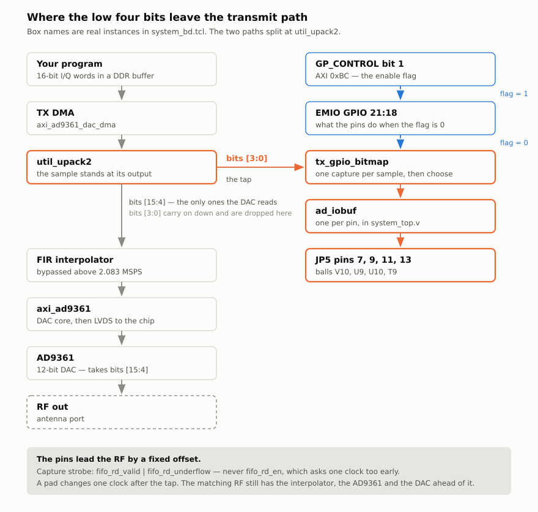
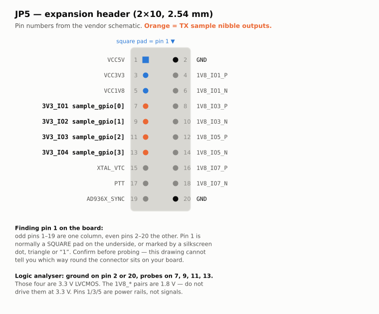
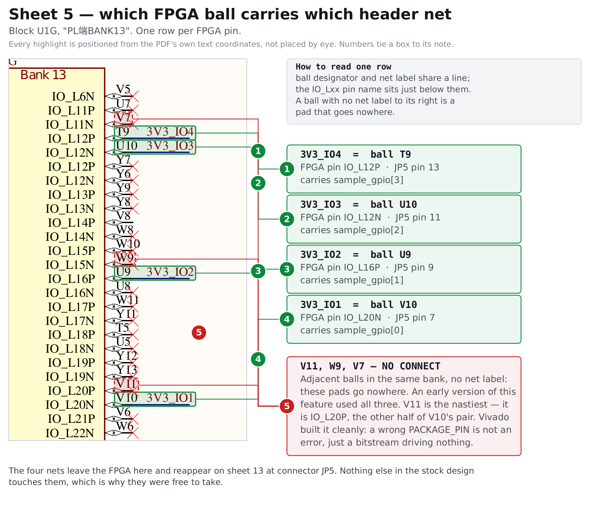
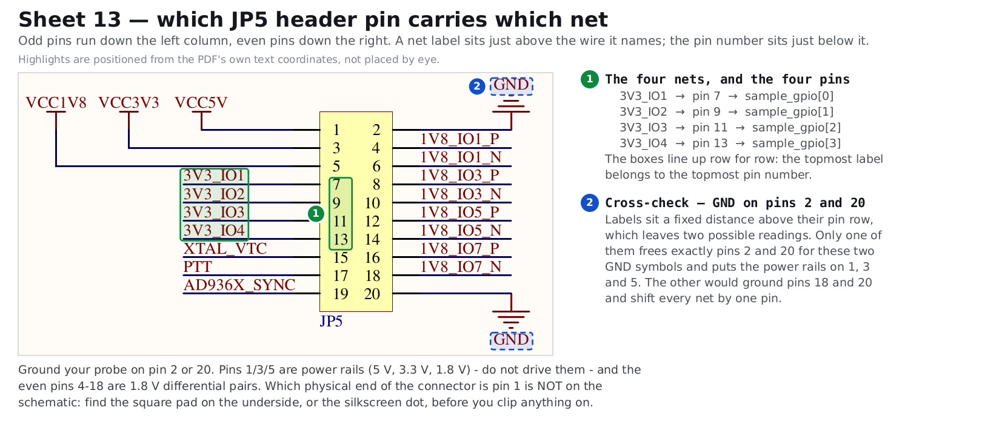
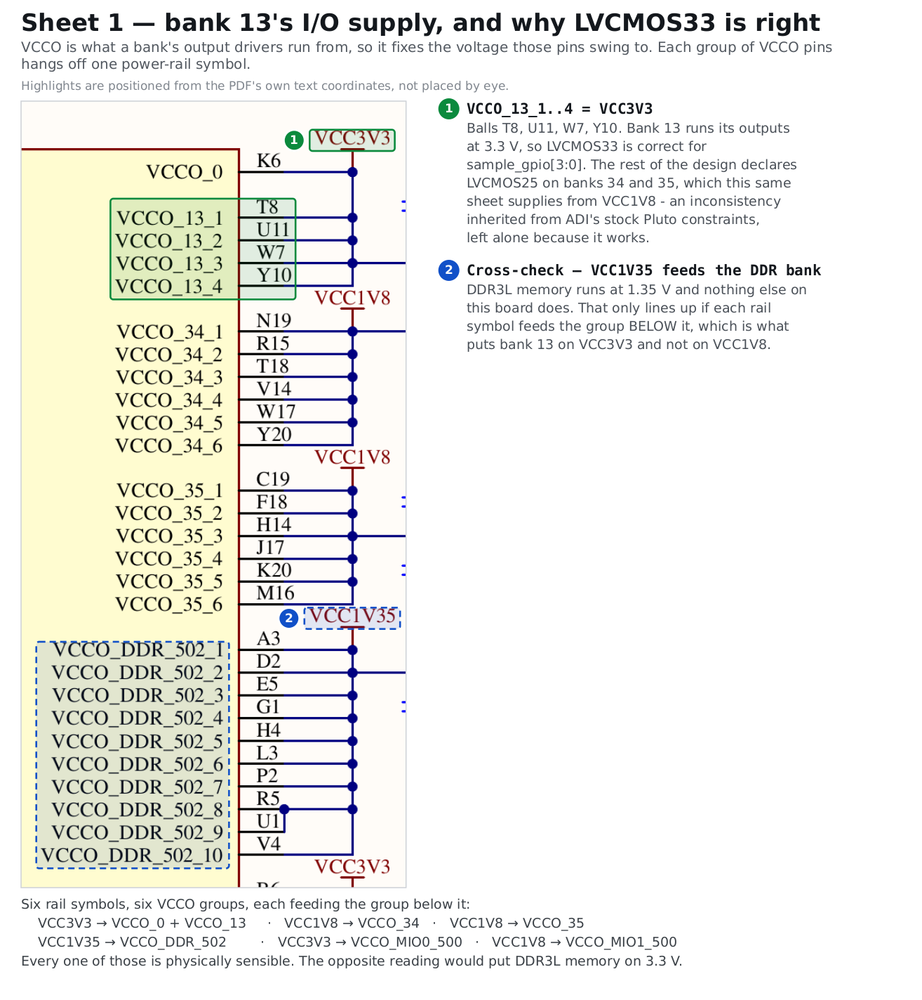
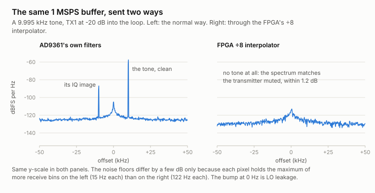
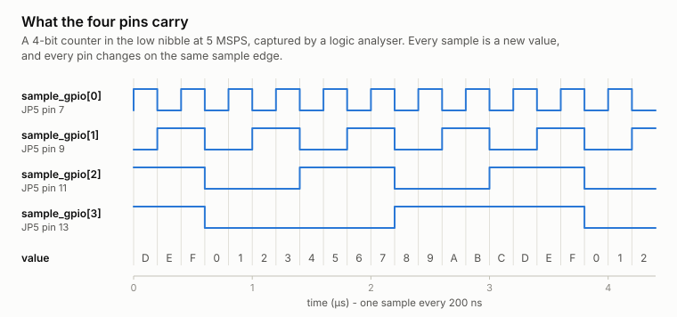
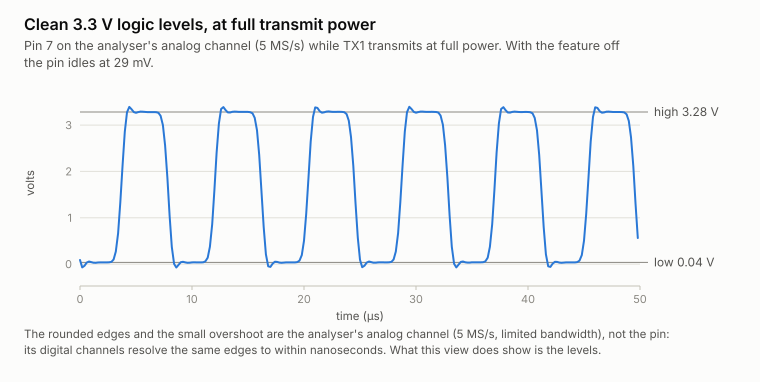
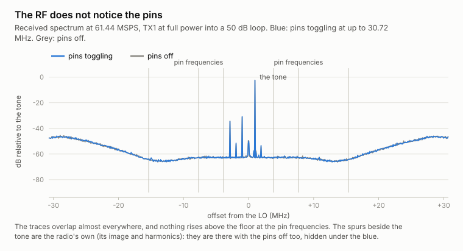

# Four header pins that tick with the transmitted waveform

The full reference for a feature of the base firmware: **four digital output
pins whose every edge is locked to a specific transmitted RF sample**. The
README has the [short version](../README.md#sample-locked-gpio-outputs); this
page is the detail behind it.

It gives you something no software timing can offer. Not "about a millisecond later, give or take"
— a fixed offset you measure once and then trust. You decide, sample by
sample, what those pins do.

The trick costs nothing, because the bits it uses were being thrown away.

**Contents**

- [The four bits nobody uses](#the-four-bits-nobody-uses) — the idea
- [What "coherent" buys you](#what-coherent-buys-you) — and what it does *not* mean
- [How it is built](#how-it-is-built) — datapath, module, wiring, pins, cost
- [How to control it](#how-to-control-it) — the register, GPIO mode, authoring patterns
- [Building and flashing](#building-and-flashing)
- [Limits](#limits) · [What has actually been verified](#what-has-actually-been-verified)
- [Notes for anyone extending it](#notes-for-anyone-extending-it)

---

## The four bits nobody uses

Some vocabulary first, because three things here are easy to confuse.

- A **sample** is one number describing the signal at one instant. Transmitting
  means handing the radio a long list of them.
- The **DAC** (digital-to-analog converter) is the chip block that turns each
  sample into a voltage. Its **resolution** is how many bits of each sample it
  actually reads.
- **DMA** (direct memory access) is how those samples get from a buffer in RAM
  to the radio without the CPU copying each one.

Now the useful fact. You hand the AD9361 **16-bit** samples — that is what
libiio, GNU Radio and every tool here produce. **The DAC is only 12 bits.** It
takes the top 12 of your 16 and ignores the rest:

```
your sample:   b15 b14 b13 b12 b11 b10 b9 b8 b7 b6 b5 b4 │ b3 b2 b1 b0
               └──────────── the DAC converts these ────┘  └─ discarded ─┘
```

You can see it in ADI's own HDL — `axi_ad9361_tx_channel.v` does literally
`dac_data_out_int <= dma_data[15:4];`. The bottom four bits (the **low
nibble**, the usual jargon for "bottom four bits") reach the FPGA and stop
there. Nothing downstream reads them, so they change nothing about the
transmitted signal, at any sample rate you reach the normal way. (The one path
that would feed them to the DAC is the FPGA's ÷8 transmit interpolator, which
does not work on this board anyway; see [Limits](#limits).)

So they are free. This feature routes them to four pins on the expansion
header instead of dropping them.

## What "coherent" buys you

**Coherent** here means: a fixed, unchanging, known relationship in time
between two things. It does **not** mean simultaneous, and the difference
matters enough to spell out.

The pins carry bits `b0..b3` of a sample; bits `b4..b15` of that same sample
become RF. But the pin is driven one FPGA clock after the sample leaves the
DMA unpacker, while the RF still has to cross the rest of the FPGA's transmit
path, the AD9361's own digital filters, the DAC and the analog transmit chain. **So
the pins lead the RF**, by something on the order of a microsecond depending
on how the filters are configured.

What makes that useful is that the lead is *constant*. It does not drift, it
does not vary sample to sample, and it comes out the same on every run as long
as you do not change the sample rate or the filter configuration. Measure it
once — with a scope on a pin and another on the RF, or by looping the
transmitter back into the receiver and cross-correlating — and subtract it
forever after.

Nothing in software gets you even that. A GPIO toggled from Linux is tens of
microseconds away from the RF and the delay changes from run to run and from
pulse to pulse; even a kernel driver is at the mercy of the DMA queue depth.
Here the offset is structural, so it is a calibration constant instead of a
source of error.

### What it is for

The motivating application is **multi-channel radar** (1 transmitter, 8
receivers; or 2 and 8). The transmit buffer in DDR holds the waveform, and the
low nibble of each sample carries, on separate pins:

| Pin | Typical use |
|---|---|
| `sample_gpio[0]` | **master clock** — a steady square wave the receivers clock from |
| `sample_gpio[1]` | **frame clock** — one pulse per pulse-repetition interval |
| `sample_gpio[2]` | **sync / trigger** — "the chirp starts *now*" |
| `sample_gpio[3]` | spare: a coded marker, a range gate, a T/R switch line |

Separate receiver hardware then samples with a timebase welded to the
transmitted waveform, which is the whole game in radar and in MIMO
(multiple-input multiple-output: several antennas that must agree on phase).

**None of those roles is wired into the FPGA.** A pin's role is whatever
pattern you put in that bit — see [how to control it](#how-to-control-it).

---

## How it is built

The FPGA does not *generate* anything. It **transports**: whatever you author
into the low nibble comes out on the pins, one nibble per sample. The four bits
branch off early, while the sample is still exactly the 16-bit word you wrote,
and travel to the pad on their own:

<picture>
  <source media="(prefers-color-scheme: dark)" srcset="img/nibble-path-dark.svg">
  
</picture>

The same thing as text, with the enable flag and the ordinary-GPIO path shown:

```
  DDR buffer ──DMA──> tx_upack ──┬── [15:4] ──> interpolator ──> AD9361 ──> RF
  (16-bit samples)   (unpacker)  │                                DAC
                                 │
                                 └── [3:0] ──> tx_gpio_bitmap ──> 4 header pins
                                                     ▲   ▲
                              up_dac_gpio_out[1] ────┘   └──── EMIO GPIO 18-21
                              (the enable flag)                (when flag = 0)
```

### Files

| File | What it is |
|---|---|
| `hdl/projects/pluto/tx_gpio_bitmap.v` | the module (~30 lines of logic) |
| `hdl/projects/pluto/system_bd.tcl` | block-design wiring: slices, the OR gate, EMIO widened 18 → 22 |
| `hdl/projects/pluto/system_top.v` | the `ad_iobuf` onto the four package pins |
| `hdl/projects/pluto/system_constr.xdc` | pin assignments and the CDC constraint |
| `firmware/sim/tb_tx_gpio_bitmap.v` | self-checking testbench, 2092 checks |
| `firmware/patches/0006-tx-sample-nibble-to-gpio.patch` | all of the above, applied by `setup.sh` |
| `firmware/patches/0007-tx-sample-gpio-iio-attribute.patch` | the `tx_sample_gpio_en` sysfs attribute |

### Where the nibble is tapped, and why there

The tap is `tx_upack/fifo_rd_data_0[3:0]` — **channel 0's I, straight out of
the DMA unpacker, before the interpolation filter.**

A FIR interpolator mixes neighbouring samples together. Tapping downstream of
it would put *filter output* on the pins rather than the bits you wrote, and
only when interpolation happened to be engaged — a bug that would appear and
disappear with the sample rate. Tapping the raw DMA word means the pattern
reaches the pins bit-for-bit whatever the rest of the transmit chain does, and
those bits are still exactly the ones the DAC discards, so the analog cost is
zero.

(`fifo_rd_data_1[3:0]` is channel 0's Q, the hook for a future I+Q widening.)

### The capture strobe, and why it is not the obvious one

The nibble is captured on `fifo_rd_valid | fifo_rd_underflow`, **not** on
`fifo_rd_en`. The obvious choice is the wrong one:

- `fifo_rd_en` is a **request** — "give me a sample".
- `util_upack2` **registers** its output (`fifo_rd_data <= deinterleaved_data;`
  in `util_upack2_impl.v`), so the requested word only appears on the
  *following* clock.
- `fifo_rd_valid` and `fifo_rd_underflow` are registered alongside the data.
  Exactly one of them is high on the clock where the new word stands at the
  output — `valid` for a real sample, `underflow` for the zeros the unpacker
  substitutes when the DMA has starved.

Capturing on `fifo_rd_en` latches the *previous* sample: stable, repeatable,
and permanently one sample behind the DAC. Using the OR of the two registered
strobes also means that when the DMA underflows and the DAC is fed zeros, the
pins carry those zeros too — so "the pins are the low nibble of what the DAC
got" has no exceptions to write down.

### Why a per-sample strobe at all

In **2R2T** mode (both channels active) the datapath presents a new sample
only every *second* FPGA clock. Capturing on the clock rather than on the
strobe would double the rate of every pattern you authored — a clock at half
the sample rate instead of a quarter, a one-sample frame marker arriving twice.
It simulates perfectly back-to-back and costs a Vivado rebuild and a flash to
discover on hardware, which is why the testbench checks it specifically and
`run_sim.sh --mutate` proves that check can fail.

### The module

```verilog
module tx_gpio_bitmap #(parameter integer NBITS = 4) (
  input                clk, rst,        // l_clk and the datapath reset
  input  [NBITS-1:0]   sample_in,       // the raw DMA nibble
  input                valid_in,        // "a new word is here NOW"
  input                flag,            // up_dac_gpio_out[1]
  input  [NBITS-1:0]   gpio_o_in,       // EMIO GPIO, used when flag = 0
  input  [NBITS-1:0]   gpio_t_in,
  output [NBITS-1:0]   pin_o, pin_t);   // to an ad_iobuf at the top level
```

| `flag` | What owns the pins |
|---|---|
| `0` | **EMIO GPIO** — Linux drives them, tristate and all. The state at reset. |
| `1` | **the fabric** — `pin_o` = the registered nibble, `pin_t` = 0 (all driven) |

Three details that are deliberate:

- **`NBITS` is a real parameter.** The testbench instantiates an 8-bit copy
  alongside the 4-bit one, because a parameter nobody instantiates is a
  parameter that does not work. Widening to I+Q is a parameter change plus four
  more pins.
- **The flag crosses two flip-flops.** It is written by software in the AXI
  clock domain and read in the datapath domain — a genuine clock-domain
  crossing, and the synchroniser keeps a metastable level out of the fabric. A
  flag change therefore takes effect two clocks later.
- **Reset clears the held nibble**, so a datapath reset cannot leave a stale
  bit pattern standing on the pins.

### Block-design wiring

All in `system_bd.tcl`, following the existing `interp_slice` template:

| Instance | What it does |
|---|---|
| `bitmap_sel` (`xlslice`) | bit **1** of `up_dac_gpio_out` → the enable flag. Bit 0 is already the interpolator bypass. |
| `nibble_slice` (`xlslice`) | `fifo_rd_data_0[3:0]` → the module's `sample_in` |
| `bitmap_valid_or` (`util_vector_logic`) | `fifo_rd_valid OR fifo_rd_underflow` → `valid_in` |
| `gpio_bitmap_o` / `gpio_bitmap_t` (`xlslice`) | EMIO GPIO bits **21:18** → the standard-GPIO inputs |
| `tx_bitmap` (module reference) | the module itself |

The PS7's `PCW_GPIO_EMIO_GPIO_IO` goes from **18 to 22** and the `gpio_i/o/t`
block-design ports widen to match, which is what gives the four pins their
ordinary-GPIO identity when the flag is clear. `system_top.v` adds an
`ad_iobuf` tying `pin_o`/`pin_t` to the package pins and feeds the pad inputs
back to `gpio_i[21:18]`.

### The pins

Four free single-ended 3.3 V I/O on connector **JP5**, unused by the stock
design. Read off sheet 5 (`U1G`, "PL端BANK13") of the vendor schematic, which
is in this repository at
[`docs/vendor/`](vendor/7020_936x_SDR-schematic.pdf). Annotated crops of that
sheet and the two others that fix this assignment are
[below the pinout](#where-the-pin-numbers-come-from):

| Signal | Header net | JP5 pin | FPGA ball | FPGA pin name |
|---|---|---|---|---|
| `sample_gpio[0]` | `3V3_IO1` | 7 | **V10** | IO_L20N |
| `sample_gpio[1]` | `3V3_IO2` | 9 | **U9** | IO_L16P |
| `sample_gpio[2]` | `3V3_IO3` | 11 | **U10** | IO_L12N |
| `sample_gpio[3]` | `3V3_IO4` | 13 | **T9** | IO_L12P |

The bit number matches the header label, so `sample_gpio[0]` is the pin
silkscreened `3V3_IO1`.

<picture>
  <source media="(prefers-color-scheme: dark)" srcset="img/jp5-pinout-dark.svg">
  
</picture>

JP5 also carries VCC1V8, VCC3V3 and VCC5V (pins 1, 3, 5) and four 1.8 V
differential pairs, which are where an I+Q widening would go. **Ground a probe
on pin 2 or 20.** The drawing is generated by `docs/img/make_jp5_pinout_svg.py`.

#### Where the pin numbers come from

<details>
<summary><b>Where these numbers come from</b> — the three vendor schematic sheets, annotated</summary>

<br>

The vendor's schematic is in this repository:
[`docs/vendor/7020_936x_SDR-schematic.pdf`](vendor/7020_936x_SDR-schematic.pdf).
Below are annotated crops of the three pages that fix the assignment, drawn
from it by
[`docs/img/make_schematic_figures.py`](img/make_schematic_figures.py) —
run it and you get these back. Every highlight is positioned from the PDF's own
text coordinates, so a box cannot drift off the word it marks.

> Use that copy. The schematic the vendor publishes on their **GitHub** is a
> different board revision: 15 pages, no `JP5`, no `3V3_IO` nets, connectors
> numbered `J1`–`J12`. It does not describe this board. See
> [docs/vendor/](vendor/README.md).

**Sheet 5 — which FPGA ball carries which header net.** Also the three balls
that look right and are not: V11, W9 and V7 sit in the same bank, next to the
real ones, and the schematic marks all three *no connect*. An early version of
this feature drove them, and Vivado produced a clean, timing-met bitstream
anyway — a wrong `PACKAGE_PIN` is not a build error.



**Sheet 13 — which JP5 pin carries which net.** Net labels sit a fixed distance
above their pin row, which leaves two possible readings; only one of them frees
pins 2 and 20 for the two GND symbols and puts the power rails on 1, 3 and 5.
The other would shift every net by one pin.



**Sheet 1 — bank 13's I/O supply, and why `LVCMOS33`.** `VCCO` is what a bank's
output drivers run from, so it fixes the voltage these pins swing to. Same
ambiguity, same kind of cross-check: only one reading puts the DDR3L memory
bank on 1.35 V, and that reading is the one that puts bank 13 on 3.3 V.



</details>

The pin *numbering* is certain — it is straight off the schematic. Which end of
the connector is physically pin 1 is not something the schematic or the board
photo in this repo can tell you: find the square pad on the underside, or the
silkscreen dot, triangle or "1", before you probe. Odd pins run down one
column, even pins down the other.

`LVCMOS33` is the right standard: sheet 1 ties `VCCO_13_1..4` (balls T8, U11,
W7, Y10) to **VCC3V3**. Each pin also carries `PULLTYPE PULLDOWN`, so an
undriven pin reads a defined low. That is safe because each of the four nets
appears exactly twice in the whole schematic — once at the FPGA ball, once at
JP5 — so there is no external pull, series part or ESD diode anywhere on them
for an internal pull to fight. Idle *low* rather than high because a sync line
that floats high looks asserted to whatever reads it. Note this differs from the rest of the design, which
declares `LVCMOS25` and `LVDS_25` on banks 34 and 35 that the same sheet
supplies from **VCC1V8** — an inconsistency inherited from ADI's stock Pluto
constraints, left alone here because the board demonstrably works.

> **Do not guess these balls.** V11, W9 and V7 are adjacent bank-13 balls and
> look like plausible candidates — an earlier version of this feature used
> them. V11 is the worst of the three, because it is `IO_L20P`, the other half
> of the same differential pair as V10: adjacent ball, adjacent pin name, and
> wired to nothing. The schematic marks all three **"no connect"**. Vivado
> accepted them without complaint and produced a clean, timing-met bitstream
> that drove three pads wired to nothing, because a wrong `PACKAGE_PIN` is not
> a build error.

### What it costs

Measured against a stock build of the same tree:

| | Stock | With the feature |
|---|---|---|
| Slice LUTs | 11 893 | **+3** |
| Slice registers | 20 851 | **+7** (4 nibble + 2 synchroniser + 1) |
| Bonded IOBs | 57 | **+4** |
| DSPs / block RAM | 72 / 2 | **no change** |
| Timing | WNS +0.214 ns | **WNS +0.205 ns**, 0 failing of 48 263 |

Timing is met either way; differences of a few hundredths of a nanosecond
between builds are layout variation, not the feature. The worst path is in
ADI's DMA, not here.

The enable flag's clock-domain crossing is constrained so Vivado does not time
it as an ordinary synchronous path, which would give it just 2 ns. That
constraint only works since patch `0009`. Patch `0006` wrote it with only an end
point (`-to`), and `set_max_delay -datapath_only` without `-from` is an error
that an `.xdc` drops without a word in the build log. So earlier builds timed
the crossing as a 2 ns path, and it happened to pass: a +0.231 ns build
reported before 2026-09-19 was measured that way. With `0009` the crossing
reads `MaxDelay Path 4.000ns` and meets it with 2.46 ns to spare.

---

## How to control it

### Turning the bit-map on and off

```sh
# on the board - resolve the device by name; the iio:deviceN index is not stable
D=$(for d in /sys/bus/iio/devices/iio:device*; do
      [ "$(cat $d/name)" = cf-ad9361-dds-core-lpc ] && echo $d; done)

cat   $D/tx_sample_gpio_en                # 0 = GPIO, 1 = sample nibble
echo 1 > $D/tx_sample_gpio_en             # on
echo 0 > $D/tx_sample_gpio_en             # off
```

Underneath, that is **bit 1 of the DAC core's `GP_CONTROL` register, AXI offset
`0xBC`**. Bit 0 of the same register is the interpolator bypass, so the
attribute read-modify-writes rather than assigning. Before `patches/0007` added
it the only route was poking `direct_reg_access` in debugfs, which still works
if you are running an older build:

```sh
# on the board
echo "0xBC 0x2" > /sys/kernel/debug/iio/iio:device2/direct_reg_access
```

The register resets to 0, so **the pins are ordinary GPIO at power-on** and the
feature is inert until you ask for it.

**Changing the sample rate will not clobber your flag.** The driver's
`cf_axi_interpolation_set()` read-modify-writes only `BIT(0)`, so engaging or
bypassing the FPGA interpolation filter leaves bit 1 alone.

### The pins as ordinary GPIO

With the flag clear, the four pins are EMIO GPIO bits 18–21. On Zynq the EMIO
lines follow the 54 MIO ones:

The lines are named in the device tree (patch `0008`), so they can be found by
name rather than computed:

```sh
# on the board
gpiofind sample_gpio0                 # -> gpiochip0 72
gpioget  $(gpiofind sample_gpio0)     # read
gpioset  $(gpiofind sample_gpio0)=1   # drive, with the feature off
```

The legacy sysfs path still works and is what the checker uses, because it can
be driven from a shell loop fast enough to sample a slow pattern:

```sh
# on the board
BASE=$(cat /sys/class/gpio/gpiochip*/base | head -1)   # 906 on this firmware
N=$((BASE + 54 + 18))                                  # 978 = sample_gpio[0]
echo $N > /sys/class/gpio/export
echo out > /sys/class/gpio/gpio$N/direction
echo 1   > /sys/class/gpio/gpio$N/value
```

`sample_gpio[0..3]` are GPIO **978, 979, 980, 981** on this firmware — the Zynq
controller is 54 MIO lines followed by 64 EMIO, so these are controller lines
72–75.

> **A pin's level does not tell you who is driving it.** With the flag clear
> the fabric releases the pins and the pull-down holds them low — which is also
> what the fabric drives for a zero nibble. So any test of the flag has to
> stream *two different* nibbles and ask whether the pin follows the data.
>
> **Reading a pin back is subtler than it looks.** With `direction=out` the
> sysfs `value` file returns what you *wrote*, not what is on the pad. This was
> measured, not assumed: EMIO bits routed to no pad at all read back
> identically, so a readback in that mode proves nothing. To observe the actual
> pin level, set `direction=in`, which releases the PS's driver and lets the pad
> input reach `gpio_i`. In bit-map mode the fabric keeps driving the pin
> regardless of what the PS asks for, so `direction=in` plus a read is how you
> see what the fabric is putting out.

### Authoring the pin patterns

This is the part people underestimate, so in detail.

There is no "set pin 0 to clock mode" register. **The pattern is data.** You
build the transmit buffer yourself and put the bits in it. A pin is a master
clock because you made that bit alternate; it is a frame marker because you
made that bit pulse once per frame.

The rule that matters: **OR the nibble in last**, after every scaling, gain or
format-conversion step. Anything that multiplies your samples will overwrite
the bottom bits, because to that code they are noise.

A complete program, not a fragment. It runs as written and was run against a
board before being put here.

```python
# run on your HOST (not the board):  pip install pyadi-iio numpy
import adi, iio, numpy as np

URI = "ip:192.168.2.1"
N   = 4096                     # buffer length in samples

# 1. Turn the bit-map on. It is an attribute of the DAC core rather than of
#    the radio, so pyadi-iio does not expose it - reach it through libiio.
dac = iio.Context(URI).find_device("cf-ad9361-dds-core-lpc")
dac.attrs["tx_sample_gpio_en"].value = "1"

# 2. The radio. -89.75 dB is maximum attenuation: silent, and the pins still
#    work, because the nibble never reaches the DAC.
sdr = adi.ad9361(uri=URI)
sdr.tx_enabled_channels = [0]
sdr.sample_rate = int(30.72e6)
sdr.tx_lo = int(2.4e9)
sdr.tx_hardwaregain_chan0 = -89.75
sdr.tx_cyclic_buffer = True    # repeat the buffer forever -> a steady clock
fs = sdr.sample_rate

# 3. The RF you actually want to transmit, as int16.
n   = np.arange(N)
sig = 0.5 * 2**15 * np.exp(2j * np.pi * 1e6 * n / fs)
i16 = sig.real.astype(np.int16)
q16 = sig.imag.astype(np.int16)

# 4. The digital side-channel: one bit per pin, as a function of sample index.
bit0 = (n % 2  == 0)                   # master clock: square wave at fs/2
bit1 = (n % 64 == 0)                   # frame clock: one sample high per 64
bit2 = (n == 0)                        # sync: one pulse at the top of the buffer
bit3 = np.zeros(N, dtype=bool)         # spare
nibble = (bit0 | (bit1 << 1) | (bit2 << 2) | (bit3 << 3)).astype(np.int16)

# 5. LAST: clear the low nibble of I and drop the pattern in.
i16 = (i16 & ~np.int16(0x000F)) | nibble

# pyadi-iio casts real and imaginary straight to int16, so integer-valued
# complex input reaches the DAC bit for bit.
sdr.tx(i16.astype(np.complex128) + 1j * q16.astype(np.complex128))
print(f"streaming at {fs/1e6:g} MSPS; sample_gpio[0] is a {fs/2e6:g} MHz square wave")
```

The pins keep going until the buffer is destroyed. To stop and hand them back
to Linux:

```python
# run on your HOST, in the same session
sdr.tx_destroy_buffer()
dac.attrs["tx_sample_gpio_en"].value = "0"
```

[`tools/sample_gpio_clock.py`](../tools/sample_gpio_clock.py) is this with
command-line arguments and that teardown wired to Ctrl-C.

Three things to notice:

- **`tx_cyclic_buffer = True` is how you get a continuous clock.** Author one
  period and let the DMA loop it. Make the buffer length an exact multiple of
  your pattern period, or you get a glitch at the wrap.
- **Only channel 0's I samples carry the nibble** in this build.
- **Analog cost is zero, and measured.** At full transmit power into a
  loopback, the received tone was identical to within 0.04 dB with the nibble
  absent, present in the data, and driving the pins at 30 MHz, and nothing
  appeared at the pin frequencies down to the noise floor, about 64 dB below
  the carrier. The same holds at low sample rates reached the normal way.

**You can exercise the whole digital path with the transmitter muted.** The
nibble never touches the analog chain, so set TX attenuation to maximum
(−89.75 dB) and the pins still do exactly what you authored, with no meaningful
RF leaving the port and no antenna required.

### What about GNU Radio?

The ordinary `complex float` flowgraph **will not work**. Every float sink
rescales on its way to int16, and rescaling destroys exactly the bits you care
about. If you want GNU Radio you have to work at `short` level end to end with
a sink that passes samples through unscaled. In practice it is easier to render
the buffer with numpy, as above, or to write a raw int16 file and transmit it
directly.

---

## Building and flashing

`setup.sh` applies `0006` and `0007` along with the rest, so a normal
`build_all.sh` includes the feature — nothing to opt into.

If you *modify* the module or its wiring, delete the Vivado project before
rebuilding: the block design is *generated* from `system_bd.tcl`, and a build
that opens an existing `pluto.xpr` reuses the old one, so wiring changes never
reach the fabric.

```bash
# run from: the repo root
cd firmware
rm -rf src/hdl/projects/pluto/pluto.{xpr,runs,gen,cache,hw,srcs,ip_user_files,sdk}
./scripts/build_all.sh --hdl-only
```

Simulate first — it takes a second and needs only `iverilog`:

```bash
# run from: firmware/
./sim/run_sim.sh            # both custom modules, against golden models
./sim/run_sim.sh --mutate   # and prove the tests can actually fail
```

The bitstream lives inside `BOOT.bin`, so this needs `BOOT.bin` replaced on
the card — `./devkit flash` does it over the network from a booting board, or
use a card reader. **DFU cannot do it.** See
[Flashing the board](flashing.md).

---

## Limits

- **Rate.** One nibble per sample, so the fastest a pin can toggle is half the
  sample rate — 30.72 MHz at 61.44 MSPS, measured. "Sample rate" means the rate
  of the buffer *you* write. Every pattern is a whole-number division of that
  rate — you cannot get an arbitrary frequency.
- **Do not engage the FPGA's ÷8 transmit interpolator.** It does not work on
  this board, independently of this feature: a tone sent through it does not
  come out at all. The received spectrum matched the transmitter muted to within
  1.2 dB of total power, while the same buffer sent the normal way arrived
  clean. The pins show part of what goes wrong: in this mode `tx_upack` is read
  at twelve times the buffer rate instead of once per sample. The likely reason
  is in the upstream block design, before any of this repository's patches:
  `tx_upack` is read on `interpolator valid OR dac_valid_i1`, and this board
  runs both transmit channels (2R2T), so channel 1's direct path keeps
  emptying the shared FIFO at the full rate. Why that leaves the output silent
  rather than merely distorted has not been established. You only reach this
  mode by setting the DAC core's
  `out_voltage_sampling_frequency` to one eighth of the AD9361's rate
  yourself. pyadi-iio and the MCP server never do: below 2.083 MSPS they use
  the AD9361's own filters instead, and the pins were measured correct at
  1 MSPS that way.

  <picture>
    <source media="(prefers-color-scheme: dark)" srcset="img/saleae-interp-dark.svg">
    
  </picture>

- **The pins only move while a TX buffer is streaming.** Between streams the
  last nibble is held. This firmware also mutes the transmitter and powers down
  the TX synthesiser between streams (see
  [Transmitter safety](transmitter-safety.md)).
- **I only, four pins**, unless you widen `NBITS`.
- **3.3 V LVCMOS**, single-ended, no series termination on the board. Keep the
  wires short; buffer anything long.
- **Skew between the four pins is not constrained by timing analysis**, but it
  is measured: all four switch within 1.5 ns of each other, a figure that
  includes the logic analyser's own channel skew. Nothing against a 16 ns
  sample period, but do not build a picosecond-accurate instrument on it
  without adding output constraints and re-running implementation.
- **Long parallel wires cross-couple.** A pin toggling at 15–30 MHz put 20 ns
  glitches on the pin next to it through a logic analyser's unshielded leads;
  the board itself was clean. Keep wires short and give each signal its own
  ground (JP5 pin 2 or 20) when a fast clock sits next to a slow signal.
- **Nothing validates your pattern.** The nibble is copied through untouched,
  which is the entire point and also means a typo goes straight to the pins.

## What has actually been verified

Being explicit, because "it builds" and "it works" are different claims:

| | Status |
|---|---|
| Logic correct against a golden model | ✅ 2092 checks, 6 mutants all caught |
| Synthesises, implements, meets timing | ✅ measured, numbers above |
| Pins land on the intended balls | ✅ confirmed in the routed checkpoint |
| Ball assignments match the schematic | ✅ read off sheet 5 |
| Bank voltage supports LVCMOS33 | ✅ `VCCO_13` = VCC3V3, sheet 1 |
| `BOOT.bin` built and flashed, board boots | ✅ AD9361 healthy afterwards |
| `tx_sample_gpio_en` sets the hardware bit | ✅ attribute and register `0xBC` agree |
| Pins idle low rather than floating | ✅ read 0 undriven; they read 1 before the pull-down |
| Nibble reaches the pins, bit for bit | ✅ all four one-hot patterns, on hardware |
| Bit order matches the header labels | ✅ `sample_gpio[n]` ↔ nibble bit `n` |
| The flag hands the pins back when cleared | ✅ measured |
| Pins track the pattern **in time**, at the rate the samples imply | ✅ two bits at once, 0.0–0.1 % period error |
| Every sample reaches the pins, in order, edge by edge | ✅ 1,002,706 consecutive samples, 0 errors (logic analyser) |
| …with both transmit channels on (the every-other-clock case) | ✅ 0 errors at 5 MSPS and at 61.44 MSPS |
| …while both receive channels stream at the same time | ✅ about 187 million samples, 0 slips |
| Full rate: pin 0 at 30.72 MHz, from 61.44 MSPS | ✅ every sample present |
| The four pins switch together | ✅ within 1.5 ns, same-direction edges |
| Electrical levels | ✅ 0.04 V / 3.28 V, 2–8 mV noise; ~30 mV idle |
| DMA underflow drives the pins to zero | ✅ on the very next sample |
| The RF is unaffected, at full transmit power | ✅ identical to 0.04 dB, pins toggling or not |
| Pins work as ordinary Linux GPIO when the feature is off | ✅ driven from `gpioset`, seen on the pads |
| Switching the feature on/off mid-stream | ✅ one partial sample at the switch, nothing else |
| **Offset between a pin edge and its RF** | ❌ **not yet measured** — needs an RF detector on the analyser |

Run the hardware check yourself with `tools/tx-gpio-bitmap-check.py`. It needs
no scope, no jumper and no antenna, and it never transmits at power — TX
attenuation is pinned at maximum throughout, which is safe because the nibble
only occupies bits the DAC discards.

```
flag ON - each pin must carry its own bit of the nibble
  0xF all high    -> [1, 1, 1, 1]  want [1, 1, 1, 1]  control 0  ok
  0x1 only bit 0  -> [1, 0, 0, 0]  want [1, 0, 0, 0]  control 0  ok
  ...
flag OFF - the fabric must let go, so the pins stop following the data
  nibble 0x0 -> [0, 0, 0, 0]   nibble 0xF -> [0, 0, 0, 0]   released (pull-down holds them low)

timing - the pins must track the pattern at the rate the samples imply
  bit0:  52 edges, period   499.6 ms, expected   499.3 ms, error 0.1%  ok
  bit1: 207 edges, period   124.8 ms, expected   124.8 ms, error 0.0%  ok
RESULT: PASS
```

### How the pin state is actually measured

Worth being precise, because "I read the pin" can mean several things. The
path is **pad → the FPGA's input buffer → `gpio_i[21:18]` → PS7 `EMIOGPIOI` →
the GPIO controller's `DATA_RO` register → sysfs**. In the routed design each
pin is a real `IOBUF` primitive whose `I` and `O` sit on *separate* nets
(`sample_gpio_OBUF[n]` and `sample_gpio_IBUF[n]`), so the value read is the
input buffer sensing the pad, not a loop-back of what was driven. The
pre-charge experiment confirms it from the other direction: with `gpio_o` set
to 0 the pin still reads 1 when it floats, which an internal echo could not do.

What that does **not** establish: the PCB trace from the FPGA ball to the JP5
pin (taken from the schematic), the actual voltage as opposed to which side of
the logic threshold it is on, and anything at edge resolution.

### The timing measurement, and why it means something

Static levels only prove the wiring. The timing stage authors a square wave
whose period is fixed by the buffer length and the sample rate — one cycle per
buffer on bit 0, four on bit 1 — drops the sample rate to the AD9361's minimum
so the pattern is slow enough for sysfs to follow, and measures the period that
comes out of the pin.

Both bits land on `N / fs` to within 0.1 %, simultaneously, with no drift over
a dozen seconds. That is the coherence mechanism showing itself: the pins are
clocked by the sample stream and by nothing else. If anything else were driving
them the period would not track the sample rate at all.

Sysfs reads take milliseconds and cannot see a pin toggling at megahertz, so
this check cannot give edge-level timing. That came next, from a logic analyser.

### Measured on a logic analyser

A Saleae Logic 8 on the four pins, with the transmitter muted except where the
table above says full power. The pattern was a counter, `nibble = n & 0xF`, so
every sample has a known value and one capture checks the mapping, dropped or
repeated samples, pin-to-pin timing and frequency together. With four channels
the analyser samples at 50 MS/s, 20 ns apart; the skew figure is finer than
that because the board's clock and the analyser's drift against each other, so
averaging over about 500,000 edges recovers sub-nanosecond timing.

<picture>
  <source media="(prefers-color-scheme: dark)" srcset="img/saleae-timing-dark.svg">
  
</picture>

At full transmit power the pins still swing cleanly between their logic levels:

<picture>
  <source media="(prefers-color-scheme: dark)" srcset="img/saleae-analog-dark.svg">
  
</picture>

And the transmitted signal does not notice them - the claim this feature rests on:

<picture>
  <source media="(prefers-color-scheme: dark)" srcset="img/saleae-spectrum-dark.svg">
  
</picture>

The one thing the pins cannot tell you is the *fixed offset between a pin edge
and its RF*, the calibration constant this feature exists to provide. That
needs the RF and a pin on the same clock: an RF detector off a coupler in the
transmit line, feeding a spare analyser channel. It remains designed-for, not
demonstrated.

### Two traps that check exists to avoid

Both of these produce a convincing-looking pass that means nothing, and both
were hit before the test was right:

- **`direction=out` readback proves nothing.** sysfs returns the value you
  wrote. EMIO bits routed to no pad at all read back perfectly. Every read must
  set `direction=in` first, and the script reads EMIO 22 — deliberately
  connected to nothing — alongside as a control that must never go high.
- **A pin's level never tells you who is driving it.** With the flag clear the
  fabric releases the pins and the pull-down holds them low — which is also
  exactly what the fabric drives for a zero nibble, so "the pin reads 0" proves
  nothing either way. (Before the pull-down was added they floated *high*, and
  the same ambiguity existed with 1s.) The only sound test of the flag is to
  stream *two different nibbles*: if the pin follows the data, the fabric owns
  it; if it reads the same either way, the fabric has let go.

## Notes for anyone extending it

Four things cost a build each to discover, none of them visible to simulation:

- **Vivado infers bus interfaces from port names.** A vector beside a port
  whose name ends in `_valid` becomes a data/valid *interface* pin, and
  `ad_connect` then refuses to wire a plain slice output to it ("Cannot connect
  non-interface to interface"). Hence `sample_in`/`valid_in` and
  `(* X_INTERFACE_IGNORE = "true" *)` on every port.
- **An `.xdc` is a restricted Tcl dialect and does not accept `if`.** A guarded
  constraint block is silently discarded whole, and the explanation appears in
  `pluto.runs/*/runme.log`, *not* in the top-level build log. Check the run
  logs, not just the build log.
- **A wrong `PACKAGE_PIN` is not an error.** Vivado will happily place a port on
  a ball the board leaves unconnected, and report perfect timing.
- **Clock-domain crossings are timed as if they were synchronous** unless you
  say otherwise, and **the constraint that says otherwise can vanish**.
  `set_max_delay -datapath_only` needs both `-from` and `-to`. With only `-to`
  it is an error (`Constraints 18-540`), and an `.xdc` drops the line silently.
  This feature's own constraint was dropped that way until patch `0009`. Check
  what was applied, not what you wrote: open the routed design and run
  `report_timing -from <source cells> -to <synchroniser cell>`. The
  requirement must read `MaxDelay Path`, not two clock edges.
