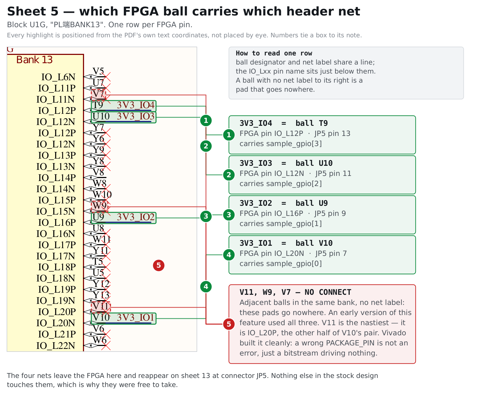
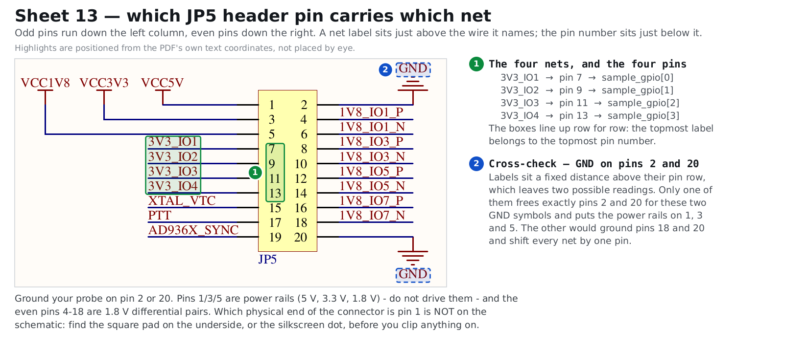
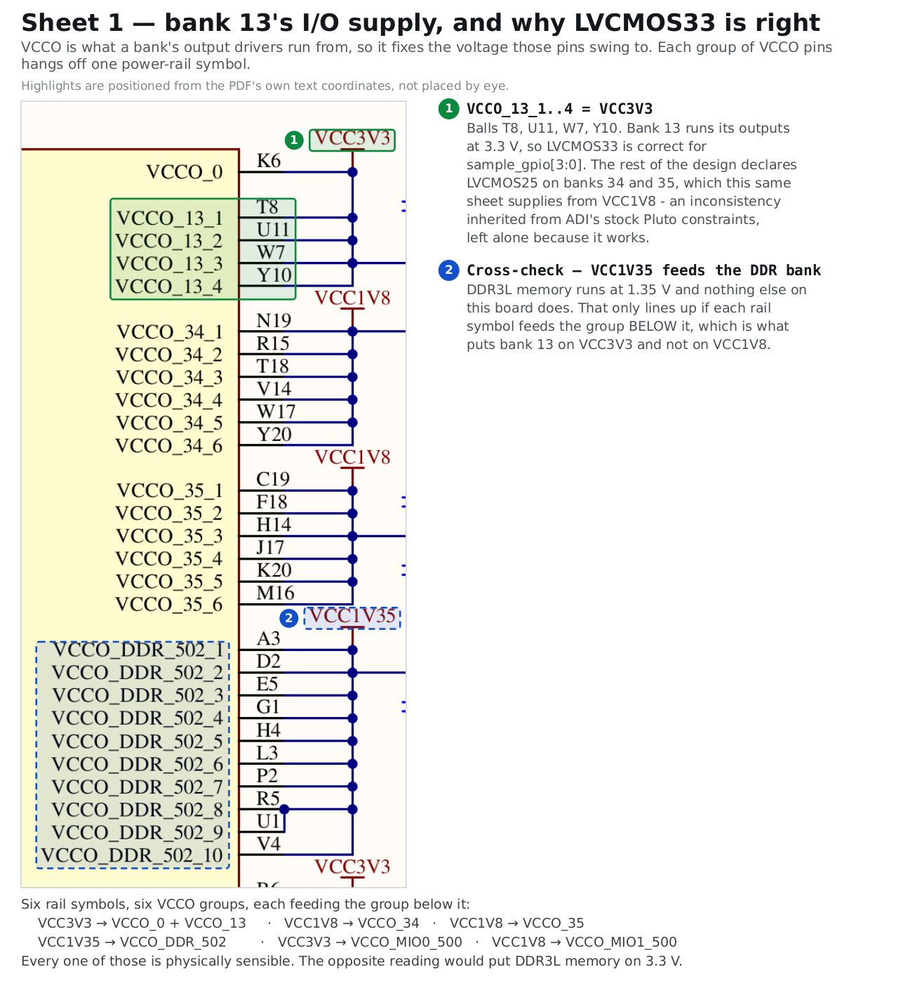

# Four header pins that tick with the transmitted waveform

The base firmware can drive four digital output pins on header JP5 whose every
edge is locked to a specific transmitted RF sample, at a fixed offset rather
than a software-dependent delay: triggers, clocks and markers for radar or
multi-receiver setups. This page is the reference: the control, the pinout, the
limits, how it is built and what has been measured. To use it, follow
[make pins follow the transmit samples](hw/pins-follow-transmit.md) and
[write a pin pattern in Python](hw/write-a-pin-pattern.md). The idea of routing
the transmit samples' low bits to GPIO came from **Akil0515**
([Telegram](https://t.me/Akil0515), see [CONTRIBUTORS.md](../CONTRIBUTORS.md)).

## The idea

A **sample** is one number describing the signal at one instant; the **DAC**
(digital-to-analog converter) turns each into a voltage; **DMA** (direct memory
access) moves samples from RAM to the radio without the CPU. You hand the
AD9361 **16-bit** samples, but **its DAC is only 12 bits** and takes the top 12
(`axi_ad9361_tx_channel.v`: `dac_data_out_int <= dma_data[15:4];`):

```
# layout of one 16-bit transmit sample
your sample:   b15 b14 b13 b12 b11 b10 b9 b8 b7 b6 b5 b4 │ b3 b2 b1 b0
               └──────────── the DAC converts these ────┘  └─ discarded ─┘
```

The bottom four bits (the **low nibble**) reach the FPGA and stop there. This
feature routes them to four header pins instead, so it costs no analog
performance. The pin's role (master clock, frame clock, trigger, T/R switch
line) is whatever pattern you put in that bit; none is wired into the FPGA.

**Coherent, not simultaneous.** A pin is driven one FPGA clock after its sample
leaves the DMA unpacker, while the RF still crosses the FPGA's transmit path,
the AD9361's filters, the DAC and the analog chain. So **the pins lead the RF**,
by something on the order of a microsecond depending on filter configuration.
The lead is constant for a given sample rate and filter setup: measure it once
(a scope on a pin and on the RF, or loopback and cross-correlation) and
subtract it. A GPIO toggled from Linux, by contrast, is tens of microseconds
away from the RF and varies run to run. The offset has not been measured on
this board yet; see [Limits](#limits).

## How to control it

There are two controls: a switch that hands the pins to the sample stream, and
the transmit buffer you write, whose low nibble is the pattern.

### The switch

```sh
# run from: the board. Resolve the device by name; the iio:deviceN index is not stable
D=$(for d in /sys/bus/iio/devices/iio:device*; do
      [ "$(cat $d/name)" = cf-ad9361-dds-core-lpc ] && echo $d; done)

cat   $D/tx_sample_gpio_en                # 0 = GPIO, 1 = sample nibble
echo 1 > $D/tx_sample_gpio_en             # on
echo 0 > $D/tx_sample_gpio_en             # off
```

From the host: `iio_attr -u ip:192.168.2.1 -d cf-ad9361-dds-core-lpc
tx_sample_gpio_en 1` (see [GPIO](gpio.md)).

The attribute is **bit 1 of the DAC core's `GP_CONTROL` register, AXI offset
`0xBC`** (bit 0 is the interpolator bypass, so the attribute
read-modify-writes). On a build without `patches/0007`, which adds the
attribute, write the register through debugfs:

```sh
# run from: the board, after setting D as above. Older builds only
echo "0xBC 0x2" > /sys/kernel/debug/iio/$(basename $D)/direct_reg_access
```

The register resets to 0, so **the pins are ordinary GPIO at power-on**.
Changing the sample rate does not clear the flag
(`cf_axi_interpolation_set()` touches only `BIT(0)`).

### Authoring the pattern

There is no "clock mode" register: **the pattern is data**. A pin is a clock
because its bit alternates. The complete program, step by step:
[write a pin pattern in Python](hw/write-a-pin-pattern.md);
[`tools/sample_gpio_clock.py`](../tools/sample_gpio_clock.py) is the same
program with arguments, teardown on Ctrl-C and an attenuator check.

| Rule | Why |
|---|---|
| **OR the nibble in last** | after every scaling, gain or format conversion, or those steps overwrite it |
| **`tx_cyclic_buffer = True` gives a continuous clock** | make the buffer length an exact multiple of the pattern period, or there is a glitch at the wrap |
| **Only channel 0's I samples carry the nibble** | the tap is channel 0's I ([how it is built](#how-it-is-built)) |
| **Read both attenuators back after the buffer opens**, and stop if either moved | everything works with the transmitter muted (−89.75 dB, no antenna needed), but setting the gain before streaming is not enough: opening a TX buffer can itself raise the attenuator, because the kernel restores a cached gain on unmute (seen at −61.5 dB on a board reading −89.75). `tools/sample_gpio_clock.py` and `tools/tx-gpio-bitmap-check.py` do this |
| **GNU Radio: work at `short` level end to end** with an unscaled sink, or render the buffer with numpy | an ordinary `complex float` flowgraph does not work, because float sinks rescale to int16 and destroy the low bits |

### The pins as ordinary GPIO

With the flag clear, the four pins are EMIO GPIO bits 18–21 (EMIO: processor
GPIO lines routed out through the FPGA fabric; see [GPIO](gpio.md)). The Zynq
GPIO controller numbers its 54 MIO lines first, so `sample_gpio[0..3]` are
controller lines **72–75** on every kernel. Patch `0008` names them:

```sh
# run from: the board. Needs libgpiod-tools: apt install gpiod on Debian
gpiofind sample_gpio0                 # -> gpiochip0 72
gpioget  $(gpiofind sample_gpio0)     # read
gpioset  $(gpiofind sample_gpio0)=1   # drive, with the feature off
```

The legacy sysfs numbers depend on the kernel's controller base: **906 on
5.15** (pins 978–981), **512 on 6.12** (pins 584–587). The sysfs commands, which
work on both root filesystems with no packages:
[toggle a GPIO pin from Linux](hw/toggle-a-gpio.md).

**Reading the pins without fooling yourself.** A low pin does not tell you who
drives it: with the flag clear the pull-down holds it low, which is also a zero
nibble. Stream two different nibbles and check the pin follows. With
`direction=out`, sysfs `value` returns what you wrote, not the pad; set
`direction=in` to read the pad.

## The pins

Four free single-ended 3.3 V I/O on connector **JP5**, read off sheet 5 of the
[vendor schematic](vendor/7020_936x_SDR-schematic.pdf). The bit number matches
the header label, so `sample_gpio[0]` is the pin silkscreened `3V3_IO1`.

| Signal | Header net | JP5 pin | FPGA ball | FPGA pin name |
|---|---|---|---|---|
| `sample_gpio[0]` | `3V3_IO1` | 7 | **V10** | IO_L20N |
| `sample_gpio[1]` | `3V3_IO2` | 9 | **U9** | IO_L16P |
| `sample_gpio[2]` | `3V3_IO3` | 11 | **U10** | IO_L12N |
| `sample_gpio[3]` | `3V3_IO4` | 13 | **T9** | IO_L12P |

![JP5 pinout: a 2x10 header, with pins 7, 9, 11, 13 carrying sample_gpio[0..3] and grounds on pins 2 and 20](img/jp5-pinout-light.svg#only-light)
![JP5 pinout: a 2x10 header, with pins 7, 9, 11, 13 carrying sample_gpio[0..3] and grounds on pins 2 and 20](img/jp5-pinout-dark.svg#only-dark)

- **Ground a probe on pin 2 or 20.** JP5 also carries VCC1V8, VCC3V3 and VCC5V
  (pins 1, 3, 5) and four 1.8 V differential pairs.
- **Find pin 1 on the board** (square pad, silkscreen dot or "1") before
  probing: neither the schematic nor the photos show which end it is. Odd pins
  run down one column, even pins down the other.
- **Voltage and pull.** `LVCMOS33`, because sheet 1 ties `VCCO_13` (the bank's
  output supply) to VCC3V3. Each pin has `PULLTYPE PULLDOWN`, so an undriven
  pin reads low; nothing else on the nets fights it.
- **Do not guess these balls.** V11, W9 and V7 are adjacent bank-13 balls the
  schematic marks **no connect**; V11 is even the other half of V10's pair.
  Vivado accepts a wrong `PACKAGE_PIN` and reports perfect timing.

#### Where the pin numbers come from

<details>
<summary><b>The three vendor schematic sheets, annotated</b></summary>

<br>

Crops of the in-repo schematic, drawn by
[`docs/img/make_schematic_figures.py`](img/make_schematic_figures.py) from the
PDF's own text coordinates. Use this copy: the schematic on the vendor's GitHub
is a different board revision with no `JP5` ([docs/vendor/](vendor/README.md)).

**Sheet 5: which FPGA ball carries which header net**, with the three
no-connect look-alikes marked.



**Sheet 13: which JP5 pin carries which net.** Only one reading of the labels
frees pins 2 and 20 for GND and puts the rails on 1, 3 and 5.



**Sheet 1: bank 13's I/O supply.** The reading that puts the DDR3L bank on
1.35 V puts bank 13 on 3.3 V.



</details>

## Limits

- **Rate.** One nibble per sample, so a pin toggles at most at half the sample
  rate: 30.72 MHz at 61.44 MSPS. Every pattern is a whole-number division of
  the rate of the buffer you write.
- **The pin-to-RF offset (about 1 µs) is designed-for, not measured.** It needs
  the RF and a pin on the same clock, for example an RF detector off a coupler
  feeding a spare logic-analyser channel.
- **Never engage the FPGA's ÷8 transmit interpolator.** It does not work on
  this board, independently of this feature: a tone sent through it does not
  come out at all, and `tx_upack` is read at twelve times the buffer rate. You
  reach it only by setting the DAC core's `out_voltage_sampling_frequency` to
  one eighth of the AD9361's rate yourself. pyadi-iio and the MCP server never
  do: below 2.083 MSPS they use the AD9361's own filters, and the pins are
  correct at 1 MSPS that way. The likely cause is upstream: `tx_upack` is read
  on `interpolator valid OR dac_valid_i1`, and in 2R2T (both transmit channels)
  channel 1 keeps emptying the shared FIFO at full rate.

  
  

- **The pins move only while a TX buffer streams**; between streams the last
  nibble is held. The firmware also mutes the transmitter between streams
  ([Transmitter safety](transmitter-safety.md)).
- **I only, four pins**, unless you widen `NBITS`.
- **3.3 V LVCMOS, no series termination.** Keep wires short; buffer anything
  long. A pin toggling at 15–30 MHz put 20 ns glitches on its neighbour through
  unshielded logic-analyser leads (the board itself was clean); give each fast
  signal its own ground (pin 2 or 20).
- **Pin-to-pin skew is not timing-constrained.** Measured within 1.5 ns, against
  a 16 ns sample period; picosecond work needs output constraints.
- **Nothing validates your pattern.** A typo goes straight to the pins.

## How it is built

The FPGA transports the nibble, it generates nothing. The four bits branch off
right after the DMA unpacker, while the sample is still the word you wrote:

![The transmit path as boxes. Your program's 16-bit I/Q words go through the TX DMA to util_upack2, where the sample stands at its output. Bits 15 to 4 carry on through the FIR interpolator and axi_ad9361 to the AD9361's 12-bit DAC and the RF output. Bits 3 to 0, the tap, go to tx_gpio_bitmap, which captures once per sample and chooses between them and EMIO GPIO 21 to 18 according to GP_CONTROL bit 1 (AXI 0xBC, the enable flag), then through one ad_iobuf per pin to JP5 pins 7, 9, 11 and 13 on balls V10, U9, U10 and T9. The pins lead the RF by a fixed offset.](img/nibble-path-light.svg#only-light)
![The transmit path as boxes. Your program's 16-bit I/Q words go through the TX DMA to util_upack2, where the sample stands at its output. Bits 15 to 4 carry on through the FIR interpolator and axi_ad9361 to the AD9361's 12-bit DAC and the RF output. Bits 3 to 0, the tap, go to tx_gpio_bitmap, which captures once per sample and chooses between them and EMIO GPIO 21 to 18 according to GP_CONTROL bit 1 (AXI 0xBC, the enable flag), then through one ad_iobuf per pin to JP5 pins 7, 9, 11 and 13 on balls V10, U9, U10 and T9. The pins lead the RF by a fixed offset.](img/nibble-path-dark.svg#only-dark)

| File (under `firmware/src/`, created by `setup.sh`, unless `firmware/`) | What it is |
|---|---|
| `hdl/projects/pluto/tx_gpio_bitmap.v` | the module (~30 lines of logic) |
| `hdl/projects/pluto/system_bd.tcl` | block-design wiring: slices, the OR gate, EMIO widened 18 → 22 |
| `hdl/projects/pluto/system_top.v` | the `ad_iobuf` onto the four package pins |
| `hdl/projects/pluto/system_constr.xdc` | pin assignments and the CDC constraint |
| `firmware/sim/tb_tx_gpio_bitmap.v` | self-checking testbench, 2092 checks |
| `firmware/patches/0006-tx-sample-nibble-to-gpio.patch` | all of the above, applied by `setup.sh` |
| `firmware/patches/0007-tx-sample-gpio-iio-attribute.patch` | the `tx_sample_gpio_en` sysfs attribute |
| `firmware/patches/0008-name-the-sample-gpio-lines.patch` | the `sample_gpio0..3` line names in the device tree |
| `firmware/patches/0009-bitmap-flag-cdc-constraint-needs-from.patch` | the corrected CDC constraint |

**The tap** is `tx_upack/fifo_rd_data_0[3:0]`: channel 0's I, before the
interpolation filter (a FIR that raises the sample rate by mixing neighbouring
samples, which would put filter output on the pins). `fifo_rd_data_1[3:0]` is
channel 0's Q, the hook for an I+Q widening.

**The capture strobe** is `fifo_rd_valid | fifo_rd_underflow`, not
`fifo_rd_en`. `util_upack2` registers its output, so a word requested by
`fifo_rd_en` appears one clock later; capturing on `fifo_rd_en` would always be
one sample behind the DAC. On an underflow the DAC gets zeros and so do the
pins. A per-sample strobe rather than every clock is needed because in 2R2T
mode a new sample arrives only every second clock; that bug passes a
back-to-back simulation and fails on hardware, so the testbench checks it.

**The module** (`tx_gpio_bitmap`, parameter `NBITS = 4`):

| `flag` | What owns the pins |
|---|---|
| `0` | **EMIO GPIO**: Linux drives them, tristate and all. The state at reset. |
| `1` | **the fabric**: `pin_o` = the registered nibble, `pin_t` = 0 (all driven) |

The flag crosses from the AXI clock to `l_clk` through a two-flop synchroniser
(a clock-domain crossing, CDC), so a change takes effect two clocks later.
Reset clears the held nibble. The testbench also instantiates an 8-bit copy, so
widening is a parameter change plus four pins.

**Block-design wiring**, all in `system_bd.tcl`:

| Instance | What it does |
|---|---|
| `bitmap_sel` (`xlslice`) | bit **1** of `up_dac_gpio_out` → the enable flag. Bit 0 is already the interpolator bypass. |
| `nibble_slice` (`xlslice`) | `fifo_rd_data_0[3:0]` → the module's `sample_in` |
| `bitmap_valid_or` (`util_vector_logic`) | `fifo_rd_valid OR fifo_rd_underflow` → `valid_in` |
| `gpio_bitmap_o` / `gpio_bitmap_t` (`xlslice`) | EMIO GPIO bits **21:18** → the standard-GPIO inputs |
| `tx_bitmap` (module reference) | the module itself |

The PS7's `PCW_GPIO_EMIO_GPIO_IO` goes from **18 to 22**; `system_top.v` ties
`pin_o`/`pin_t` to the pads and feeds the pad inputs back to `gpio_i[21:18]`.

### What it costs

Against a stock build before patch `0021` (the channel-0-only decimator; the
default build is now 94 DSP48s and 54 211 endpoints, which shifts both columns
equally):

| | Stock | With the feature |
|---|---|---|
| Slice LUTs | 11 893 | **+3** |
| Slice registers | 20 851 | **+7** (4 nibble + 2 synchroniser + 1) |
| Bonded IOBs | 57 | **+4** |
| DSPs / block RAM | 72 / 2 | **no change** |
| Timing | WNS +0.214 ns | **WNS +0.205 ns**, 0 failing of 48 263 |

WNS (worst negative slack) is the slowest path's margin; the worst path is in
ADI's DMA. The flag's CDC is constrained with `set_max_delay -datapath_only`
(patch `0009`) and meets its 4 ns with 2.46 ns to spare.

### Building and flashing

`setup.sh` applies the patches, so a normal build includes the feature. If you
modify the module or its wiring, delete the Vivado project first: a build that
finds `pluto.xpr` reuses it and the change never reaches the fabric. Simulate
before you build.

```bash
# run from: the repo root
cd firmware
./sim/run_sim.sh && ./sim/run_sim.sh --mutate   # seconds, needs only iverilog
rm -rf src/hdl/projects/pluto/pluto.{xpr,runs,gen,cache,hw,srcs,ip_user_files,sdk}
./scripts/build_all.sh --hdl-only
```

The bitstream lives in `BOOT.bin`: replace it with `./devkit flash --target factory` or a card
reader. **Never use DFU** ([Flashing the board](flashing.md)).

## Measured results

`tools/tx-gpio-bitmap-check.py` checks the feature on your board with no scope,
jumper or antenna. TX attenuation stays at maximum and is read back after every
stream starts.

```bash
# run from: the repo root, on your host
./tools/tx-gpio-bitmap-check.py ip:fishball.local
```

```
# output of tools/tx-gpio-bitmap-check.py (trimmed)
flag ON - each pin must carry its own bit of the nibble
  0xF all high    -> [1, 1, 1, 1]  want [1, 1, 1, 1]  control 0  ok
  0x1 only bit 0  -> [1, 0, 0, 0]  want [1, 0, 0, 0]  control 0  ok
  ...
flag OFF - the fabric must let go, so the pins stop following the data
  nibble 0x0 -> [0, 0, 0, 0]   nibble 0xF -> [0, 0, 0, 0]   released (pull-down holds them low)

timing - the pins must track the pattern at the rate the samples imply
  bit0:  52 edges, period   499.6 ms, expected   499.3 ms, error 0.1%  ok
  bit1: 207 edges, period   124.8 ms, expected   124.8 ms, error 0.0%  ok
RESULT: PASS
```

It reads the pads through each pin's input buffer (`IOBUF` with separate `I`
and `O` nets), not a loop-back of what was driven, and uses EMIO 22, wired to
nothing, as a control that must stay low. The timing stage drops the sample
rate to the AD9361's minimum so sysfs can follow and checks the period equals
`N / fs`. It does not check the PCB trace, the actual voltage or edge timing;
those came from a Saleae Logic 8 with a counter pattern (`nibble = n & 0xF`),
averaging about 500,000 edges for sub-nanosecond skew:


| Property | Result |
|---|---|
| Logic against a golden model | 2092 checks pass; 6 mutants all caught |
| Synthesis, implementation, timing | met; figures in [What it costs](#what-it-costs) |
| Pins on the intended balls | confirmed in the routed checkpoint |
| Ball assignments and bank voltage | sheet 5; `VCCO_13` = VCC3V3, sheet 1 |
| `tx_sample_gpio_en` sets the hardware bit | attribute and register `0xBC` agree |
| Idle level | reads 0 undriven |
| Nibble reaches the pins bit for bit, in order | all four one-hot patterns; `sample_gpio[n]` = bit `n` |
| Flag hands the pins back when cleared | yes |
| Pins track the pattern in time | two bits at once, 0.0–0.1 % period error |
| Every sample reaches the pins | 1,002,706 consecutive samples, 0 errors |
| Both transmit channels on | 0 errors at 5 MSPS and at 61.44 MSPS |
| Both receive channels streaming at once | about 187 million samples, 0 slips |
| A large cyclic buffer, from its first block (v2.3, patch 0022) | both transmit channels, 4.46 MB buffer: 3,026,697 marker steps at 40 MSPS and 4,461,207 at 60 MSPS, each 2.4 s from the buffer enable, 0 out of sequence, 0 wrong length |
| Full rate | pin 0 at 30.72 MHz from 61.44 MSPS, every sample present |
| Pin-to-pin skew | within 1.5 ns, same-direction edges (includes analyser skew) |
| Electrical levels | 0.04 V / 3.28 V, 2–8 mV noise; ~30 mV idle |
| DMA underflow | pins go to zero on the very next sample |
| Effect on RF at full transmit power | identical to 0.04 dB, pins toggling or not; nothing at the pin frequencies down to ~64 dB below the carrier |
| Ordinary Linux GPIO with the feature off | driven from `gpioset`, seen on the pads |
| Switching the feature mid-stream | one partial sample at the switch, nothing else |
| **Offset between a pin edge and its RF** | **not measured**: needs an RF detector on the analyser |

## Notes for anyone extending it

Four problems simulation does not show:

- **Vivado infers bus interfaces from port names.** A port ending in `_valid`
  becomes an interface pin that `ad_connect` refuses to wire to a slice; hence
  `sample_in`/`valid_in` and `(* X_INTERFACE_IGNORE = "true" *)` on every port.
- **An `.xdc` does not accept `if`.** A guarded block is discarded whole, with
  the reason only in `pluto.runs/*/runme.log`, not the top-level build log.
- **A wrong `PACKAGE_PIN` is not an error**, as above.
- **CDC constraints can vanish.** `set_max_delay -datapath_only` needs both
  `-from` and `-to`; with only `-to` it is error `Constraints 18-540` and the
  `.xdc` drops the line silently (builds before patch `0009` timed this
  crossing as a 2 ns path). Check the routed design with `report_timing -from
  <source cells> -to <synchroniser cell>`: the requirement must read `MaxDelay
  Path`.
