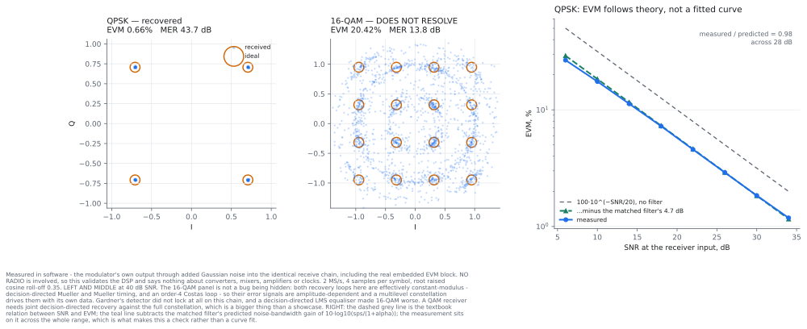

# 02 — A modulated link you can watch

**This flowgraph transmits.** Read the next section before you run it.

```bash
# run from: the repo root
gnuradio-companion examples/02-modulated-link/modulated_link.grc
```

Random bytes become QPSK, get shaped by a root raised cosine, transmitted,
received, matched-filtered, timing-recovered, carrier-recovered and measured.
The constellation, the eye and a live EVM figure all come from the same
recovered symbols.

It is a **QPSK** receiver, deliberately and explicitly. `order` also offers 16
and 64, the transmitter handles them correctly, and the receiver does not
resolve them — which is a real lesson rather than an omission, and
[the section below](#set-order-to-16-and-watch-it-fail) says exactly why.

<picture>
  <source media="(prefers-color-scheme: dark)" srcset="../../docs/img/examples-02-dark.svg">
  
</picture>

## Before you transmit

**The board reaches roughly +19 dBm at an antenna port, through a power
amplifier, anywhere from 70 MHz to 6 GHz.** Transmitting without a licence is
illegal across nearly all of that, and what leaves the port is your
responsibility. The default centre frequency is 2437 MHz, inside the 2.4 GHz ISM
band, because that is the least bad default — **not** because it is permitted
where you are. Check your own regulations. Prefer a cable and an attenuator to
an antenna.

**A loopback without an attenuator destroys the receiver.** The RX input is
rated about **+2.5 dBm** (AD9361 data sheet Rev. G, Table 11) against about
+19 dBm out. Fit at least 20 dB of pad, and measure through exactly 20 dB —
bigger pads let the board's own transmit-to-receive leak into the result. See
[transmitter-safety.md](../../docs/transmitter-safety.md) and
`tools/tx-guard.sh`.

### How the flowgraph is arranged so the safe state is the default

- **`arm` starts unticked**, and unarmed the transmit samples are multiplied by
  exactly `0.0`. There is no modulation to transmit.
- **Attenuation starts at 89.75 dB**, the most the AD9361 offers. *Higher is
  quieter* — the safe end of that slider is the right-hand end. Unarmed, the
  attenuation is forced there regardless of where you left the slider.
- **It is re-asserted after the stream opens.** Patch 0005 restores a *cached*
  attenuation when a buffer starts, so a value written before streaming — which
  is when GRC's constructor writes it — guarantees nothing during it. A snippet
  re-writes it after `start()`. Every tool in this repository does this; the
  rule exists because the alternative silently does not work.
- **The attenuation on screen is read out of the chip**, four times a second, by
  an IIO Attribute Source reading `ad9361-phy` `voltage0` `hardwaregain`. It is
  not an echo of the slider. If the driver refuses a write — the thermal limit of
  patch 0018, the `tx_disable` latch of patch 0016 — the slider will move and
  that number will not. **Believe the number.**

Two independent gates, either of which is sufficient on its own. Note that
disarming is *immediate* even though the buffer holds half a second of samples:
the attenuator is analogue and unbuffered, so it does not wait for the buffer to
drain.

### Exercising it without radiating anything

The AD9361 can route the transmit samples into the receive path **inside the
chip**, past the mixers and the amplifier:

```bash
# run from: the repo root
./devkit loopback on      # digital TX -> RX; nothing is radiated
./devkit loopback off     # ALWAYS put it back
```

Loopback does **not** translate frequency, so set the transmit and receive LO
offsets **equal** to each other — otherwise the carrier loop sees an offset it
cannot pull in. And it bypasses everything analogue, so a clean result tells you
the DSP is right and tells you nothing about the mixers, the amplifier or the
antennas.

A board left in loopback receives nothing from its antennas and looks broken for
no visible reason, which is why `./devkit loopback` shouts about it.

## Two EVM numbers, and the gap between them

*EVM* — error vector magnitude — is how far each received symbol lands from
where it should, as a percentage of the reference's RMS level. *MER* is the same
thing in decibels.

The flowgraph reports **two**. The first is the error as it arrives. The second
is the error after dividing out a single complex gain — one fixed amplitude and
one fixed rotation, fitted by least squares across the block — which is what a
real vector analyser does before quoting a figure.

**The gap between them is the useful part.** It is the share of your error that
is a static rotation you could have calibrated away, rather than noise you could
not. Mistune the carrier loop and watch the two separate: a 20° fixed rotation
reads 34.7% raw and 0.00% equalised, asserted in
[`../test_blocks.py`](../test_blocks.py).

## The caveat that matters

**The board is listening to itself, so the transmitter and the receiver share
one reference clock.** There is no frequency offset to track and no independent
phase noise. The EVM you see is real, and it is better than the same modulation
would achieve between two radios. It is a true measurement of a link that is
easier than any real link.
[modulation-gallery.md](../../docs/modulation-gallery.md) measured this path
with a *separate* radio and is the honest comparison.

## Offset tuning, at both ends

A transmitter's own carrier leaks at its LO, and a receiver's at its own. Both
offsets default to a fraction of the span so that neither leak lands on the
signal: the transmitter shifts its baseband *up* and its LO *down* by the same
amount, and the receiver does the reverse. **Set both to 0** and watch two
spikes appear in the middle of your own transmission.

## Why the transmit scale defaults to 0.20

The modulator produces symbols with an RMS of 1.0 and **peaks well above it**,
because a root raised cosine overshoots between symbols. Measured here over
400k samples:

| modulation | roll-off | peak | PAPR |
|---|---|---|---|
| QPSK | 0.35 | 1.57 | 3.9 dB |
| 16-QAM | 0.35 | 2.03 | 6.2 dB |
| 64-QAM | 0.20 | **2.37** | 7.5 dB |

gr-iio's sink takes ±1.0 as the converter's full scale, so feeding it the
modulator's output unscaled would clip the peaks by up to 7.5 dB. Clipping is
broadband: it puts your signal where you did not put it, which is a licensing
problem as well as a quality one. 0.20 keeps the worst case near −6.5 dBFS,
which is the headroom
[`tools/selftest/sdr_selftest.py`](../../tools/selftest/sdr_selftest.py)
transmits at. If you raise it, watch the spectrum — shoulders coming up is
clipping, not power.

## Why the rate is modest, and what a stream of `U` means

Receiving tolerates a slow link: samples pile up on the board, you lose some,
and it prints `O` for overflow. **Transmitting does not.** The converter must be
fed in real time, so a late buffer means the DAC runs dry and prints `U` — and
on this firmware that is worse than untidy. **Patch 0015 mutes the transmitter
after 250 ms of starvation** and switches the data source to the internal DDS.
A link hiccup takes your signal off the air and leaves the flowgraph looking
like it is still working.

That was measured, not imagined. Driving transmit and receive together at
4 MS/s over a wireless host link produced bursts of 20–40 underflows in 45
seconds, each beside an `Unable to push buffer: Connection timed out`, while a
transmit-only stream at the same rate and buffer produced none. It is
intermittent — the same configuration ran clean later the same hour, which is
what contention on a shared radio channel looks like rather than a throughput
limit.

The defence is buffer **duration**, `buf / samp_rate`, because that is the
length of stall you can absorb:

| `buf` = 1048576 | slack | vs the 250 ms watchdog |
|---|---|---|
| at 4 MS/s | 262 ms | about equal to it |
| at 2 MS/s | **524 ms** | twice — the default here |
| at 1 MS/s | 1050 ms | four times |

So the default is 2 MS/s, 500 ksym/s at 4 samples per symbol, 8 MB/s in each
direction. Lowering the rate buys slack *and* lowers the traffic, so it helps
twice; raising the buffer only helps once. A wired link makes all of this go
away — [modulation-and-throughput.md](../../docs/modulation-and-throughput.md)
has the throughput side of the same story.

### `Unable to create buffer: -16`

`-16` is `EBUSY`, and it is almost always a **stale session on the board**, not
a problem with your flowgraph. A libiio client that is killed rather than closed
leaves its session open on the board holding the transmit DMA; the board showed
three such sessions while the host showed none. The next transmit allocation is
then refused, indefinitely. It has nothing to do with the buffer's *size* — a
4 MB buffer allocates fine when the DMA is free.

```bash
# run on the board - clears stale sessions; iiod is restarted by init
killall iiod
```

Restarting the flowgraph, or the host, will not fix it. Rebooting the board
will.

## Which knobs are live, and which need a re-run

**Live**, because the block exposes a setter: attenuation, centre frequency,
receive gain, both loop bandwidths, the receive matched filter's roll-off, both
LO offsets, `arm`, transmit scale.

**Re-run**, because the value is fixed when a block is constructed: `order` (the
modulator is built from its constellation object), `sps`, `tx_alpha` (the
transmit filter's taps are baked into the modulator) and the buffer sizes.

That is why there are **two** roll-off controls. `tx_alpha` is what the
transmitter shapes with and it cannot change while running. `rrc_alpha` is the
receiver's matched filter, which can. Leave them equal and the filter is
matched; drag `rrc_alpha` away from 0.35 and watch EVM climb. A matched filter
is only matched if somebody keeps it that way.

## What is inside

- **One definition of the constellation.**
  [`../lib/qam.py`](../lib/qam.py) is a GRC *Python Module* block, so
  `qam.points(order)` is callable from parameter expressions. It feeds both the
  constellation object the modulator is built from *and* the reference the EVM
  meter measures against. An EVM meter holding its own idea of the constellation
  can read a healthy few percent while the transmitter sends something else
  entirely — both sides internally consistent and wrong together. Sharing the
  function makes that impossible rather than unlikely.
- **[`../lib/evm_meter.py`](../lib/evm_meter.py)**, and it is worth reading for
  one reason beyond EVM: the first version decided symbols with a brute-force
  distance matrix on every call to `work()`, which at a megasymbol a second
  pegged a core, starved the transmit thread and logged 40 underflows in 45
  seconds where a bare transmit stream logged none. **A Python block that is too
  slow will get your transmitter muted.** It now decides separably — exact, not
  approximate, asserted in `../test_blocks.py` — and recomputes statistics on a
  40 ms clock rather than on every call.
- **Decision-directed timing recovery, chosen by measurement.** The flowgraph
  uses modified Mueller and Müller. Gardner's detector was the first choice — it
  needs no symbol decisions, so in principle it works before the carrier has
  locked — and on this chain it **did not lock at all**: the recovered symbols
  had a magnitude spread of 0.30 against 0.002 for Mueller and Müller, and EVM
  sat near 45% on a *noiseless* signal. That is the kind of thing only a
  measurement tells you.

## Set `order` to 16 and watch it fail

The transmitter is fine at any order — it is a table of points and a filter. The
**receiver** is a QPSK receiver, and a QPSK receiver does not become a QAM
receiver by changing one number.

| order | measured EVM at 40 dB SNR | |
|---|---|---|
| 4 (QPSK) | **0.66%** | resolves cleanly |
| 16 | 20.4% | never resolves into sixteen points |
| 64 | 16.1% | never resolves |

Both recovery loops here lean on the constellation being effectively
constant-modulus:

- The timing detector is decision-directed Mueller and Müller, built around
  two-level decisions. On a multilevel constellation its error signal is
  dominated by which *amplitude* a symbol had rather than by the timing error,
  so the loop is driven by the data.
- An order-4 Costas loop recovers a carrier from four-fold symmetry. 16-QAM has
  that symmetry, but its phase-error estimate is also amplitude-dependent, so
  the same problem appears again.

Two things that did **not** rescue it, both measured rather than assumed:
Gardner's detector (no lock at all, as above), and a decision-directed LMS
equaliser after the carrier loop, which made 16-QAM *worse* — 20.4% to 35.1%.

What a QAM receiver needs is joint decision-directed timing and carrier recovery
against the full constellation — in GNU Radio, something built around
`constellation_receiver_cb`, or a properly trained rather than blind equaliser.
That is a bigger piece of work than a showcase, and it is the honest reason this
example stops at QPSK.

The **spectrum and the eye are receiver-independent** and are correct at every
order, so if you want to see 64-QAM transmitted properly, look at those.

## EVM follows theory, which is how you know it is right

Measured in software — the modulator's own output through added Gaussian noise
into the identical receive chain, real embedded EVM block included — QPSK EVM
tracks the textbook relation across 28 dB of SNR:

| SNR in | EVM measured | 100·10^(−SNR/20) | ratio |
|---|---|---|---|
| 6 dB | 26.67% | 50.12% | 0.53 |
| 14 dB | 11.26% | 19.95% | 0.56 |
| 22 dB | 4.57% | 7.94% | 0.58 |
| 30 dB | 1.84% | 3.16% | 0.58 |
| 34 dB | 1.18% | 2.00% | 0.59 |

The ratio is **constant**, and it is not a fitted constant. The noise is added
across the whole 4×-oversampled band and the matched filter keeps only the
symbol bandwidth, so it should improve SNR by
10·log10(sps / (1 + α)) = 10·log10(4 / 1.35) = **4.72 dB**, an amplitude factor
of 0.580. Measured: 0.58. A chain that reproduces a predicted constant across
28 dB is a chain that is working.

## Verified

- `grcc` compiles it; the generated Python parses.
- Run against the board **unarmed**: the snippet re-asserts 89.75 dB after the
  stream opens, and the chip still read −89.75 dB afterwards.
- The safety properties were read out of the *generated* Python, not assumed:
  `arm = False`, `set_attenuation(0, tx_atten if arm else 89.75)`,
  `multiply_const_cc(tx_scale if arm else 0.0)`, and
  `snippets_main_after_start(tb)` immediately after `tb.start()`.
- Rate and buffer chosen from measurement: 2 MS/s duplex with a 1 Msample
  buffer streamed with zero underflows over repeated 25-second runs.
- The DSP claims are assertions in `../test_blocks.py`, which needs no radio.
